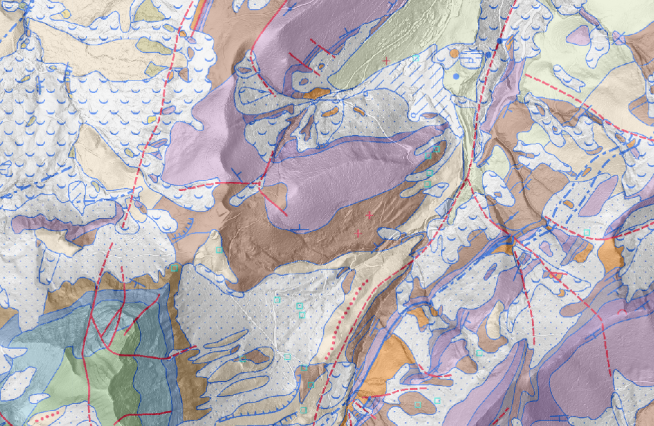

# Datenmodel GeoCover (04/10/24)

## Thema Rock Bodies
### Klasse Unconsolidated_Deposits_PT
_Die Klasse Unconsolidated_Deposits_PT umfasst einzelne Gesteine (Korngrösse: Steine bis Blöcke), die durch gravitative, glaziale oder anthropogene Transportprozesse an ihren heutigen Ort gelangten, respektive sich an Ort und Stelle durch Verwitterung des umliegenden Gesteins gebildet haben.
_

**Attribute KIND**
_Objektart_

|GeolCode|Deutsch|Français|
|----------|--------------------|--------------------|
|      14401001| Runc erratischer Block|bloc erratique|
|      14401002| Runc Schwarm erratischer Blöcke|accumulation de blocs erratiques|
|      14401003| Runc anthropogene Ansammlung von erratischen Blöcken|amas anthropique de blocs erratiques|
|      14401004| Runc Wanderblock|bloc laboureur|
|      14401005| Runc Geschiebe|cailloutis glaciaire|
|      14401006| Runc Sturzblock|bloc éboulé|
|      14401007| Runc Lesesteinhaufen|dépôt d'épierrage|
|      14401008| Runc Verwitterungsrückstände (Gerölle und/oder Konkretionen)|éléments résiduels (galets et/ou rognons)|

**Attribute STATUS**
_Zustand der Objektart_

|GeolCode|Deutsch|Français|
|----------|--------------------|--------------------|
|      14402001| versetzt|déplacé artificiellement|
|      14402002| zerstört|détruit|
|      14402003| in Situ|in situ|
|      14402004| umgelagert|déplacé naturellement|
|        999997| Unknown|inconnu|
|        999998| Not applicable|not applicable|

**Attribute ROCK_TYPE**
_Gesteinstyp (Kristallingestein / Sedimentgestein)_

|GeolCode|Deutsch|Français|
|----------|--------------------|--------------------|
|      14403001| Kristallingestein|roche cristalline|
|      14403002| Sedimentgestein|roche sédimentaire|
|      14403003| Basisches / Ultrabasisches Gestein|roche basique / ultrabasique|
|        999997| Unknown|inconnu|
|        999998| Not applicable|not applicable|

**Attribute ROCK_SPE**
_Bezeichnung des Leitgesteins_

|GeolCode|Deutsch|Français|
|----------|--------------------|--------------------|
|      14404001| Vallorcine-Konglomerat||
|      14404002| Allalin-Gabbro||
|      14404003| Mont-Blanc-Granit||
|      14404004| Serpentinit||
|      14404005| Niesen-Brekzie||
|      14404006| Hohgant-Sandstein||
|      14404007| Grindelwald-Marmor||
|      14404008| Aare-Granit||
|      14404009| Gastern-Granit||
|      14404010| Habkern-Granit||
|      14404011| Windgällen-Porphyr||
|      14404012| Glarner Verrucano||
|      14404013| Kalknagelfluh des Speer- und Stockberggebietes||
|      14404014| Ilanz-Verrucano||
|      14404015| Mels-Sandstein||
|      14404016| Taspinit-Brekzie||
|      14404017| Albula-Granit||
|      14404018| Punteglias-Granit||
|      14404019| Rofna-Porphyr||
|      14404020| Degersheim-Kalknagelfluh||
|      14404021| Taveyannaz-Sandstein||
|      14404022| Muschelsandstein||
|      14404023| Karbon-Brekzie||
|      14404024| Alpines Sedimentgestein||
|      14404025| Molassegestein||
|      14404026| Gruontal-Konglomerat||
|        999997| Unknown|inconnu|
|        999998| Not applicable|not applicable|

**Attribute MAT_TYPE**
_Materialbezeichnung (lithologische Einheit)_

**Attribute ORIG_DESCR**
_Originalbezeichnung gemäss der Legende der zugrundeliegenden geologischen Karte_

**Attribute PROTECTED**
_Geschütztes geologisches Objekt_

### Klasse Unconsolidated_Deposits_PLG
_Die Klasse Unconsolidated_Deposits_PLG beinhaltet alle flächenhaft ausgeschiedenen Lockergesteine. Die Angabe, ob eine Lockergesteinsmasse bewegt (durch Gravitation versetzt) wurde, geht aus der Klasse Instabilities_within_Unconsolidated_Deposits_PLG (Thema Geomorphology) hervor. Eine Ausnahme bilden Lockergesteinsmassen, welche unter dem Einfluss der Schwerkraft bewegt wurden und keine Angaben zum Ausgangsmaterial enthalten (Rutschmassen oder zerrüttete Gesteinsmassen «Sackungsmassen»). Solche Lockergesteine werden sowohl in der Klasse Unconsolidated_Deposits_PLG als auch in der Klasse Instabilities_with_in_Unconsolidated_Deposits_PLG erfasst. Zur näheren Erklärung der verschiedenen Objektarten sind im Anhang A einige Fallbeispiele abgebildet.
_

**Attribute KIND**
_Objektart_

|GeolCode|Deutsch|Français|
|----------|--------------------|--------------------|
|      14517001| Runc Lockergestein|roche meuble|

**Attribute LITSTRAT**

|GeolCode|Deutsch|Français|
|----------|--------------------|--------------------|
|      15201001| Ältere Ablagerungen, undifferenziert|Dépôts indifférenciés précédant le Dernier Maximum Glaciaire|
|      15201002| Niederterrasse|Niederterrasse|
|      15201003| Hochterrasse|Hochterrasse|
|      15201004| Tiefere Deckenschotter|Tiefere Deckenschotter|
|      15201005| Höhere Deckenschotter|Höhere Deckenschotter|
|      15201006| Birrfeld-Eiszeit (Letzte Eiszeit)|Période glaciaire du Birrfeld (Dernière Période glaciaire)|
|      15201007| Last Glacial Maximum (LGM), undiff.|Dernier Maximum Glaciaire (LGM), indifférencié|
|      15201008| LGM-Rückzug|Phase de retrait du LGM|
|      15201009| Birmenstorf-Vergletscherung (2. LGM-Vorstoss)|Glaciation de Birmenstorf|
|      15201010| Wettingen-Vorstoss|Avancée glaciaire de Wettingen|
|      15201011| Flüefeld-Schotter|Gravier du Flüefeld|
|      15201012| Altberg-Till|Till de l'Altberg|
|      15201013| Birmenstorf-Vorstoss|Avancée glaciaire de Birmenstorf|
|      15201014| Birr-Schotter|Gravier de Birr|
|      15201015| Oberhard-Till|Till d'Oberhard|
|      15201016| Seon-Vorstoss|Avancée glaciaire de Seon|
|      15201017| Berg-Schotter|Gravier de Berg|
|      15201018| Fornholz-Till|Till de Fornholz|
|      15201019| Gontenschwil-Vorstoss|Avancée glaciaire de Gontenschwil|
|      15201020| Gontenschwil-Till|Till de Gontenschwil|
|      15201021| Staffelbach-Vorstoss|Avancée glaciaire de Staffelbach|
|      15201022| Staffelbach-Schotter|Gravier de Staffelbach|
|      15201023| Staffelbach-Till|Till de Staffelbach|
|      15201024| Lindmühle-Vergletscherung (1. LGM-Vorstoss)|Glaciation de Lindmühle|
|      15201025| Otelfingen-Vorstoss|Avancée glaciaire d'Otelfingen|
|      15201026| Tägerhard-Schotter|Gravier de Tägerhard|
|      15201027| Lindmühle-Vorstoss|Avancée glaciaire du Lindmühle|
|      15201028| Ämmert-Schotter|Gravier d'Ämmert|
|      15201029| Ämmert-Till|Till d'Ämmert|
|      15201030| Emmet-Vorstoss|Avancée glaciaire d'Emmet|
|      15201031| Gündelmoos-Lehm|Limon de Gündelmoos|
|      15201032| Igliste-Schotter|Gravier d'Igliste|
|      15201033| Niderholz-Till|Till du Niderholz|
|      15201034| Zetzwil-Vorstoss|Avancée glaciaire de Zetzwil|
|      15201035| Zetzwil-Till|Till de Zetzwil|
|      15201036| Kirchleerau-Vorstoss|Avancée glaciaire de Kirchleerau|
|      15201037| Kirchleerau-Till|Till de Kirchleerau|
|      15201038| Gossau-Interstadial|Interstade de Gossau|
|      15201039| Mülligen-Paläoboden|Paléosol de Mülligen|
|      15201040| Niederweningen-Formation|Formation de Niederweningen|
|      15201041| Hombrechtikon-Vergletscherung (Frühletzteiszeitliche Vergl.)|Glaciation de Hombrechtikon|
|      15201042| Mülligen-Schotter|Gravier de Mülligen|
|      15201043| 2. letzteiszeitlischs Vorstoss|2ème avancée glaciaire de la Dernière Période glaciaire|
|      15201044| 1. letzteiszeitlischs Vorstoss|1ère avancée glaciaire de la Dernière Période glaciaire|
|      15201045| Klettgau-Schotter|Gravier du Klettgau|
|      15201046| Obere Klettgauschotter|Gravier supérieur du Klettgau|
|      15201047| Glazi-lakustrische Serie|Série glaciolacustre (Gravier du Klettgau)|
|      15201048| Mittlere Klettgauschotter|Gravier moyen du Klettgau|
|      15201049| Untere Klettgauschotter|Gravier inférieur du Klettgau|
|      15201050| Gondiswil-Interglazial (Letztes Integlazial)|Interglaciaire de Gondiswil (Dernier Interglaciaire)|
|      15201051| Flurlingen-Quelltuff|Tuf calcaire de Flurlingen|
|      15201052| Birrfeld- und Klettgau-Paläoböden|Paléosols du Birrfeld et du Klettgau|
|      15201053| Beringen-Eiszeit|Période glaciaire de Beringen (Avant-dernière Période glaciaire)|
|      15201054| Entfelden-Schotter|Gravier d'Entfelden|
|      15201055| Aarau-Schotter|Gravier d'Aarau|
|      15201056| Suhr-Schotter|Gravier de Suhr|
|      15201057| Veltheim-Schotter|Gravier de Veltheim|
|      15201058| Stüsslingen-Schotter|Gravier de Stüsslingen|
|      15201059| Langwiesen-Vergletscherung|Glaciation de Langwiesen|
|      15201060| Langwiesen-Vorstoss|Avancée glaciaire de Langwiesen|
|      15201061| Schaffhausen-Schotter|Gravier de Schaffhouse|
|      15201062| Reuenthal-Vorstoss|Avancée glaciaire de Reuenthal|
|      15201063| Lupfig-Schotter|Gravier de Lupfig|
|      15201064| Löhningen-Engiwald-Vergletscherung|Glaciation de Löhningen-Engiwald|
|      15201065| Engiwald-Vorstoss|Avancée glaciaire de l'Engiwald|
|      15201066| Rüfenach-Vorstoss|Avancée glaciaire de Rüfenach|
|      15201067| Löhningen-Vorstoss|Avancée glaciaire de Löhningen|
|      15201068| Remigen-Vorstoss|Avancée glaciaire de Remingen|
|      15201069| Remigen-Schotter|Gravier de Remingen|
|      15201070| Meikirch-Interglazial|Interglaciaire de Meikirch|
|      15201071| Ältere Beckenfüllungen|Anciens remplissages de bassin|
|      15201072| Hagenholz-Eiszeit|Période glaciaire du Hagenholz|
|      15201073| Hagenholz-Vergletscherung|Glaciation du Hagenholz|
|      15201074| Hagenholz-Vorstoss|Avancée glaciaire du Hagenholz|
|      15201075| Aathal-Schotter|Gravier de l'Aathal|
|      15201076| Pfyn-Vorstoss|Avancée glaciaire de Pfyn|
|      15201077| Ittingen-Schotter|Gravier d'Ittingen|
|      15201078| Ryhirt-Formation|Formation du Ryhirt|
|      15201079| Geisslingen-Schotter|Gravier de Geisslingen|
|      15201080| Habsburg-Hagenholz-Interglazial|Interglaciaire Habsburg-Hagenholz|
|      15201081| Möhlinerfeld-Paläoboden|Paléosol du Möhlinerfeld|
|      15201082| Habsburg-Eiszeit|Période glaciaire de Habsburg|
|      15201083| Gränichen-Schotter|Gravier de Gränichen|
|      15201084| Roggehuse-Schotter|Gravier de Roggehuse|
|      15201085| Buerfeld-Schotter|Gravier du Buerfeld|
|      15201086| Habsburg-Vergletscherung|Glaciation de Habsburg|
|      15201087| Habsburg-Vorstoss|Avancée glaciaire de Habsburg|
|      15201088| Habsburg-Schotter|Gravier de Habsburg|
|      15201089| Unterschlatt-Vorstoss|Avancée glaciaire d'Unterschlatt|
|      15201090| Thalgut-Interglazial|Interglaciaire de Thalgut|
|      15201091| Möhlin-Eiszeit (Grösste Eiszeit)|Période glaciaire de Möhlin|
|      15201092| Möhlin-Vergletscherung|Glaciation de Möhlin|
|      15201093| Möhlin-Vorstoss|Avancée glaciaire de Möhlin|
|      15201094| Bünten-Till|Till de Bünten|
|      15201095| Schleitheim-Vorstoss|Avancée glaciaire de Schleitheim|
|      15201096| Fisibach-Schotter|Gravier de Fisibach|
|      15201097| Bärengraben-Schotter und -Till|Gravier et Till du Bärengraben|
|      15201098| Iberig-Schotterkomplex|Gravier de l'Iberig|
|      15201099| Obere Iberigschotter|Gravier supérieur de l'Iberig|
|      15201100| Oberer Till|Oberer Till (Iberig)|
|      15201101| Mittlere Iberigschotter|Gravier moyen de l'Iberig|
|      15201102| Untere Iberigschotter|Gravier inférieur de l'Iberig|
|      15201103| Unterer Till|Unterer Till (Iberig)|
|      15201104| Wolfacher-Schotter und -Till|Gravier et Till de Wolfacher|
|      15201105| Fornech-Schotter|Gravier de la Fornech|
|      15201106| Forenirchel-Schotter|Gravier du Forenirchel|
|      15201107| Steig-Schotter|Gravier du Steig|
|      15201108| Irchel-Schotterkomplex|Gravier de l'Irchel|
|      15201109| Obere Irchelschotter|Gravier supérieur de l'Irchel|
|      15201111| Irchel-Dolomitschotter|Gravier dolomitique de l'Irchel|
|      15201112| Mittlere Irchelschotter|Gravier moyen de l'Irchel|
|      15201113| Untere Irchelschotter|Gravier inférieur de l'Irchel|
|      15201114| Langacher-Schotter|Gravier du Langacher|
|      15201115| Dürn-Formation|Formation du Dürn|
|      15201116| Degermoos-Schotter|Gravier de Degermoos|
|      15201117| Ebnet-Schotter|Gravier de l'Ebnet|
|      15201118| Wannen-Schotter|Gravier du Wannen(buck)|
|      15201119| Egghalden-Schotter|Gravier de l'Egghalden|
|      15201120| Buechen-Formation|Formation de Buechen|
|      15201121| Feusi-Schotter|Gravier du Feusi|
|      15201122| Lindenhau-Schotter|Gravier du Lindenhau|
|      15201123| Egg-Schotter|Gravier de l'Egg|
|      15201124| Sundgau-Schotter|Gravier du Sundgau|
|      15201125| Mischschotter|Mischschotter (Sundgau)|
|      15201126| Weisse Serie|Weisse Serie (Sundgau)|
|      15201129| Zürich-Stein-Bremgarten-Stadien|stade glaciaire de Zürich-Stein-Bremgarten|
|      15201130| Untere Singen-Terrasse|terrasse inférieure de Singen|
|      15201131| Schlieren-Diessenhofen-Stetten-Stadien|stade de Schlieren-Diessenhofen-Stetten|
|      15201132| Obere Singen-Terrasse|terrasse supérieure de Singen|
|      15201133| Rheinau-Terrasse|terrasse de Rheinau|
|      15201134| Nohl-Terrasse|terrasse de Nohl|
|      15201135| Altenburg-Fulach-Terrasse|terrasse d'Altenburg-Fulach|
|      15201136| Aare-Schotter|Gravier de l'Aar|
|      15201137| Schüss-Schotter|Gravier de la Suze|
|      15201138| Orvin-Schotter|Gravier d'Orvin|
|      15201139| Seeablagerungen von Frinvillier und Rondchâtel|Dépôts lacustres de Frinvillier et Rondchâtel|
|      15201140| Stauschotter von Diessbach|Gravier de retenue de Diessbach|
|      15201141| Mély-Formation|Formation de Mély|
|      15201142| Kiessande von Madretsch|Sable à gravier de Madretsch|
|      15201143| Seeland-Schotter|Gravier du Seeland|
|      15201144| Emme-Schotter|Gravier de l'Emme|
|      15201145| Gäu-Schotter|Gravier du Gäu|
|      15201146| Flumenthal-Lehm|Limon du Flumenthal|
|      15201147| Killwangen-Schaffhausen-Mellingen-Stadium|stade de Killwangen-Schaffhouse-Mellingen|
|      15201148| Munot-Terrasse|terrasse du Munot|
|      15201149| Stokar-Terrasse|terrasse de Stokar|
|      15201150| Breite-Terrasse|terrasse de la Breite|
|      15201151| Maximalstand (Kilwangen-Schaffhausen-Stadium)|stade maximal (Kilwangen-Schaffhouse)|
|      15201152| Wehntal-Schotter|Gravier du Wehntal|
|      15201153| Bick-Till|Till du Bick(acher)|
|      15201154| Flüe-Till|Till de Flüe|
|      15201155| Wettingen-Schotter|Gravier de Wettingen|
|      15201156| Bersturzmasse von Selzach|Dépôt d'écroulement de Selzach|
|      15201157| Plateauschotter|Plateauschotter|
|      15201158| La-Côte-Schotter|Alluvions de la Côte|
|      15201159| Enge-Schotter|Gravier de l'Enge|
|      15201160| Attiswil-Schotter|Gravier d'Attiswil|
|      15201161| Lommiswil-Schotter|Gravier de Lommiswil|
|      15201162| Oensingen-Moos-Lehm|Limon d'Oensingen-Moos|
|      15201163| Berken-Schotter|Gravier de Berken|
|      15201164| Berken-Sand|Sable de Berken|
|      15201165| Schwarzhäusern-Lehm|Limon de Schwarzhäusern|
|      15201166| Käppelihof-Schotter|Gravier du Käppelihof|
|      15201167| Aarburg-Schotter|Gravier d'Aarburg|
|      15201168| Tuileries-Formation|Formation des Tuileries|
|      15201169| Grandson-Formation|Formation de Grandson|
|      15201170| Poissine-Formation|Formation de la Poissine|
|      15201171| Surbtal-Lehm|Limon du Surbtal|
|      15201172| Surbtal-Till|Till du Surbtal|
|      15201173| Surbtal-Schotter|Gravier du Surbtal|
|      15201174| Fislisbach-Schotter|Gravier de Fislisbach|
|      15201175| Reusstal-Sand|Sable du Reusstal|
|      15201176| Reusstal-Lehm|Limon du Reusstal|
|      15201177| Hausen-Lehm|Limon de Hausen|
|      15201178| Hausen-Moräne|Till de Hausen|
|      15201179| Ruckfeld-Schotter|Gravier du Ruckfeld|
|      15201180| Endingen-Schotter|Gravier d'Endingen|
|      15201181| Rhein- und Aareschotter|Gravier du Rhin et de l'Aar|
|      15201182| Juraschotter|Juraschotter|
|      15201183| Alte Doubsschotter|Gravier ancien du Doubs|
|      15201184| Wutach-Schotter|Gravier de la Wutach|
|      15201185| Merenbach-Schotter|Gravier du Merenbach|
|      15201186| Malmkalk-Schotter der Randen-Täler|Malmkalk-Schotter (vallée du Randen)|
|      15201187| Solothurn-Stadium|stade de Soleure|
|      15201188| Münsingen-Schotterkomplex|Complexe graveleux de Münsingen|
|      15201189| Alterswil-Schotter|Gravier d'Alterswil|
|      15201190| Karlsruhe-Schotter|Gravier de Karlsruhe|
|      15201191| Chisetal-Schotter|Gravier du Chisetal|
|      15201192| Grauholz-Schotter|Gravier du Grauholz|
|      15201193| Trachslau-Schotter|Gravier de Trachslau|
|      15201194| Bennau-Schotter|Gravier de Bennau|
|      15201195| Hütten-Schotter|Gravier de Hütten|
|      15201196| Schnabelsberg-Stauchotter|Gravier de Schnabelsberg|
|      15201197| Einsiedeln-Lehm|Limon d'Einsiedeln|
|      15201198| Willisau-Schotter|Gravier de Willisau|
|      15201199| Wolhusen-Schotter|Gravier de Wolhusen|
|      15201200| Wiggen-Schotter|Gravier de la Wigger|
|      15201201| Menzingen-Schotter|Gravier de Menzingen|
|      15201202| La-Tuffière-Schotter|Gravier de la Tuffière|
|      15201203| Gontenschwil-Lehm|Limon de Gontenschwil|
|      15201204| Mooslerau-Lehm|Limon du Mooslerau|
|      15201205| Triengen-Schotter|Gravier de Triengen|
|      15201206| Triengen-Lehm|Limon de Triengen|
|      15201207| Sihl-Schotter|Gravier de la Sihl|
|      15201208| Haselbach-Schotter|Gravier du Haselbach|
|      15201209| Jonen-Schotter|Gravier de Jonen|
|      15201210| Aabach-Schotter|Gravier de l'Aabach|
|      15201211| Starrberg-Schotter|Gravier de Starrberg|
|      15201212| Port-Stauschotter|Gravier de Port|
|      15201213| Rempen-Stauschotter|Gravier de Rempen|
|      15201214| Dagmersellen-Vorstoss|Avancée glaciaire de Dagmersellen|
|      15201215| Oftringen-Schotter|Gravier d'Oftringen|
|      15201216| Zelg-Schotter|Gravier de Zelg|
|      15201217| Forst-Schotter|Gravier du Forst|
|      15201218| Raintal-Deltaschotter|Gravier du Raintal|
|      15201219| Kleinhöchstetten-Kies-Sand-Komplex|Complexe sablo-graveleux de Kleinhöchstetten|
|      15201220| Krauchthal-Schotter|Gravier du Krauchthal|
|      15201221| Brandflue-Schotter|Gravier de la Brandflue|
|      15201222| Küsnacht-Schotter|Gravier de Küsnacht|
|      15201223| Chatzenstrick-Schotter|Gravier du Chatzenstrick|
|      15201224| Rabennest-Schotter|Gravier du Rabennest|
|      15201225| Ratengütsch-Schotter|Gravier du Ratengütsch|
|      15201226| Scherenspitz-Schotter|Gravier du Scherenspitz|
|      15201227| Walsenhaus-Schotter|Gravier de Walsenhaus|
|      15201228| Richterswil-Seeton|Argile lacustre de Richterswil|
|      15201229| Schwanden-Schotter|Gravier de Schwanden|
|      15201230| Reidbach-Schotter|Gravier du Reidbach|
|      15201231| Zell-Schotterkomplex|Gravier de Zell|
|      15201232| Gubel-Schotter|Gravier de Gubel|
|      15201233| Chälen-Schotter|Gravier de Chälen|
|      15201234| Chälen-Till|Till de Chälen|
|      15201235| Sihlsprung-Schotter|Gravier du Sihlsprung|
|      15201236| Kollbrunn-Schotter|Gravier de Kollbrunn|
|      15201237| Walenberg-Schotter|Gravier de Walenberg|
|      15201238| Ritteren-Schotterkomplex|Complexe graveleux de Ritteren|
|      15201239| Vorholz-Schotter|Gravier du Vorholz|
|      15201240| Gutsch-Schotter|Gravier du Gutsch|
|      15201241| Junkerenwald-Schotter|Gravier du Junkerenwald|
|      15201242| Chräjeloch-Schotter|Gravier du Chräjeloch|
|      15201243| Butteberg-Schotter|Gravier du Butteberg|
|      15201244| Höchi-Schotter|Gravier du Höchi|
|      15201245| Heitere-Schotter|Gravier deHeitere|
|      15201246| Holziken-Schotter|Gravier de Holziken|
|      15201247| Ruedertal-Schotter|Gravier du Ruedertal|
|      15201248| Bänkel-Schotter|Gravier de Bänkel|
|      15201249| Quartär, undifferenziert|Quaternaire, indifférencié|
|      15201250| Deckenschotter, undifferenziert|Deckenschotter, indifférencié|
|      15201251| Girenbad-Schotter|Gravier du Girenbad|
|      15201252| Sagenbach-Schotter|Gravbier du Sagenbach|
|      15201253| Schrotzburg-Schotter|Gravier de la Schrotzburg|
|      15201254| Schrotzburg-Till|Till de la Schrotzburg|
|      15201255| Bohlingen-Schotter|Gravier de Bohlingen|
|      15201256| Bannholz-Schotter|Gravier du Bannholz|
|      15201257| Hungerbol-Schotter|Gravier d'Hungerbol|
|      15201258| Chilchstapfen-Schotter|Gravier de la Chilchstapfen|
|      15201259| Ofenloch-Karstfüllung||
|      15201260| Wurmsbach-Deltaablagerungen||
|      15201261| Oeschinensee-Bergsturzablagerungen||
|      15201262| Fisistock-Bergsturzablagerungen||
|      15201263| Bire-Bergsturzablagerungen||
|      15201264| Hasle-Schotter||
|      15201265| Fankhusgrabe-Schotter||
|      15201266| Rossgaden-Schotter||
|      15201267| Grundtal-Schotter||
|      15201268| Murg-Schieferkohle||
|      15201269| Oberricken-Schotter||
|      15201270| Haslentobel-Schotter||
|      15201271| Aatal-Seebodenlehm||
|      15201272| Eschenbach-Formation||
|      15201273| Oberkirch-Seebodenlehm||
|      15201274| Günterstall-Schotter||
|      15201275| Gublen-Schotter||
|      15201276| Unter-Buechwald-Schotter||
|      15201277| Regelstein-Till||
|      15201278| Halden-Seeablagerungen||
|      15201279| Schafbüel-Formation||
|      15201280| Unteres-Huttenbüel-Schotter||
|      15201281| Winden-Schieferkohle||
|      15201282| Tiefenwinkel-Seebodensedimente||
|      15201283| Uznach-Schieferkohle||
|      15201284| Embrach-Seeablagerungen||
|      15201286| Bergsturzablagerungen von Sierre|dépôt d'écroulement de Sierre|
|      15201287| Bergsturzablagerungen von Chiètres|dépôt d'écroulement de Chiètres|
|      15201288| Bergsturzablagerungen von Chessel-Noville|dépôt d'écroulement de Chessel-Noville|
|      15201289| Bergsturzablagerungen von Novalles-Vugelles|dépôt d'écroulement de Novalles-Vugelles|
|      15201290| Bergsturzablagerungen von Gwelber-Laui-Weid|dépôt d'écroulement de Gwelber-Laui-Weid|
|      15201291| Bergsturzablagerungen von Castasegna|dépôt d'écroulement de Castasegna|
|      15201292| Bergsturzablagerungen von Sogno|dépôt d'écroulement de Sogno|
|      15201293| Bergsturzablagerungen von Prapan|dépôt d'écroulement de Prapan|
|      15201294| Bergsturzablagerungen von Schaingels|dépôt d'écroulement de Schaingels|
|      15201295| Bergsturzablagerungen von Mutta|dépôt d'écroulement de Mutta|
|      15201296| Bergsturzablagerungen von Brienz|dépôt d'écroulement de Brienz|
|      15201297| Bergsturzablagerungen von Flims|dépôt d'écroulement de Flims|
|      15201298| Bergsturzablagerungen von Brüsis|dépôt d'écroulement de Brüsis|
|      15201299| Bergsturzablagerungen vom Chapf|dépôt d'écroulement de Chapf|
|      15201300| Bergsturzablagerungen von Derborence||
|      15201301| Bergsturzablagerungen vom Drussetschawald|dépôt d'écroulement du Drussetschawald|
|      15201302| Bergsturzablagerungen vom Delenwald|dépôt d'écroulement du Delenwald|
|      15201303| Bergsturzablagerungen von Elm|dépôt d'écroulement d'Elm|
|      15201304| Bergsturzablagerungen von Goldau|dépôt d'écroulement de Goldau|
|      15201305| Bergsturzablagerungen von Iragell|dépôt d'écroulement d'Iragell|
|      15201306| Bergsturzablagerungen vom Kernwald|dépôt d'écroulement du Kernwald|
|      15201307| Bergsturzablagerungen von Triesenberg|dépôt d'écroulement de Triesenberg|
|      15201308| Bonaduz-Formation|Formation de Bonaduz|
|      15201309| Bonfol-Ton|Argile de Bonfol|
|      15201310| Bergsturzablagerungen von Tamins|dépôt d'écroulement de Tamins|
|      15201311| Informell benannte Bergsturzablagerungen|dépôts d'écroulement nommés informellement|
|      15201312| Informell benannte künstliche Ablagerungen|dépôts artificiels nommés informellement|
|      15201313| Künstliche Ablagerungen des Bahnhofs Brig|dépôts artificiels de la gare de Brigue|
|      15201314| Künstliche Ablagerungen Golar|dépôts artificiels Golar|
|      15201315| Künstliche Ablagerungen der Gamsenried-Deponie|dépôts artificiels de la décharge de la Lonza|
|      15201316| Künstliche Ablagerungen des Riedertals|dépôts artificiels du Riedertal|
|      15201317| Informell benannte Sackungsmassen|masses tassées nommées informellement|
|      15201318| Sackungsmasse des Heinzenbergs|masse tassée du Heinzenberg|
|      15201319| Informell benannte fluviatile Schotter|graviers fluviatiles nommés informellement|
|      15201320| Schotter und Sand der Rhône|graviers et sables du Rhône|
|      15201321| Schotter und Sand der Vispa|graviers et sables de la Viège|
|      15201322| Informell benannter Bachschutt|dépôts torrentiels nommés informellement|
|      15201323| Bachschutt des Baltschiederbachs|dépôts torrentiels du Baltschiedertal|
|      15201324| Bachschutt des Bietschbachs|dépôts torrentiels du Bietschbach|
|      15201325| Bachschutt des Chelchbachs|dépôts torrentiels du Chelchbach|
|      15201326| Bachschutt der Gamsa|dépôts torrentiels de la Gamsa|
|      15201327| Bachschutt des Jolibachs|dépôts torrentiels du Jolibach|
|      15201328| Bachschutt der Lonza|dépôts torrentiels de la Lonza|
|      15201329| Bachschutt der Saltina|dépôts torrentiels de la Saltina|
|      15201330| Bachschutt der Vispa|dépôts torrentiels de la Viège|
|      15201331| Bachschutt der Gürbe|dépôts torrentiels de la Gürbe|
|      15201332| Bachschutt des Lombachs|dépôts torrentiels du Lombach|
|      15201333| Pliozäne Ablagerungen|dépôts pliocènes|
|      15201334| Stockesee-Sediment|Sédiments du Stockesee|
|      15201335| Strätligen-Till|Till de Strätligen|
|      15201336| Bärenholz-Till|Till du Bärenholz|
|      15201337| Wässerifluh-Formation|Formation de la Wässerlifluh|
|      15201338| Schlyffi-Till|Till de la Schlyffi|
|      15201339| Brüggstutz-Schotter|Gravier du Brüggstutz|
|      15201340| Guntelsei-Till|Till de la Guntelsei|
|      15201341| Guntelsei-Schotter|Gravier de la Guntelsei|
|      15201342| Steghalden-Schotter|Gravier de la Steghalden|
|      15201343| Glütschtal-Formation|Formation du Glütschtal|
|      15201344| Hahni-Schotter|Gravier de Hahni|
|      15201444| Löss, undifferenziert|Loess, indifférencié|
|      15201458| Ceppo|Ceppo|
|      15201459| Novazzano-Sand|Sable de Novazzano|
|      15201460| Bergsturzablagerungen vom Stützwald|dépôt d'écroulement du Stützwald|
|      15201462| Birkenhof-Formation||
|      15201463| Zeiningen-Till||
|      15201464| Höhenschotter||
|      15201465| Böschmatt-Schotter||
|      15201466| Bramegg-Schotter||
|      15201467| Kaltenegg-Schotter||
|      15201468| Steinhuserberg-Schotter||
|      15201469| Büelm-Schotter||
|      15201470| Büel-Schotter||
|      15201471| Bünten-Schotter||
|      15201472| Durnagel-Schotter||
|      15201473| Dürrenroth-Schotter||
|      15201474| Egghüsli-Schotter||
|      15201475| Emmental-Schotter||
|      15201476| Ergolztal-Schotter||
|      15201477| Gammenthal-Schotter||
|      15201478| Gondiswil-Formation||
|      15201479| Hasewald-Schotter||
|      15201480| Hirzmatt-Schotter||
|      15201481| Mettlen-Schotter||
|      15201482| Möhlinerfeld-Schotter||
|      15201483| Muttenfeld-Schotter||
|      15201484| Nidfurn-Schotter||
|      15201485| Oberhöhe-Grundmoräne||
|      15201486| Obermoos-Schotter||
|      15201487| Öflingen-Schotter||
|      15201488| Rottal-Schotter||
|      15201489| Rüdelwald-Schotter||
|      15201490| Rufswil-Schotter||
|      15201491| Rütimatt-Schotter||
|      15201492| Schwanderholzwald-Schotter||
|      15201493| Schwande-Seebodensedimente||
|      15201494| Soppensee-Seebodensedimente||
|      15201495| Speicherboden-Lokalmoräne||
|      15201496| terrasse lémanique de 10 m||
|      15201497| terrasse lémanique de 3 m||
|      15201498| Untere Zeller Schotter||
|      15201499| Untergrabehüsli-Schotter||
|      15201500| Untertreie-Schotter||
|      15201501| Wallbach-Schotter||
|      15201502| Werthenstein-Schotter||
|      15201503| Willburg-Formation||
|      15201504| Wilzigen-Seebodensedimente||
|      15201505| Reuss-Schotterkomplex||
|      15201506| Hagnau-Niveau||
|      15201507| Reusstal-Seebodensediment||
|      15201508| Wyna-Schotter||
|      15201509| Rickenbach-Schotter||
|      15201510| Ermensee-Schotter||
|      15201511| Mooretal-Schotter||
|      15201512| Ämmet-Schotter||
|      15201513| Homberg-Till||
|      15201514| Lindenberg-Till||
|      15201515| Heubeerihübel-Schotter||
|      15201516| Ritzhans-Schotter||
|      15201517| Unterdorf-Schotter||
|      15201518| Schönegg-Formation||
|      15201519| Säckingen-Schotter||
|      15201520| Bruderhäusle-Schotter||
|      15201521| Mumpf-Schotter||
|      15201522| Riedmatt-Schotter||
|      15201523| Beuggen-Schotter||
|      15201524| Feldhof-Schotter||
|      15201525| Spärgacher-Schotter||
|      15201526| Wagenmoos-Till|Till du Wagenmoos|
|      15201527| Niderstalden-Schotter|Gravier de Niderstalden|
|      15201528| Zulgtal-Schotter|Gravier du Zulgtal|
|      15201529| Spiez-Schotter|Gravier de Spiez|
|      15201530| Hahni-Till|Till de Hahni|
|      15201531| Bergsturzablagerung von Ralligen (im Thunersee)|Dépôt d'écroulement de Ralligen (dans le lac de Thoune)|
|      15201532| Bergsturzablagerung von Bargis|dépôt d'éboulement de Bargis|
|      15201533| Bergsturzablagerung von Fidaz|dépôt d'éboulement de Fidaz|
|      15201534| Niederterrassenschotter, tiefere Niveaus|Niederterrasse, niveaux graveleux inférieurs|
|      15201535| Niederterrassenschotter, zweitoberste Terrasse|Niederterrasse, deuxième niveau graveleux le plus élevé|
|      15201536| Niederterrassenschotter, oberste Terrasse|Niederterrasse, premier niveau graveleux le plus élevé|
|      15201537| Tiefere Deckenschotter, unteres Niveau|Tiefere Deckenschotter, niveau inférieur|
|      15201538| Tiefere Deckenschotter, oberes Niveau|Tiefere Deckenschotter, niveau supérieur|
|      15201539| Kunkels-Formation|Formation de Kunkels|
|      15201540| Alluvion von Ransun|Alluvion de Ransun|
|      15201541| Rüdlingen-Till|Till de Rüdlingen|
|      15201542| Niklaushalden-Formation|Formation de Niklaushalden|
|      15201543| Stadel-Till|Till de Stadel|
|      15201544| Volken-Lehm|Limon de Volken|
|      15201545| Rheinau-Till|Till de Rheinau|
|      15201546| Ellikerholz-Formation|Formation de l'Ellikerholz|
|      15201547| Eggholz-Formation|Formation de l'Eggholz|
|      15201548| Bannhalden-Schotter|Gravier de Bannhalden|
|      15201549| Weiach-Schotter|Gravier de Weiach|
|      15201550| Balm-Schotter|Gravier de Balm|
|      15201551| Windlach-Till|Till de Windlach|
|      15201552| Südranden-Till|Gravier du Südranden|
|      15201553| Schlossbuck-Schotter|Gravier de Schlossbuck|
|      15201554| Risibüel-Schotter|Gravier de Risibüel|
|      15201555| Schmerlet- und Toktri-Formation, undifferenziert|Formations de Schmerlet et Toktri, indifférenciées|
|      15201556| Saxegrabe-Schotter|Gravier du Saxegrabe|
|      15201557| Zweidlen-Schotter|Gravier de Zweidlen|
|      15201558| Burgacher-Schotter|Gravier de Burgacher|
|      15201559| Chatzenstig-Schotter|Gravier du Chatzenstig|
|      15201560| Wasterkingen-Schotter|Gravier de Wasterkingen|
|      15201561| Paradiesgärtli-Schotter|Gravier du Paradiesgärtli|
|      15201562| Tubeschwanz-Schotter|Gravier de Tubeschwanz|
|      15201563| Weisweil-Schotter|Gravier de Weisweil|
|      15201564| Hasli-Formation|Formation de Hasli|
|      15201565| Stetten-Schotter|Gravier de Stetten|
|      15201566| Plaffeien-Seetone||
|      15201567| Plasselb-Stauschotter||
|        999997| Unknown|inconnu|
|        999998| Not applicable|not applicable|

**Attribute LITHO**

|GeolCode|Deutsch|Français|
|----------|--------------------|--------------------|
|      15101001| Lockergestein|roche meuble|
|      15101003| gravitative Sedimente und Verwitterungsbildungen, undifferenziert|dépôts gravitaires et d'altération, indifférenciés|
|      15101005| Sturzablagerung, undifferenziert|dépôts d'écroulement, d'éboulement, indifférenciés|
|      15101006| Bergsturzablagerung|dépôt d'écroulement|
|      15101007| Felssturzablagerung|dépôt d'éboulement|
|      15101008| Lawinenschutt|dépôts d'avalanche|
|      15101009| Hangschutt|éboulis|
|      15101010| Blockschutt|amas de blocs éboulés|
|      15101012| Verwitterungslehm, undifferenziert|limons d'altération, indifférenciés|
|      15101013| Plateaulehm|limons de plateau, éluvions|
|      15101014| Hanglehm, Schwemmlehm|limons de pente, colluvions|
|      15101015| Blockgletscher|glacier rocheux|
|      15101016| zerrüttete Sackungsmasse|masse de roche tassée et disloquée|
|      15101017| Rutschmasse|masse glissée|
|      15101019| glazigenes Sediment, undifferenziert|sédiments glaciaires, indifférenciés|
|      15101021| Moräne (Till), undifferenziert|moraine (till), indifférenciée|
|      15101024| Moräne auf Gletscher oder Toteis (Glacier or Dead Ice covered by Till)|moraine sur glacier ou glace morte (glacier or dead ice covered by till)|
|      15101026| fluviatiles Sediment, undifferenziert|sédiments fluviatiles, indifférenciés|
|      15101028| glazifluviatiles Sediment, undifferenziert|sédiments fluvioglaciaires, indifférenciés|
|      15101030| randglazialer Schotter|graviers de bordure glaciaire|
|      15101031| glazifluviatiler Schotter|graviers fluvioglaciaires|
|      15101032| Vorstossschotter|graviers de progression|
|      15101033| Rückzugsschotter|graviers de retrait|
|      15101034| Stauschotter|graviers de retenue|
|      15101035| gemischter Schutt|dépôts mixtes|
|      15101037| Murgangablagerung|dépôts de laves torrentielles|
|      15101039| Alluvion, undifferenziert|alluvions, indifférenciés|
|      15101040| fluviatiler Schotter|graviers fluviatiles|
|      15101041| Bachschutt|dépôts torrentiels|
|      15101042| Überschwemmungssediment|dépôts d'inondation|
|      15101044| lakustrisches Sediment, undifferenziert|sédiments lacustres, indifférenciés|
|      15101046| glazilakustrisches Sediment, undifferenziert|dépôts glaciolacustres, indifférenciés|
|      15101047| glazilakustrisches Deltasediment|dépôts deltaïques glaciolacustres|
|      15101048| subaquatisch abgelagerte Moräne (Waterlaid Till)|moraine aquatique (waterlaid till)|
|      15101049| detritische Verlandungsbildung|dépôts d'atterrissement détritiques|
|      15101050| palustrisches Sediment|sédiments palustres|
|      15101051| palustrisches Sediment, undifferenziert|sédiments palustres, indifférenciés|
|      15101052| Sumpf|dépôts paludéens|
|      15101053| Torfmoor, Torf|dépôts de tourbière, tourbe|
|      15101054| Lignit (palustrisches Sediment)|lignite (sédiment palustre)|
|      15101056| Strandablagerungen|dépôts de terrasses lacustres|
|      15101057| lakustrisches Deltasediment|dépôts deltaïques lacustres|
|      15101058| Seebodensediment|sédiments de fond lacustre|
|      15101059| Seekreide|craie lacustre|
|      15101061| äolisches Sediment, undifferenziert|sédiments éoliens, indifférenciés|
|      15101062| äolischer Sand, Flugsand|sable éolien|
|      15101063| Löss, Lösslehm|loess, loess argileux|
|      15101065| vulkanische Asche|cendres volcaniques|
|      15101067| anthropogene Elemente, undifferenziert|éléments anthropiques, indifférenciés|
|      15101069| künstliche Ablagerung, undifferenziert|dépôts artificiels, indifférenciés|
|      15101070| Aufschüttung, Damm|remblai, digue|
|      15101071| Auffüllung|comblement|
|      15101072| Deponie|décharge|
|      15101073| Halde|terril|
|      15101075| dünne Lockermaterialbedeckung|couverture meuble pelliculaire|
|      15101076| geringmächtige Lockergesteinsbedeckung|couverture de roches meubles peu épaisse|
|      15101078| tiefgründige Verwitterungsdecke|sol d'altération profonde|
|      15101079| Gyttja|gyttja|
|      15101080| Quelltuff (Kalksinter, Lockergestein)|tuf calcaire (dépôt non consolidé)|
|      15101081| hydrochemische Bildungen (Kalksinter)|dépôts hydrochimiques|
|      15101082| Travertin (Kalksinter, Lockergestein)|travertin (dépôt non consolidé)|
|      15101083| In-situ-Verwitterungsschutt|dépôt d'altération in situ|
|      15101084| strukturierter Hangschutt|éboulis structuré|
|      15101085| Tsunamiablagerung|dépôt de tsunami|
|      15101086| Entwässerungssediment|sédiment formé par échappement d'eau|
|      15101087| Sedimentärer Gang (clastic dike)|filon sédimentaire|
|      15102001| Sedimentgestein|roche sédimentaire|
|      15102003| klastisches Sedimentgestein, undifferenziert|roche sédimentaire clastique, indifférenciée|
|      15102005| Konglomerat und Brekzie, undifferenziert (Psephit, Korngrösse: Kies, Steine und Blöcke)|conglomérat et brèche, indifférencié (psephite: classe des graviers, cailloux et blocs)|
|      15102006| Brekzie|brèche|
|      15102007| Konglomerat|poudingue|
|      15102009| Sandstein, undifferenziert (Psammit: Sandkorngrösse)|grès, indifférencié (psammite: classe des sables)|
|      15102010| Quarzsandstein|grès quartzitique|
|      15102011| Kalksandstein|grès calcaire|
|      15102012| Dolomitsandstein|grès dolomitique|
|      15102013| kieseliger Sandstein|grès siliceux|
|      15102014| mergeliger Sandstein|grès marneux|
|      15102015| toniger Sandstein|grès argileux|
|      15102016| Arkose|arkose|
|      15102017| Flyschsandstein, Grauwacke|grès du flysch, grauwacke|
|      15102018| Geröll führender Sandstein|grès à galets|
|      15102019| Glimmersandstein|grès micacé|
|      15102020| Glaukonitsandstein|grès glauconieux|
|      15102021| Nummulitensandstein|grès à nummulites|
|      15102022| Muschelsandstein|grès coquillier|
|      15102024| Pelit, undifferenziert|pélite, indifférenciée|
|      15102025| Siltstein|siltite|
|      15102026| Tonstein|argilite|
|      15102027| Mergelstein|marne|
|      15102028| Tonmergelstein|marne argileuse|
|      15102029| Kalkmergelstein|marne calcaire|
|      15102030| Schlammstein|mudstone|
|      15102032| biogenes / biochemisches / organisches Sedimentgestein, undifferenziert|roche sédim. biogène / biochimique / organique, indifférenciée|
|      15102034| Kalkstein, undifferenziert|calcaire, indifférencié|
|      15102035| Kieselkalk|calcaire siliceux|
|      15102036| Spatkalk|calcaire spathique|
|      15102037| Mikrit|calcaire micritique|
|      15102038| Arenit|calcarénite|
|      15102039| Rudit|calcirudite|
|      15102040| Riffkalk|calcaire récifal|
|      15102041| Kalkbrekzie|calcaire bréchique|
|      15102042| Kalkoolith|calcaire oolitique|
|      15102043| Nummulitenkalk|calcaire à nummulites|
|      15102044| Aptychenkalk|calcaire à aptychus|
|      15102045| biogener Kalkstein, undifferenziert|calcaire biogénique, indifférencié|
|      15102046| detritischer Kalk|calcaire détritique|
|      15102047| Süsswasserkalk|calcaire d'eau douce|
|      15102049| Dolomit|dolomie|
|      15102051| kieseliges Gestein, undifferenziert|sédiment siliceux, indifférencié|
|      15102052| Radiolarit|radiolarite|
|      15102053| Spiculit|spiculite|
|      15102054| Hornstein, Chert|chaille, chert|
|      15102056| Kohle, undifferenziert|charbon, indifférencié|
|      15102057| Lignit (organisches Sedimentgestein)|lignite (roche sédimentaire organique)|
|      15102058| Steinkohle|houille|
|      15102059| Anthrazit|anthracite|
|      15102061| Eisenoolith|oolite ferrugineuse|
|      15102063| phosphoritreiches Gestein, undifferenziert|roche phosphatée, indifférenciée|
|      15102064| phosphoritreicher Sandstein|grès phosphaté|
|      15102065| phosphoritreicher Kalkstein|calcaire phosphaté|
|      15102066| phosphoritreicher Mergelstein|marne phosphatée|
|      15102068| chemisches Sedimentgestein, undifferenziert|roche sédimentaire chimique, indifférenciée|
|      15102070| Evaporit, undifferenziert|évaporite, indifférenciée|
|      15102071| Anhydrit|anhydrite|
|      15102072| Gips|gypse|
|      15102073| Steinsalz|sel|
|      15102075| Karbonat, undifferenziert|roche carbonatée, indifférenciée|
|      15102076| Rauwacke (Sedimentgestein)|rauwacke (roche sédimentaire)|
|      15102077| Quelltuff (Kalksinter, Sedimentgestein)|tuf calcaire (roche sédimentaire)|
|      15102078| Travertin (Kalksinter, Sedimentgestein)|travertin (roche sédimentaire)|
|      15102080| Residualgestein / pedogen überprägtes Gestein, undifferenziert|roche résiduelle / roche sédim. transf. par pédogenèse, indifférenciée|
|      15102082| Bohnerz|pisolite ferrugineuse|
|      15102084| siderolithische Verwitterungsbildungen|sédiment d'altération sidérolithique|
|      15102086| silikatreiches Gestein, undifferenziert|roche silicatée, indifférenciée|
|      15102087| Boluston|argile à bolus|
|      15102088| Huppererde|hupper|
|      15102089| Quarzsand|sable quartzitique|
|      15102090| Silcrete|silcrète|
|      15102092| pedogenes Karbonat, undifferenziert|roche carbonatée pédogénétique, indifférenciée|
|      15102093| Caliche|caliche|
|      15102094| Krustenkalk|calcrète|
|      15102100| Echinodermenkalk|calcaire échinodermique|
|      15102101| glaukonitischer Kalkstein|calcaire glauconieux|
|      15102102| Lithothamniensandstein|grès à lithothamnies|
|      15102103| Eisensandstein|grès ferrugineux|
|      15102104| glaukonitischer Mergel|marne glauconieuse|
|      15102105| kreidiger Kalk|calcaire crayeux|
|      15102106| bioklastischer Kalk|calcaire bioclastique|
|      15102107| Mergelkalk|calcaire marneux|
|      15102108| eisenschüssiger Kalk|calcaire ferrugineux|
|      15102109| Dolomitbrekzie|brèche dolomitique|
|      15103001| Magmatit|roche magmatique|
|      15103003| Intrusivgestein, undifferenziert|roche intrusive, indifférenciée|
|      15103005| Tiefengestein, undifferenziert|roche plutonique, indifférenciée|
|      15103006| Alkalogranit|granite alcalin|
|      15103007| Granit|granite|
|      15103008| Granodiorit|granodiorite|
|      15103009| Quarzdiorit|diorite quartzique|
|      15103010| Tonalit|tonalite|
|      15103011| Diorit|diorite|
|      15103012| Syenit|syénite|
|      15103013| Alkalisyenit|syénite alcaline|
|      15103014| Quarzgabbro|gabbro quartzique|
|      15103015| Gabbro|gabbro|
|      15103016| Norit|norite|
|      15103017| Monzodiorit|monzodiorite|
|      15103018| Monzogabbro|monzogabbro|
|      15103019| Monzonit|monzonite|
|      15103020| Pyroxenit (Intrusivgestein)|pyroxénite (roche intrusive)|
|      15103021| Peridotit (Intrusivgestein)|péridotite (roche intrusive)|
|      15103022| nephelinitischer Syenit|syénite néphélinique|
|      15103023| Essexit|essexite|
|      15103024| Granophyr|granophyre|
|      15103026| Ganggestein, undifferenziert|roche filonienne, indifférenciée|
|      15103027| Mikrogranit|microgranite|
|      15103028| Rhyolithporphyr|porphyre rhyolitique|
|      15103029| Pegmatit|pegmatite|
|      15103030| Aplit|aplite|
|      15103031| Mikrodiorit|microdiorite|
|      15103032| Mikrogabbro|microgabbro|
|      15103033| Lamprophyr|lamprophyre|
|      15103034| Pikrit (Intrusivgestein)|picrite (roche intrusive)|
|      15103035| Dolerit|dolérite|
|      15103037| Extrusivgestein, undifferenziert|roche extrusive, indifférenciée|
|      15103039| Ergussgestein, undifferenziert|roche effusive, indifférenciée|
|      15103040| Alkalirhyolith|rhyolite alcaline|
|      15103041| Rhyolith|rhyolite|
|      15103042| Rhyodazit|rhyodacite|
|      15103043| Dazit|dacite|
|      15103044| Quarzandesit|andésite quartzique|
|      15103045| Andesit|andésite|
|      15103046| Alkalitrachyt|trachite alcaline|
|      15103047| Trachyt|trachite|
|      15103048| Basalt|basalte|
|      15103049| Pikrit (Effusiva)|picrite (roche effusive)|
|      15103050| Phonolith|phonolite|
|      15103051| Karbonatit|carbonatite|
|      15103053| pyroklastisches Gestein, undifferenziert (vulkanischer Tuff, > 75 % pyroklast. Komp.)|roche pyroclastique, indifférenciée (tuf volcanique, > 75 % comp. pyrocl.)|
|      15103054| Ignimbrit|ignimbrite|
|      15103055| Pyroklastische Brekzie|brèche pyroclastique|
|      15103056| Lapillituff|lapilli|
|      15103057| Kristalltuff|tuff à cristaux|
|      15103058| Aschentuff|cendres volcaniques|
|      15103060| Tuffit, undifferenziert (pyroklast. und nicht vulk. Sedimente, 75-25 % pyroklast. Komp.)|roche volcano-sédimentaire, indifférenciée (tuffite 75-25 % comp. pyrocl.)|
|      15103061| tuffitische Brekzie|brèche tuffitique|
|      15103062| tuffitisches Konglomerat|poudingue tuffitique|
|      15103063| tuffitischer Sandstein|grès tuffitique|
|      15103064| tuffitischer Siltstein|siltite tuffitique|
|      15103065| tuffitischer Tonstein|argilite tuffitique|
|      15103066| Bentonit|bentonite|
|      15103067| saures Ganggestein|roche filonienne acide|
|      15103068| basisches Ganggestein|roche filonienne basique|
|      15103069| Basisches Gestein|roche basique|
|      15103070| Ultrabasisches Gestein|roche ultrabasique|
|      15104001| Metamorphit|roche métamorphique|
|      15104002| Gestein der Störungszone|roche liée à une zone de déformation|
|      15104003| Gestein der Störungszone, undifferenziert|roche liée à une zone de déformation, indifférenciée|
|      15104005| Kakirit, undifferenziert|kakirite, indifférenciée|
|      15104006| Gesteinsmehl|roche pulvérisée|
|      15104007| Kluftletten|argile de faille|
|      15104008| tektonische Brekzie (kohäsionslos)|brèche de faille|
|      15104010| Kataklasit, undifferenziert|cataclasite, indifférenciée|
|      15104011| Rauwacke (Kataklasit)|rauwacke (roche cataclastique)|
|      15104012| tektonische Dolomitbrekzie|brèche tectonique dolomitique|
|      15104013| tektonische Brekzie (mit Kohäsion)|brèche tectonique|
|      15104014| Protokataklasit|protocataclasite|
|      15104015| (Meso)Kataklasit|(méso)cataclasite|
|      15104016| Ultrakataklasit|ultracataclasite|
|      15104018| Mylonit, undifferenziert|mylonite, indifférenciée|
|      15104019| Protomylonit|protomylonite|
|      15104020| Mylonit|(méso)mylonite|
|      15104021| Ultramylonit|ultramylonite|
|      15104023| Phyllonit|phyllonite|
|      15104025| Pseudotachylit|pseudotachylite|
|      15104027| Gestein der Regional- und Kontaktmetamorphose, undifferenziert|roche du métamorphisme régional et du contact, indifférenciée|
|      15104029| Phyllit|phyllite|
|      15104031| Schiefer, undifferenziert|schiste, indifférencié|
|      15104032| Tonschiefer (Schiefer)|ardoise, schiste ardoisier|
|      15104033| Serizitschiefer|séricitoschiste|
|      15104034| Chloritschiefer|chloritoschiste|
|      15104035| Glimmerschiefer|micaschiste|
|      15104036| Glaukophanschiefer|schiste à glaucophane|
|      15104037| Kalkschiefer|calcschiste|
|      15104038| Prasinit|prasinite|
|      15104039| Talkschiefer|talcschiste|
|      15104041| Gneis, undifferenziert|gneiss, indifférencié|
|      15104042| Augengneis|gneiss oeillé|
|      15104043| Bändergneis|gneiss rubané|
|      15104044| Adergneis|gneiss veiné|
|      15104045| Zweiglimmergneis|gneiss à deux micas|
|      15104046| agmatischer Gneis|gneiss agmatique|
|      15104047| Leptinit|leptynite|
|      15104048| Paragneis|paragneiss|
|      15104049| Orthogneis|orthogneiss|
|      15104050| Stronalit|stronalite|
|      15104051| Kinzigit|kinzigite|
|      15104053| Fels, undifferenziert|roche à texture granoblastique, indifférenciée|
|      15104054| Kalksilikatfels|roche à calcsilicates|
|      15104055| Marmor (Fels)|marbre (texture granoblastique)|
|      15104056| Karbonat- und Silikat führendes Gestein|roche à carbonates et silicates|
|      15104057| silikatreicher Marmor|cipolin|
|      15104058| Granulit|granulite|
|      15104059| Rodingit|rodingite|
|      15104060| Amphibolit|amphibolite|
|      15104061| Bänderamphibolit|amphibolite rubanée|
|      15104062| Schollenamphibolit|amphibolite à blocs|
|      15104063| Amphibolitgneis|gneiss amphibolitique|
|      15104064| Eklogit|éclogite|
|      15104065| Peridotit (Metamorphit)|péridotite (roche métamophique)|
|      15104067| Hornfels|hornfels|
|      15104069| Metasomatit, undifferenziert|métasomatite, indifférenciée|
|      15104070| Skarn|skarn|
|      15104071| Greisen|greisen|
|      15104072| Gneis mit Feldspatblasten|gneiss à blastes de feldspath|
|      15104074| Anatexit, undifferenziert|anatexite, indifférenciée|
|      15104075| Migmatit|migmatite|
|      15104076| Metatexit mit Fleckentextur|métatexite à structure tachetée|
|      15104077| Metatexit mit stromatitischer Textur|métatexite à structure stromatitique|
|      15104078| Metatexit mit Netztextur|métatexite à structure réticulée|
|      15104079| Diatexit mit nebulitischer Textur|diatexite à structure nébulitique|
|      15104080| Diatexit mit Schlierentextur|diatexite à structure artéritique (Schlieren)|
|      15104081| Diatexit mit Schollentextur|diatexite à enclaves (Schollen)|
|      15104084| monomineralischer Metamorphit, undifferenziert|roche métamorphique monominérale, indifférenciée|
|      15104085| Biotitit|biotitite|
|      15104086| Hornblenditit|hornblendite|
|      15104087| Albitit|albitite|
|      15104088| Pyroxenit (monomineralischer Metamorphit)|pyroxénite (roche métamorphique monominérale)|
|      15104089| Chloritit|chloritite|
|      15104090| Serpentinit|serpentinite|
|      15104091| Quarzit (monomineralischer Metamorphit)|quartzite (roche métamorphique monominérale)|
|      15104092| Metamorphit (Protolith erkennbar)|roche métamorphique (protolithe reconnaissable)|
|      15104093| Metamorphit (sedimentärer Protolith erkennbar)|roche métamorphique (protolithe sédimentaire reconnaissable)|
|      15104095| Metamorphit (magmatischer Protolith erkennbar)|roche métamorphique (protolithe magmatique reconnaissable)|
|      15104096| Quarzschiefer|quartzschiste|
|      15104097| Granat-Glimmerschiefer|micaschiste à grenat|
|      15104098| Grünschiefer|schiste vert|
|      15104099| Ophikalzit|ophicalcite|
|      15104201| Metasediment|métasediment|
|      15104202| Metapsephit|métaconglomérat|
|      15104203| Metabrekzie|métabrèche|
|      15104204| Metakonglomerat|métapoudingue|
|      15104205| Metasandstein|métagrès|
|      15104206| Quarzit (sedimentärer Protolith)|quartzite (protolithe sédimentaire)|
|      15104207| Metapsammit|méta-arénite|
|      15104208| Metaarkose|méta-arkose|
|      15104209| Metagrauwacke|métagrauwacke|
|      15104210| Geröll führender Metasandstein|métagrès à galets|
|      15104211| Metapelit|métapélite|
|      15104212| Metasiltstein|métasiltite|
|      15104213| Tonschiefer (sedimentärer Protolith)|méta-argilite (protolithe sédimentaire)|
|      15104214| Metamergel|métamarne|
|      15104215| Marmor (sedimentärer Protolith)|marbre (protolithe sédimentaire)|
|      15104216| dolomitischer Marmor|marbre dolomitique|
|      15104217| Metaradiolarit|métaradiolarite|
|      15104218| Metakarbonat|métaroche carbonatée|
|      15104401| Metamagmatit|métamagmatite|
|      15104402| metamorph überprägtes Intrusivgestein|métaroche intrusive|
|      15104403| Metaplutonit|métaroche plutonique|
|      15104404| Metaalkalogranit|métagranite alcalin|
|      15104405| Metagranit|métagranite|
|      15104406| Metagranodiorit|métagranodiorite|
|      15104407| Metaquarzdiorit|métadiorite quartzique|
|      15104408| Metatonalit|métatonalite|
|      15104409| Metadiorit|métadiorite|
|      15104410| Metasyenit|métasyénite|
|      15104411| Metaalkalisyenit|métasyénite alcaline|
|      15104412| Metaquarzgabbro|métagabbro quartzique|
|      15104413| Metagabbro|métagabbro|
|      15104414| Metanorit|métanorite|
|      15104415| Metamonzodiorit|métamonzodiorite|
|      15104416| Metamonzogabbro|métamonzogabbro|
|      15104417| Metamonzonit|métamonzonite|
|      15104418| Metapyroxenit|métapyroxénite|
|      15104419| Metaperidotit|métapéridotite|
|      15104420| nephelinitischer Metasyenit|métasyénite néphélinique|
|      15104421| Metaessexit|méta-essexite|
|      15104422| Metagranophyr|métagranophyre|
|      15104423| Metaganggestein|métaroche filonienne|
|      15104424| Metamikrogranit|métamicrogranite|
|      15104426| Metapegmatit|métapegmatite|
|      15104427| Metaaplit|méta-aplite|
|      15104428| Metamikrodiorit|métamicrodiorite|
|      15104429| Metamikrogabbro|métamicrogabbro|
|      15104430| Metalamprophyr|métalamprophyre|
|      15104431| Metapikrit|métapicrite|
|      15104432| Metadolerit|métadolérite|
|      15104433| Metaalkalirhyolith|métarhyolite alcaline|
|      15104434| Metarhyolith|métarhyolite|
|      15104435| Metarhyodazit|métarhyodacite|
|      15104436| Metadazit|métadacite|
|      15104437| Metaquarzandesit|méta-andésite quartzique|
|      15104438| Metaandesit|méta-andésite|
|      15104439| Metaalkalitrachyt|métatrachite alcaline|
|      15104440| Metatrachyt|métatrachite|
|      15104441| Metabasalt|métabasalte|
|      15104443| Metaphonolit|métaphonolite|
|      15104444| metamorph überprägtes pyroklastisches Gestein|métaroche pyroclastique|
|      15104445| Metaignimbrit|méta-ignimbrite|
|      15104446| Metavulkanit|métavulcanite|
|      15104447| ultramafisches Gestein|roche ultramafique|
|      15104448| tektonische Kalkbrekzie|brèche tectonique calcaire|
|        999997| Unknown|inconnu|
|        999998| Not applicable|not applicable|

**Attribute CHRONO_T**

|GeolCode|Deutsch|Français|
|----------|--------------------|--------------------|
|      15001001| Phanerozoikum|Phanérozoïque|
|      15001002| Känozoikum|Cénozoïque|
|      15001003| Quartär|Quaternaire|
|      15001004| Holozän|Holocène|
|      15001005| Pleistozän|Pléistocène|
|      15001006| Spätes Pleistozän|Pléistocène tardif|
|      15001007| Mittleres Pleistozän|Pléistocène moyen|
|      15001009| Frühes Pleistozän|Pléistocène précoce|
|      15001010| Calabrien|Calabrien|
|      15001011| Gélasien|Gélasien|
|      15001012| Tertiär|Tertiaire|
|      15001013| Neogen|Néogène|
|      15001014| Pliozän|Pliocène|
|      15001015| Plaisancien|Plaisancien|
|      15001016| Zancléen|Zancléen|
|      15001017| Miozän|Miocène|
|      15001018| Spätes Miozän|Miocène tardif|
|      15001019| Messinien|Messinien|
|      15001020| Tortonien|Tortonien|
|      15001021| Mittleres Miozän|Miocène moyen|
|      15001022| Serravallien|Serravallien|
|      15001023| Langhien|Langhien|
|      15001024| Frühes Miozän|Miocène précoce|
|      15001025| Burdigalien|Burdigalien|
|      15001026| spätes Burdigalien|Burdigalien tardif|
|      15001027| frühes Burdigalien|Burdigalien précoce|
|      15001028| Aquitanien|Aquitanien|
|      15001029| Paläogen|Paléogène|
|      15001030| Oligozän|Oligocène|
|      15001031| Chattien|Chattien|
|      15001032| spätes Chattien|Chattien tardif|
|      15001033| frühes Chattien|Chattien précoce|
|      15001034| Rupélien|Rupélien|
|      15001035| Eozän|Eocène|
|      15001036| Spätes Eozän|Eocène tardif|
|      15001037| Priabonien|Priabonien|
|      15001038| spätes Priabonien|Priabonien tardif / Latdorfien|
|      15001039| frühes Priabonien|Priabonien précoce|
|      15001040| Mittleres Eozän|Eocène moyen|
|      15001041| Bartonien|Bartonien|
|      15001042| Lutétien|Lutétien|
|      15001043| Frühes Eozän|Eocène précoce|
|      15001044| Yprésien|Yprésien|
|      15001045| Paleozän|Paléocène|
|      15001046| Thanétien|Thanétien|
|      15001047| Sélandien|Sélandien|
|      15001048| Danien|Danien|
|      15001049| Mesozoikum|Mésozoïque|
|      15001050| Kreide|Crétacé|
|      15001051| Späte Kreide|Crétacé tardif|
|      15001052| Maastrichtien|Maastrichtien|
|      15001053| Campanien|Campanien|
|      15001054| Santonien|Santonien|
|      15001055| Coniacien|Coniacien|
|      15001056| Turonien|Turonien|
|      15001057| Cénomanien|Cénomanien|
|      15001058| Frühe Kreide|Crétacé précoce|
|      15001059| Albien|Albien|
|      15001060| Aptien|Aptien|
|      15001061| Barrémien|Barrémien|
|      15001062| Hauterivien|Hauterivien|
|      15001063| Valanginien|Valanginien|
|      15001064| Berriasien|Berriasien|
|      15001065| Jura|Jurassique|
|      15001066| Später Jura|Jurassique tardif|
|      15001067| Tithonien|Tithonien|
|      15001068| Kimméridgien|Kimméridgien|
|      15001069| Oxfordien|Oxfordien|
|      15001070| Mittlerer Jura|Jurassique moyen|
|      15001071| Callovien|Callovien|
|      15001072| Bathonien|Bathonien|
|      15001073| Bajocien|Bajocien|
|      15001074| Aalénien|Aalénien|
|      15001075| Früher Jura|Jurassique précoce|
|      15001076| Toarcien|Toarcien|
|      15001077| Pliensbachien|Pliensbachien|
|      15001078| Sinémurien|Sinémurien|
|      15001079| Hettangien|Hettangien|
|      15001080| Trias|Trias|
|      15001081| Späte Trias|Trias tardif|
|      15001082| Rhät|Rhétien|
|      15001083| Norien|Norien|
|      15001084| Carnien|Carnien|
|      15001085| Mittlere Trias|Trias moyen|
|      15001086| Ladinien|Ladinien|
|      15001087| Anisien|Anisien|
|      15001088| Frühe Trias|Trias précoce|
|      15001089| Olénékien|Olénékien|
|      15001090| Indusien|Indusien|
|      15001091| Paläozoikum|Paléozoïque|
|      15001093| Perm|Permien|
|      15001095| Lopingien|Lopingien|
|      15001096| Changhsingien|Changhsingien|
|      15001098| Wuchiapingien|Wuchiapingien|
|      15001101| Guadalupien|Guadalupien|
|      15001102| Capitanien|Capitanien|
|      15001106| Wordien|Wordien|
|      15001108| Roadien|Roadien|
|      15001110| Cisuralien|Cisuralien|
|      15001111| Kungurien|Kungurien|
|      15001113| Artinskien|Artinskien|
|      15001115| Sakmarien|Sakmarien|
|      15001117| Asselien|Assélien|
|      15001119| Karbon|Carbonifère|
|      15001120| Pennsylvanien|Pennsylvanien|
|      15001121| Spätes Pennsylvanien|Pennsylvanien tardif|
|      15001122| Mittleres Pennsylvanien|Pennsylvanien moyen|
|      15001123| Frühes Pennsylvanien|Pennsylvanien précoce|
|      15001124| Mississippien|Mississippien|
|      15001125| Spätes Mississippien|Mississippien tardif|
|      15001126| Mittleres Mississippien|Mississippien moyen|
|      15001127| Frühes Mississippien|Mississippien précoce|
|      15001128| Devon|Dévonien|
|      15001129| Frühes Devon|Dévonien tardif|
|      15001130| Mittleres Devon|Dévonien moyen|
|      15001131| Spätes Devon|Dévonien tardif|
|      15001133| Silur|Silurien|
|      15001134| Ordovizium|Ordovicien|
|      15001135| Kambrium|Cambrien|
|      15001136| Proterozoikum|Protérozoïque|
|      15001137| Gzhélien|Gzhélien|
|      15001138| Kasimovien|Kasimovien|
|      15001139| Moscovien|Moscovien|
|      15001140| Bashkirien|Bashkirien|
|      15001141| Serpukhovien|Serpukhovien|
|      15001142| Viséen|Viséen|
|      15001143| Tournaisien|Tournaisien|
|      15001144| Pridoli|Pridolien|
|      15001145| Ludlow|Ludlowien|
|      15001146| Wenlock|Wenlockien|
|      15001147| Llandovery|Llandoveryien|
|      15001148| Spätes Ordovizium|Spätes Ordovizium|
|      15001149| Mittleres Ordovizium|Mittleres Ordovizium|
|      15001150| Frühes Ordovizium|Frühes Ordovizium|
|      15001151| Chibanien||
|      15001152| Präkambrium||
|      15001153| Archaikum||
|        999997| Unknown|inconnu|
|        999998| Not applicable|not applicable|

**Attribute CHRONO_B**

|GeolCode|Deutsch|Français|
|----------|--------------------|--------------------|
|      15001001| Phanerozoikum|Phanérozoïque|
|      15001002| Känozoikum|Cénozoïque|
|      15001003| Quartär|Quaternaire|
|      15001004| Holozän|Holocène|
|      15001005| Pleistozän|Pléistocène|
|      15001006| Spätes Pleistozän|Pléistocène tardif|
|      15001007| Mittleres Pleistozän|Pléistocène moyen|
|      15001009| Frühes Pleistozän|Pléistocène précoce|
|      15001010| Calabrien|Calabrien|
|      15001011| Gélasien|Gélasien|
|      15001012| Tertiär|Tertiaire|
|      15001013| Neogen|Néogène|
|      15001014| Pliozän|Pliocène|
|      15001015| Plaisancien|Plaisancien|
|      15001016| Zancléen|Zancléen|
|      15001017| Miozän|Miocène|
|      15001018| Spätes Miozän|Miocène tardif|
|      15001019| Messinien|Messinien|
|      15001020| Tortonien|Tortonien|
|      15001021| Mittleres Miozän|Miocène moyen|
|      15001022| Serravallien|Serravallien|
|      15001023| Langhien|Langhien|
|      15001024| Frühes Miozän|Miocène précoce|
|      15001025| Burdigalien|Burdigalien|
|      15001026| spätes Burdigalien|Burdigalien tardif|
|      15001027| frühes Burdigalien|Burdigalien précoce|
|      15001028| Aquitanien|Aquitanien|
|      15001029| Paläogen|Paléogène|
|      15001030| Oligozän|Oligocène|
|      15001031| Chattien|Chattien|
|      15001032| spätes Chattien|Chattien tardif|
|      15001033| frühes Chattien|Chattien précoce|
|      15001034| Rupélien|Rupélien|
|      15001035| Eozän|Eocène|
|      15001036| Spätes Eozän|Eocène tardif|
|      15001037| Priabonien|Priabonien|
|      15001038| spätes Priabonien|Priabonien tardif / Latdorfien|
|      15001039| frühes Priabonien|Priabonien précoce|
|      15001040| Mittleres Eozän|Eocène moyen|
|      15001041| Bartonien|Bartonien|
|      15001042| Lutétien|Lutétien|
|      15001043| Frühes Eozän|Eocène précoce|
|      15001044| Yprésien|Yprésien|
|      15001045| Paleozän|Paléocène|
|      15001046| Thanétien|Thanétien|
|      15001047| Sélandien|Sélandien|
|      15001048| Danien|Danien|
|      15001049| Mesozoikum|Mésozoïque|
|      15001050| Kreide|Crétacé|
|      15001051| Späte Kreide|Crétacé tardif|
|      15001052| Maastrichtien|Maastrichtien|
|      15001053| Campanien|Campanien|
|      15001054| Santonien|Santonien|
|      15001055| Coniacien|Coniacien|
|      15001056| Turonien|Turonien|
|      15001057| Cénomanien|Cénomanien|
|      15001058| Frühe Kreide|Crétacé précoce|
|      15001059| Albien|Albien|
|      15001060| Aptien|Aptien|
|      15001061| Barrémien|Barrémien|
|      15001062| Hauterivien|Hauterivien|
|      15001063| Valanginien|Valanginien|
|      15001064| Berriasien|Berriasien|
|      15001065| Jura|Jurassique|
|      15001066| Später Jura|Jurassique tardif|
|      15001067| Tithonien|Tithonien|
|      15001068| Kimméridgien|Kimméridgien|
|      15001069| Oxfordien|Oxfordien|
|      15001070| Mittlerer Jura|Jurassique moyen|
|      15001071| Callovien|Callovien|
|      15001072| Bathonien|Bathonien|
|      15001073| Bajocien|Bajocien|
|      15001074| Aalénien|Aalénien|
|      15001075| Früher Jura|Jurassique précoce|
|      15001076| Toarcien|Toarcien|
|      15001077| Pliensbachien|Pliensbachien|
|      15001078| Sinémurien|Sinémurien|
|      15001079| Hettangien|Hettangien|
|      15001080| Trias|Trias|
|      15001081| Späte Trias|Trias tardif|
|      15001082| Rhät|Rhétien|
|      15001083| Norien|Norien|
|      15001084| Carnien|Carnien|
|      15001085| Mittlere Trias|Trias moyen|
|      15001086| Ladinien|Ladinien|
|      15001087| Anisien|Anisien|
|      15001088| Frühe Trias|Trias précoce|
|      15001089| Olénékien|Olénékien|
|      15001090| Indusien|Indusien|
|      15001091| Paläozoikum|Paléozoïque|
|      15001093| Perm|Permien|
|      15001095| Lopingien|Lopingien|
|      15001096| Changhsingien|Changhsingien|
|      15001098| Wuchiapingien|Wuchiapingien|
|      15001101| Guadalupien|Guadalupien|
|      15001102| Capitanien|Capitanien|
|      15001106| Wordien|Wordien|
|      15001108| Roadien|Roadien|
|      15001110| Cisuralien|Cisuralien|
|      15001111| Kungurien|Kungurien|
|      15001113| Artinskien|Artinskien|
|      15001115| Sakmarien|Sakmarien|
|      15001117| Asselien|Assélien|
|      15001119| Karbon|Carbonifère|
|      15001120| Pennsylvanien|Pennsylvanien|
|      15001121| Spätes Pennsylvanien|Pennsylvanien tardif|
|      15001122| Mittleres Pennsylvanien|Pennsylvanien moyen|
|      15001123| Frühes Pennsylvanien|Pennsylvanien précoce|
|      15001124| Mississippien|Mississippien|
|      15001125| Spätes Mississippien|Mississippien tardif|
|      15001126| Mittleres Mississippien|Mississippien moyen|
|      15001127| Frühes Mississippien|Mississippien précoce|
|      15001128| Devon|Dévonien|
|      15001129| Frühes Devon|Dévonien tardif|
|      15001130| Mittleres Devon|Dévonien moyen|
|      15001131| Spätes Devon|Dévonien tardif|
|      15001133| Silur|Silurien|
|      15001134| Ordovizium|Ordovicien|
|      15001135| Kambrium|Cambrien|
|      15001136| Proterozoikum|Protérozoïque|
|      15001137| Gzhélien|Gzhélien|
|      15001138| Kasimovien|Kasimovien|
|      15001139| Moscovien|Moscovien|
|      15001140| Bashkirien|Bashkirien|
|      15001141| Serpukhovien|Serpukhovien|
|      15001142| Viséen|Viséen|
|      15001143| Tournaisien|Tournaisien|
|      15001144| Pridoli|Pridolien|
|      15001145| Ludlow|Ludlowien|
|      15001146| Wenlock|Wenlockien|
|      15001147| Llandovery|Llandoveryien|
|      15001148| Spätes Ordovizium|Spätes Ordovizium|
|      15001149| Mittleres Ordovizium|Mittleres Ordovizium|
|      15001150| Frühes Ordovizium|Frühes Ordovizium|
|      15001151| Chibanien||
|      15001152| Präkambrium||
|      15001153| Archaikum||
|        999997| Unknown|inconnu|
|        999998| Not applicable|not applicable|

**Attribute MAT_TYPE**

**Attribute BURIED_OUT**

**Attribute COMPOSIT**

**Attribute ADMIXTURE**

**Attribute STRUCTUR**
_Textur des Lockergesteins_

|GeolCode|Deutsch|Français|
|----------|--------------------|--------------------|
|      14510001| texturlos|sans structure|
|      14510002| geschichtet|stratifié|
|      14510003| schräg-/kreuzgeschichtet|à stratification oblique/entrecroisée|
|      14510004| grossmassstäbliche Schrägschichtung (z.B. Deltaschichtung)|stratification oblique à grande échelle (p.ex. stratification deltaïque)|
|      14510005| glaziale Überprägung (Glazitektonik)|soumis à des déformations glaciotectoniques|
|      14510006| periglazial gestörte Schichtung (Diapir, Eiskeil, etc.)|affecté par la cryoturbation (diapir, coin de glace, etc.)|
|      14510007| laminiert|laminé|
|      14510008| mit Warven|varvé|
|      14510009| normal gradiert|à granoclassement normal|
|      14510010| invers gradiert|à granoclassement inverse|
|      14510011| bioturbiert|bioturbé|
|      14510012| pedogen überprägt|pédogénétisé|
|        999997| Unknown|inconnu|
|        999998| Not applicable|not applicable|

**Attribute CHARACT**
_Spezifische Eigenschaft_

**Attribute MORPHOLO**
_Morphologie der Lockergesteinseinheit_

|GeolCode|Deutsch|Français|
|----------|--------------------|--------------------|
|      14512001| Kegel / Fächer|cône|
|      14512002| Schleier|voile|
|      14512003| Düne|dune|
|      14512004| Wall|vallum|
|      14512005| Terrasse|terrasse|
|      14512006| Sander|sandur|
|      14512007| Os|esker|
|      14512008| Bastion|bastion|
|        999997| Unknown|inconnu|
|        999998| Not applicable|not applicable|

**Attribute GLAC_TYPE**
_Gletschertyp; Attribut nur für Moränen_

|GeolCode|Deutsch|Français|
|----------|--------------------|--------------------|
|      14513001| Lokalgletscher|glacier local|
|      14513002| grosse Tal- und Vorlandgletscher|grands glaciers de vallées et de piedmont|
|      14513003| Bündner Gletscher|glacier des Grisons|
|      14513004| Bodensee-Rheingletscher|glacier du Bodensee-Rhein|
|      14513005| Linth-Rheingletscher|glacier de la Linth-Rhein|
|      14513006| Reussgletscher|glacier de la Reuss|
|      14513007| Waldemme- und Entlegletscher|glaciers de la Waldemme et de l’Entle|
|      14513008| Walliser Gletscher|glacier Valaisan|
|      14513009| Aaregletscher|glacier de l‘Aar|
|      14513010| Saanegletscher|glacier de la Sarine|
|      14513011| Schlierengletscher|glacier des Schlieren|
|      14513012| Engelberger Gletscher|glacier d'Engelberg|
|      14513013| Brünig-Aaregletscher|glacier du Brünig-Aar|
|        999997| Unknown|inconnu|
|        999998| Not applicable|not applicable|

**Attribute REF_YEAR**
_Zeitpunkt oder Zeitperiode. Zum Beispiel «1940 1943, Periode der Drainage» (muss präzisiert werden)_

**Attribute THIN_COVER**
_Lockermaterialbedeckung, wenn vorhanden._

|GeolCode|Deutsch|Français|
|----------|--------------------|--------------------|
|      14515001| geringmächtige Lockergesteinsbedeckung, undifferenziert|couverture de roches meubles peu épaisse, indifférenciée|
|      14515002| geringmächtige Moränenbedeckung|couverture morainique peu épaisse|
|      14515003| geringmächtige Schotterbedeckung|couverture de graviers peu épaisse|
|      14515004| geringmächtige Schwemmlehmbedeckung|couverture de colluvions peu épaisse|
|      14515005| geringmächtige Löss- oder Lösslehmbedeckung|couverture de loess ou de loess argileux peu épaisse|
|      14515006| tiefgründige Verwitterungsdecke|sol d'altération profonde|
|        999997| Unknown|inconnu|
|        999998| Not applicable|not applicable|

**Attribute ORIG_DESCR**
_Originalbezeichnung gemäss der Legende der zugrundeliegenden geologischen Karte_

### Klasse Bedrock_PLG
_Die Klasse Bedrock_PLG enthält alle flächenbildenden lithostratigraphischen Festgesteinseinheiten. Die Angabe,  ob ein Festgestein bewegt (durch Gravitation versetzt) wurde, geht aus der Klasse Instabilities_within_Bedrock_PLG (Thema Geomorphology) hervor.
_

**Attribute KIND**
_Spezifische Eigenschaft_

|GeolCode|Deutsch|Français|
|----------|--------------------|--------------------|
|      14334001| Rbed Festgestein|roche consolidée|

**Attribute FM_HOMOG**
_Gesteinsaufbau_

**Attribute LISTRAT**
_Lithostratigraphische Einhei_

|GeolCode|Deutsch|Français|
|----------|--------------------|--------------------|
|      15200001| Twannbach-Formation|Formation du Twannbach|
|      15200002| Reuchenette-Formation|Formation de Reuchenette|
|      15200003| Courgenay-Formation|Formation de Courgenay|
|      15200004| Vellerat-Formation|Formation de Vellerat|
|      15200005| St-Ursanne-Formation|Formation de St-Ursanne|
|      15200006| Bärschwil-Formation|Formation de Bärschwil|
|      15200007| Ifenthal-Formation|Formation d'Ifenthal|
|      15200008| Hauptrogenstein|Hauptrogenstein|
|      15200009| Passwang-Formation|Formation du Passwang|
|      15200010| Opalinus-Ton|Argile à Opalinus|
|      15200011| Staffelegg-Formation|Formation de la Staffelegg|
|      15200012| Malm des Juragebirges|Malm du Jura|
|      15200013| Vouglans-Member|Membre de Vouglans|
|      15200014| Chailley-Member|Membre du Chailley|
|      15200015| Oberer Virgula-Mergel|Marnes à Virgula supérieures|
|      15200016| Grenznerineen-Bank|Banc à Nérinées du sommet|
|      15200017| Cladocoropsis-Kalk|Calcaire à Cladocoropsis|
|      15200018| Unterer Virgula-Mergel|Marnes à Virgula inférieures|
|      15200019| Courtedoux-Member|Membre de Courtedoux|
|      15200020| Banné-Member|Membre du Banné|
|      15200021| Vabenau-Member|Membre de Vabenau|
|      15200022| Creugenat-Schichten|Couches du Creugenat|
|      15200023| Etiollets-Formation|Formation des Etiollets|
|      15200024| Complexe récifal|Complexe récifal (Fm. des Etiollets)|
|      15200025| Couvaloup-Member|Membre du Couvaloup|
|      15200026| Porrentruy-Member|Membre de Porrentruy|
|      15200027| La-May-Member|Membre de la May|
|      15200028| Oolithe-Rousse-Member|Membre de l'Oolithe rousse|
|      15200029| Bure-Member|Membre de Bure|
|      15200030| Hauptmumienbank-Member|Membre du Hauptmumienbank (Oolithe nuciforme)|
|      15200031| Röschenz-Member|Membre de Röschenz|
|      15200032| Vorbourg-Member|Membre du Vorbourg|
|      15200033| Tiergarten-Member|Membre du Tiergarten|
|      15200034| Buix-Member|Membre de Buix|
|      15200035| Chestel-Member|Membre du Chestel|
|      15200036| Caquerelle-Pisolith|Pisolite de la Caquerelle|
|      15200037| Grellingen-Member|Membre de Grellingen|
|      15200039| Pichoux-Formation|Formation du Pichoux|
|      15200040| Liesberg-Member|Membre de Liesberg|
|      15200041| Sornetan-Member|Membre de Sornetan|
|      15200042| Renggeri-Member|Membre à Renggeri|
|      15200043| Graitery-Member|Membre du Graitery|
|      15200044| Herznach-Member|Membre de Herznach|
|      15200045| Schellenbrücke-Bank|Banc du Schellenbrücke|
|      15200046| Bollement-Member|Membre de Bollement|
|      15200047| Ängistein-Member|Membre d'Ängistein|
|      15200048| Unter-Erli-Bank|Banc d'Unter Erli|
|      15200049| Bözen-Member|Membre de Bözen|
|      15200050| Saulcy-Member|Membre de Saulcy|
|      15200051| Schelmenloch-Member|Membre du Schelmenloch|
|      15200052| Anwil-Bank|Banc d'Anwil|
|      15200053| Châtillon-Member|Membre de Châtillon|
|      15200054| St-Brais-Member|Membre de St-Braix|
|      15200055| Dogger des Juragebirges|Dogger du Jura|
|      15200056| Lias des Juragebirges|Lias du Jura|
|      15200057| Spatkalk|Spatkalk (Hauptrogenstein)|
|      15200058| Pierre-Blanche|Pierre Blanche (Hauptrogenstein)|
|      15200059| Movelier-Schichten|Couches de Movelier|
|      15200060| Obere Oolithische Serie (Grande Oolithe)|Série oolitique supérieure (Grande Oolithe)|
|      15200061| Obere Acuminata-Schichten|Couches à Acuminata supérieures|
|      15200062| Untere Oolithische Serie (Oolithe Subcompacte)|Série oolitique inférieure (Oolithe Subcompacte)|
|      15200063| Grenchenberg-Member|Membre du Grenchenberg|
|      15200064| Rothenfluh-Member|Membre de la Rothenfluh|
|      15200065| Brüggli-Member|Membre de Brüggli|
|      15200066| Humphriesi-Schichten|Couches à Humphriesi|
|      15200067| Waldenburg-Member|Membre de Waldenburg|
|      15200068| Hirnichopf-Member|Membre du Hirnichopf|
|      15200069| Hauenstein-Member|Membre de Hauenstein|
|      15200070| Sissach-Member|Membre de Sissach|
|      15200071| Gross-Wolf-Member|Membre du Gross Wolf|
|      15200072| Eriwis-Bank|Banc d'Eriwis|
|      15200073| Erlimoos-Bank|Banc d'Erlimoos|
|      15200074| Gipf-Bank|Banc de Gipf|
|      15200075| Rietheim-Member|Membre de Rietheim|
|      15200076| Unterer Stein|Unterer Stein (Fm. de la Staffelegg)|
|      15200077| Rickenbach-Member|Membre de Rickenbach|
|      15200078| Müsenegg-Bank|Banc de la Müsenegg|
|      15200079| Breitenmatt-Member|Membre de Breitenmatt|
|      15200080| Trasadingen-Bank|Banc de Trasadingen|
|      15200081| Grünschholz-Member|Membre du Grünschholz|
|      15200082| Frick-Member|Membre de Frick|
|      15200083| Mont-Terri-Member|Membre du Mont Terri|
|      15200084| Fasiswald-Member|Membre de Fasiswald|
|      15200085| Weissenstein-Member|Membre du Weissenstein|
|      15200086| Beggingen-Member|Membre de Beggingen|
|      15200087| Gächlingen-Bank|Banc de Gächlingen|
|      15200088| Schleitheim-Bank|Banc de Schleitheim|
|      15200089| Schambelen-Member|Membre du Schambelen|
|      15200090| Hallau-Bank|Banc de Hallau|
|      15200091| Siderolithikum des Juragebirges|Sidérolithique du Jura|
|      15200092| Gorges-de-l'Orbe- und Vallorbe-Formation, undifferenziert|Formations des Gorges de l'Orbe et de Vallorbe, indifférenciées|
|      15200093| Vallorbe-Member|Formation de Vallorbe|
|      15200094| Rivière-Member|Membre de la Rivière|
|      15200095| Russille-Member|Membre de la Russille|
|      15200096| Gorges-de-l'Orbe-Formation|Formation des Gorges de l'Orbe|
|      15200097| Pierre-Châtel-, Vions- und Chambotte-Formation, undifferenziert|Formations de Pierre-Châtel, de Vions et de la Chambotte, indifférenciées|
|      15200098| Chambotte-Formation|Formation de la Chambotte|
|      15200099| Guiers-Member|Membre du Guiers|
|      15200100| Vions-Formation|Formation de Vions|
|      15200101| Pierre-Châtel-Formation|Formation de Pierre-Châtel|
|      15200102| Burghorn-Formation|Formation du Burghorn|
|      15200103| Wettigen-Member|Membre de Wettingen|
|      15200104| Baden-Member|Membre de Baden|
|      15200105| Villigen-Formation|Formation de Villigen|
|      15200106| Wangental-Member|Membre du Wangental|
|      15200107| Letzi-Member|Membre du Letzi|
|      15200108| Knollen-Bank|Knollen-Bank (Fm. de Villigen)|
|      15200109| Küssaburg-Member|Membre de la Küssaburg|
|      15200110| Wangen-Member|Membre de Wangen|
|      15200111| Hornbuck-Member|Membre du Hornbuck|
|      15200112| Crenularis-Member|Membre à Crenularis|
|      15200113| Geissberg-Member|Membre du Geissberg|
|      15200114| Wildegg-Formation|Formation de Wildegg|
|      15200115| Effingen-Member|Membre d'Effingen|
|      15200116| Gerstenhübel-Bank|Banc du Gerstenhübel|
|      15200117| Birmenstorf-Member|Membre de Birmenstorf|
|      15200118| Günsberg-Formation|Formation de Günsberg|
|      15200119| Moutier-Korallenkalk|Calcaire à coraux de Moutier|
|      15200120| Klingnau-Formation|Formation de Klingnau|
|      15200121| Knorri-Ton|Argile à Knorri|
|      15200122| Wuerttembergica-Schichten|Couches à Wuerttembergica|
|      15200123| Subfurcatum-Bank|Banc à Subfurcatum|
|      15200124| Blagdeni-Schichten|Couches à Blagdeni|
|      15200125| Keuper|Groupe du Keuper|
|      15200126| Klettgau-Formation|Formation du Klettgau|
|      15200127| Belchen-Member|Membre du Belchen|
|      15200128| Bänkerjoch-Formation|Formation du Bänkerjoch|
|      15200129| Muschelkalk|Groupe du Muschelkalk|
|      15200130| Schinznach-Formation|Formation de Schinznach|
|      15200131| Asp-Member|Membre d'Asp|
|      15200132| Stamberg-Member|Membre du Stamberg|
|      15200133| Liedertswil-Member|Membre de Liedertswil|
|      15200134| Kienberg-Member|Membre de Kienberg|
|      15200135| Zeglingen-Formation|Formation de Zeglingen|
|      15200136| Obere Sufatzone|Obere Sufatzone (Fm. de Zeglingen)|
|      15200137| Salzlager|Salzlager (Fm. de Zeglingen)|
|      15200138| Untere Sulfatzone|Untere Sulfatzone (Fm. de Zeglingen)|
|      15200139| Kaiseraugst-Formation|Formation de Kaiseraugst|
|      15200140| Orbicularis-Mergel|Marne à Orbicularis|
|      15200141| Wellenkalk / Wellenmergel|Wellenkalk / Wellenmergel|
|      15200142| Wellendolomit|Wellendolomit|
|      15200143| Buntsandstein|Groupe du Buntsandstein|
|      15200144| Dinkelberg-Formation|Formation du Dinkelberg|
|      15200145| Rhötton|Rhötton|
|      15200146| Plattensandstein|Plattensandstein (Fm. du Dinkelberg)|
|      15200147| Karneol-Horizont|Karneol-Horizont (Fm. du Dinkelberg)|
|      15200148| Narlay-Formation|Formation de Narlay|
|      15200149| Perte-du-Rhône-Formation|Formation de la Perte-du-Rhône|
|      15200150| Grand-Essert-Formation|Formation du Grand Essert|
|      15200151| Pierre Jaune de Neuchâtel|Membre de Neuchâtel|
|      15200152| Hauterive-Mergel|Membre d'Hauterive|
|      15200153| Vuache-Formation|Formation du Vuache|
|      15200154| Alectryonia-Kalk|Calcaire à Alectyonia rectangularis|
|      15200155| Arzier-Mergel|Marne d'Arzier|
|      15200156| Goldberg-Formation|Formation du Goldberg|
|      15200157| Wiesental-Formation|Formation du Wiesental|
|      15200158| Weitenau-Formation|Formation de Weitenau|
|      15200159| Weiach-Formation|Formation de Weiach|
|      15200160| Günsberg-, Vellerat-, Villigen-, Balsthal- und Courgenay-Formation, undifferenziert|Formations de Günsberg, Vellerat, Villigen, Balsthal et Courgenay, indifférenciées|
|      15200161| Kreide des Juragebirges|Crétacé du Jura|
|      15200162| Jura des Juragebirges|Jurassique du Jura|
|      15200163| Trias des Juragebirges|Trias du Jura|
|      15200175| Bohnerzton|Argile à pisolites ferrugineuses|
|      15200176| Boluston|Argile à bolus|
|      15200177| Hupper|Hupper|
|      15200178| Homomya-Mergel|Marne à Homomyes|
|      15200179| Vogesen-Sandstein|Grès des Vosges|
|      15200180| Glassand|Sable siliceux vitrifiable|
|      15200181| Mussel-Member|Membre de Mussel|
|      15200182| Fulie-Member|Membre de la Fulie|
|      15200183| Uttins-Mergel|Marne des Uttins|
|      15200184| Mergelkalk-Zone|Zone marno-calcaire (Fm. du Grand Essert)|
|      15200185| Bryozoen-Mergel|Marne à Bryozoaires|
|      15200186| Zuckerkörniger Kalk|Calcaire saccharoïde|
|      15200187| Chevenez-Member|Membre de Chevenez|
|      15200188| Balsthal-Formation|Formation de Balsthal|
|      15200189| Verena-Member|Membre de Ste-Vérène|
|      15200190| Holzflue-Member|Membre de la Holzflue|
|      15200191| Laufen-Member|Membre de Laufon|
|      15200192| Olten-Member|Membre d'Olten|
|      15200193| Steinibach-Member|Membre du Steinibach|
|      15200194| Grüne Mumienbank|Grüne Mumienbank|
|      15200195| Pecten-Bank|Banc à Pecten (Fm. de Wildegg)|
|      15200196| Ferrugineus-Oolith|Oolite à Ferrugineus|
|      15200197| Wittnau-Korallenkalk|Calcaire à coraux de Wittnau|
|      15200198| Furcil-Mergel|Marne du Furcil|
|      15200199| Maeandrina-Schichten|Couches à Maeandrina|
|      15200200| Gisliflue-Korallenkalk|Calcaire à coraux de la Gisliflue|
|      15200201| Untere Acuminata-Schichten|Couches à Acuminata inférieures|
|      15200202| Parkinsoni-Schichten|Couches à Parkinsoni|
|      15200203| Dewalquei-Kalk|Couches à Pecten dewalquei|
|      15200204| Brot-Schichten|Couches de Brot|
|      15200205| Comptum-Bank|Banc à Comptum|
|      15200206| Seebi-Member|Membre de Seebi|
|      15200207| Gruhalde-Member|Membre de la Gruhalde|
|      15200208| Berlingen-Member|Membre de Berlingen|
|      15200209| Gansingen-Member|Membre de Gansingen|
|      15200210| Ergolz-Member|Membre de l'Ergolz|
|      15200211| Kaisten-Bank|Banc de Kaisten|
|      15200212| Eptingen-Member|Banc d'Eptingen|
|      15200213| Dünnlenberg-Bank|Banc du Dünnlenberg|
|      15200214| Saalhof-Bank|Banc de Saalhof|
|      15200215| Fützen-Bank|Banc de Fützen|
|      15200216| Dolomitzone|Dolomitzone (Fm. de Zeglingen)|
|      15200217| Oberer Schuttfächer|Oberer Schuttfächer (Fm. de Weitenau)|
|      15200218| Playa-Serie|Playa-Serie (Fm. de Weitenau)|
|      15200219| Unterer Schuttfächer|Unterer Schuttfächer (Fm. de Weitenau)|
|      15200220| Spät- bis postvariszische Intrusiva der Nordschweiz|Roches plutoniques tardi- à postvarisques de la Forêt Noire|
|      15200221| Permo-Karbon der Nordschweiz|Permo-Carbonifère du NW de la Suisse|
|      15200222| Stockberg-Quarzporphyr|Quarzporphyre du Stockberg|
|      15200223| Bärhalde-Granit|Granite de la Bärhalde|
|      15200224| Schluchsee-Granit|Granite du Schluchsee|
|      15200225| Säckingen-Granit|Granite de Säckingen|
|      15200226| Jüngere Flussablagerungen|Jüngere Flussablagerungen (Fm. de Weiach)|
|      15200227| Seeablagerungen|Seeablagerungen (Fm. de Weiach)|
|      15200228| Ältere Flussablagerungen|Ältere Flussablagerungen (Fm. de Weiach)|
|      15200229| Kohle-Serie|Kohle-Serie (Fm. de Weiach)|
|      15200230| Frühvariszische Intrusiva der Nordschweiz|Roches plutoniques éo-variques de la Forêt Noire|
|      15200231| Albtal-Granit|Granite de l'Albtal|
|      15200232| Malsburg-Granit|Granite de Malsburg|
|      15200233| Blauen-Granit|Granite du Blauen|
|      15200234| Klemmbach-Granit|Granite du Klemmbach|
|      15200235| Randgranit|Randgranit|
|      15200236| Münsterhalden-Granit|Granite des Münsterhalden|
|      15200237| Schönau-Herrenschwand-Granit|Granite de Schönau-Herrenschwand|
|      15200238| St.-Blasien-Granit|Granite de St-Blasien|
|      15200239| Mambach-Granit|Granite de Mambach|
|      15200240| Lenzkirch-Steina-Granit|Granite de Lenzkirch-Steina|
|      15200241| Hauenstein-Granit|Granite du Hauenstein|
|      15200242| Böttstein-Granit|Granite de Böttstein|
|      15200243| Prä- und frühvariszische Sedimente und Vulkanite der Nordschweiz|Roches sédimentaires et volcaniques anté- à éo-varisques de la Forêt Noire|
|      15200244| Schiefer und Grauwacken|Schistes et grauwackes de la Forêt Noire|
|      15200245| Prävariszisches polyzyklisches Grundgebirge der Nordschweiz|Socle polycyclique anté-varisque de la Forêt Noire|
|      15200246| Prävariszische Orthogneise der Nordschweiz|Orthogneiss de la Forêt Noire|
|      15200247| Todtmoos-Horbach-Gneiskomplex|Complexe gneissique de Todtmoos-Horbach|
|      15200248| Murgtal-Gneiskomplex|Complexe gneissique du Murgtal|
|      15200249| Laufenburg-Gneiskomplex|Complexe gneissique de Laufenburg|
|      15200250| Prävariszische Migmatite der Nordschweiz|Migmatites de la Forêt Noire|
|      15200251| Wiesen-Wehratal-Komplex|Complexe du Wiesental-Wehratal|
|      15200252| Wehratal-Syenit|Syénite du Wehratal|
|      15200253| Prävariszische Grüngesteine der Nordschweiz|Roches vertes de la Forêt Noire|
|      15200254| Molasse|Molasse|
|      15200255| Obere Süsswassermolasse (OSM)|Molasse d'eau douce supérieure (OSM)|
|      15200256| Tannenberg-Schichten|Couches de Tannenberg|
|      15200257| Pfänder-Schichten|Couches du Pfänder|
|      15200258| Napf-Formation|Formation du Napf|
|      15200259| Blapbach-Kohleflöz|Niveau charbonneux du Blapbach|
|      15200260| Eimätteli-Member|Membre d'Eimätteli|
|      15200261| Schüpferegg-Nagelfluh|Poudingue de la Schüpferegg|
|      15200262| OSM-II|OSM-II|
|      15200263| Hegau-Vulkanite|Roches volcaniques du Hegau|
|      15200264| Hegau-Basalt|Basalte du Hegau|
|      15200265| Hegau-Phonolith|Phonolite du Hegau|
|      15200266| Hegau-Deckentuffe|Tuffite du Hegau|
|      15200267| Hörnligipfel-Nagelfluh|Poudingue du Hörnligipfel|
|      15200268| Höchegg-Brekzie|Brèche de la Höchegg|
|      15200269| Hörnligubel-Mergel|Marne du Hörnligubel|
|      15200270| Tösswald-Schichten|Couches du Tösswald|
|      15200271| Bischofzell-Bentonit|Bentonite de Bischofszell|
|      15200272| Öhningen-Zone im Hörnligebiet|Zone d'Öhningen de la région du Hörnli|
|      15200273| Krinau-Schichten|Couches de Krinau|
|      15200274| Glimmersandstein-Formation|Formation du Glimmersand|
|      15200275| Fellitobel-Süsswasserkalk|Calcaire d'eau douce du Fellitobel|
|      15200276| Uetliberg-Schichten|Couches de l'Üetliberg|
|      15200277| Uetliberggipfel-Nagelfluh|Poudingue de l'Üetliberggipfel|
|      15200278| Uetliberg-Mergel|Poudingue de l'Üetliberg|
|      15200279| Falätschen-Mergel|Marne de la Falätschen|
|      15200280| Pfannenstiel-Schichten|Couches du Pfannenstiel|
|      15200281| Zürich-Schichten|Couches de Zürich|
|      15200282| Leimbach-Bentonit|Bentonite de Leimbach|
|      15200283| Rütschlibach-Riedhof-Süsswasserkalk|Calcaire d'eau douce du Rütschlibach-Riedhof|
|      15200284| Winterthur-Bentonit|Bentonite de Winterthur|
|      15200285| Aeugstertal-Bentonit|Bentonite de l'Aeugstertal|
|      15200286| Äntlisberg-Doldertobel-Süsswasserkalk|Calcaire d'eau douce de l'Äntlisberg-Doldertobel|
|      15200287| Wehrenbach-Höckler-Süsswasserkalk|Calcaire d'eau douce du Wehrenbach-Höckler|
|      15200288| Küsnacht-Bentonit|Bentonite de Küsnacht|
|      15200289| Urdorf-Bentonit|Bentonite d'Urdorf|
|      15200290| Appenzellergranit-Leitniveau|Niveau repère de l'Appenzellergranit|
|      15200291| Abtwil-Konglomerat|Conglomérat d'Abtwil|
|      15200292| Hüllistein-Konglomerat|Conglomérat d'Hüllistein|
|      15200293| Degersheim-Kalknagelfluh|Conglomérat de Degersheim|
|      15200294| Meilen-Kalk|Calcaire de Meilen|
|      15200295| OSM-I|OSM-I|
|      15200296| Lichtensteig-Schichten|Formation de Lichtensteig|
|      15200297| Hörnli-Formation|Formation du Hörnli|
|      15200298| Guggershorn-Formation|Formation du Guggershorn|
|      15200299| Horgen-Käpfnach-Süsswasserkalk|Calcaire d'eau douce de Horgen-Käpfnach|
|      15200300| OSM-J|OSM-J|
|      15200301| Bois-de-Raube-Formation|Formation du Bois de Raube|
|      15200302| Jura-Nagelfluh|Juranagelfluh (OSM-J)|
|      15200303| Oehningien des Juragebirges|Oehningien du Jura|
|      15200304| Combe-Girard-Bentonit|Bentonite de la Combe Girard|
|      15200305| Vermes-Süsswasserkalk|Calcaire d'eau douce de Vermes|
|      15200306| Crêt-du-Locle-Formation, Gompholitfazies|Gompholite du Locle|
|      15200307| Obere Meeresmolasse (OMM)|Molasse marine supérieure (OMM)|
|      15200308| OMM-II|OMM-II|
|      15200309| St-Gallen-Formation|Formation de St-Gall|
|      15200310| Staffelbach-Grobsandstein|Grès grossier de Staffelbach|
|      15200311| OMM-I|OMM-I|
|      15200312| Luzern-Formation|Formation de Lucerne|
|      15200313| Safenwil-Muschelsandstein|Grès coquillier de Safenwil|
|      15200314| Untere Süsswassermolasse (USM)|Molasse d'eau douce inférieure (USM)|
|      15200315| Höhronen-Nagelfluh|Poudingue des Höhronen|
|      15200316| Kronberg-Nagelfluh|Poudingue du Kronberg|
|      15200317| Cornalle-Sandstein|Grès de la Cornalle|
|      15200318| Mont-Pèlerin-Nagelfluh|Poudingue du Mont Pèlerin|
|      15200319| Speer-Formation|Formation du Speer|
|      15200320| Thun-Formation|Formation de Thoune|
|      15200321| Gunten-Quarzitnagelfluh|Poudingue quartzitique de Gunten|
|      15200322| Rigi-Formation|Formation du Rigi|
|      15200323| Scheidegg-Nagelfluh|Poudingue de la Rigi-Scheidegg|
|      15200324| Bunte Rigi-Nagelfluh|Bunte Rigi-Nagelfluh|
|      15200325| Radiolaritreiche Nagelfluh|Radiolaritreiche Nagelfluh (Fm. du Rigi)|
|      15200326| USM-III|USM-III|
|      15200327| Sommersberg-Nagelfluh|Poudingue du Sommersberg|
|      15200328| Brendenbach-Mergel|Poudingue du Brendenbach|
|      15200329| USM-II|USM-II|
|      15200330| Formation der Granitischen Molasse|Formation de la Molasse granitique|
|      15200331| Oberaquitane Mergelzone|Oberaquitane Mergelzone|
|      15200332| Molasse Grise de Lausanne|Molasse Grise de Lausanne|
|      15200333| Bois-Genoud-Bentonit|Bentonite de Bois-Genoud|
|      15200334| Cuarny-Sandstein|Grès de Cuarny|
|      15200335| USM-I|USM-I|
|      15200336| Grès et Marnes Gris à Gypse|Grès et Marnes Gris à Gypse|
|      15200337| Molasse à Charbon|Molasse à Charbon|
|      15200338| Molasse Rouge|Molasse Rouge|
|      15200339| Heuboden-Äschitannen-Nagelfluh|Poudingue de Heuboden-Äschitannen|
|      15200340| Beichlen-Formation|Formation de la Beichlen|
|      15200341| USM-J|USM-J|
|      15200342| La-Chaux-Süsswasserkalk|Calcaire d'eau douce de La Chaux|
|      15200343| Elsässer Molasse s.s.|Molasse alsacienne s.s.|
|      15200344| Delémont-Süsswasserkalk|Calcaire d'eau douce de Delémont|
|      15200345| Matzendorf-Süsswasserkalk|Calcaire d'eau douce de Matzendorf|
|      15200346| Oensingen-Süsswasserkalk|Calcaire d'eau douce d'Oensingen|
|      15200347| Wynau-Süsswasserkalk|Calcaire d'eau douce de Wynau|
|      15200348| Untere Meeresmolasse (UMM)|Molasse marine inférieure (UMM)|
|      15200349| UMM-III|UMM-III|
|      15200350| Horw-Sandstein|Grès d'Horw|
|      15200351| UMM-II|UMM-II|
|      15200352| Grisigen-Mergel|Marne de Grisigen|
|      15200353| UMM-I|UMM-I|
|      15200354| Cucloz-Subformation|Sous-formation de Cucloz|
|      15200355| Cucloz-Sandstein|Grès de Cucloz|
|      15200356| Marnes gris-souris|Marnes gris-souris|
|      15200357| Schistes marno-micacés|Schistes marno-micacés|
|      15200358| Hilfern-Formation|Formation de la Hilfern|
|      15200359| Rietbad-Subformation|Sous-formation de Rietbad|
|      15200360| Jordisboden-Mergel|Marne du Jordisboden|
|      15200361| Goldegg-Sandstein|Grès de la Goldegg|
|      15200362| UMM-J|UMM-J|
|      15200363| Septarienton|Argile à Septaria (Septarienton)|
|      15200364| Fischschiefer|Schistes à Poissons (Fischschiefer)|
|      15200365| Foraminiferenmergel|Marnes à Foraminifères (Foraminiferenmergel)|
|      15200366| Meeressand|Meeressand|
|      15200368| Cyathulabank (Laufen-Becken)|Banc à Cyathula (bassin de Laufon)|
|      15200369| Cyrenenmergel|Marne à Cyrènes|
|      15200370| Porrentruy-Konglomerat|Conglomérat de Porrentruy|
|      15200371| Raitsche|Raitsche|
|      15200373| Ajoie-Gompholit|Gompholite d'Ajoie|
|      15200378| Tüllingen-Süsswasserkalk|Calcaire d'eau douce de Tüllingen|
|      15200379| Elsässer-Molasse s.l.|Molasse alsacienne s.l.|
|      15200380| Oberer Teil des Hauptrogensteins|Partie supérieure du Hauptrogenstein|
|      15200382| Unterer Teil des Hauptrogensteins|Partie inférieure du Hauptrogenstein|
|      15200383| Calcaire roux marneux|Calcaire roux marneux|
|      15200384| Ajoie-Member|Membre d'Ajoie|
|      15200385| Bois-de-Raube-Member|Membre du Bois de Raube|
|      15200386| Montchaibeux-Member|Membre du Montchaibeux|
|      15200387| Daubrée-Konglomerat|Conglomérat de Daubrée|
|      15200388| Wanderblock-Bildungen|Dépôts de blocs pérégrins (Wanderblock-Bildungen)|
|      15200389| Geröllsande|Sables à galets (OMM)|
|      15200390| Polygene Nagelfluh|Poudingue polygénique (OMM)|
|      15200391| Muschelsandstein|Zone du grès coquillier (OMM)|
|      15200392| Graue Molasse|Molasse Grise (OMM)|
|      15200393| Daubrée-Kalk|Calcaire de Daubrée|
|      15200394| Basisbildungen der USM-J|Formations de la base de l'USM-J|
|      15200395| Laufen-Juranagelfluh|Juranagelfluh de Laufon|
|      15200396| Basler Juranagelfluh|Juranagelfluh du Jura bâlois|
|      15200397| Aargauer Juranagelfluh|Juranagelfluh d'Argovie|
|      15200398| Randen-Juranagelfluh|Juranagelfluh du Randen|
|      15200399| Jensberg-Schichten|Couches du Jensberg|
|      15200400| Rebhubel-Schichten|Couches du Rebhubel|
|      15200401| Niedermatt-Formation|Formation de Niedermatt|
|      15200402| Belpberg-Formation|Formation du Belpberg|
|      15200403| Pfadflüe-Nagelfluh|Poudingue de la Pfadflüe|
|      15200404| Sädel-Kalknagelfluh|Poudingue calcaire de Sädel|
|      15200405| Utzigen-Muschelsandstein|Grès coquillier d'Utzigen|
|      15200406| Ulmiz-Quarzitnagelfluh|Poudingue quarzitique d'Ulmiz|
|      15200407| Bütschelbach-Nagelfluh|Poudingue du Bütschelbach|
|      15200408| Kalchstätten-Formation|Formation de Kalchstätten|
|      15200409| Freudenberg-Nagelfluh|Poudingue du Freudenberg|
|      15200410| Goldbrunnen-Schichten|Couches de Goldbrunnen|
|      15200411| Dreilinden-Nagelfluh|Poudingue de Dreilinden|
|      15200412| Obere Grenznagelfluh|Obere Grenznagelfluh (Fm. de Saint-Gall)|
|      15200413| Kirchberg-Formation|Formation de Kirchberg|
|      15200414| Grimmelfingen-Formation|Formation de Grimmelfingen|
|      15200415| Chnebelburg-Schichten|Couches de la Chnebelburg|
|      15200416| Meinisberg-Muschelsandstein|Grès coquillier de Meinisberg|
|      15200417| Brüttelen-Muschelnagelfluh|Poudingue coquillier de Brüttelen|
|      15200418| Sense-Formation|Formation de la Singine|
|      15200419| Montécu-Schichten|Couches de Montécu|
|      15200420| Molière-Muschelsandstein|Grès coquillier de la Molière|
|      15200421| Scherli-Quarzitnagelfluh|Poudingue quartzitique du Scherli(grabe)|
|      15200422| Grilly-Süsswasserkalk|Calcaire d'eau douce de Grilly|
|      15200423| Orbe-Süsswasserkalk|Calcaire d'eau douce d'Orbe|
|      15200424| Krustenkalk|Calcaire concrétionné (USM)|
|      15200425| Gümmenen-Formation|Formation de Gümmenen|
|      15200426| Solothurner Schildkrötenkalk|Calcaire à tortues de Soleure|
|      15200429| Obere bunte Molasse|Molasse bariolée supérieure|
|      15200430| Oberdorf-Süsswasserkalk|Calcaire d'eau douce d'Oberdorf|
|      15200431| Limnischer Horizont (OMM-II)|Horizon limnique (OMM-II)|
|      15200432| Quarzitnagelfluh (der St.-Gallen-Fm.)|Poudingue quartzitique (Fm. de Saint-Gall)|
|      15200433| Basiskonglomerat (der Luzern-Fm.)|Conglomérat basal (Fm. de Lucerne)|
|      15200436| Poncin-Member|Membre de Poncin|
|      15200437| Vraconne-Sandstein|Grès de la Vraconne|
|      15200438| La-Presta-Mergel|Argile de la Presta|
|      15200439| Vernettes-Sandstein|Grès des Vernettes|
|      15200440| Ponthoud-Bank|Banc du Ponthoud|
|      15200441| Scie-Besse-Sandstein|Grès de Scie Besse|
|      15200442| Mortier-Mergel|Marne du Mortier|
|      15200443| Vauglène-Bänke|Couches de Vauglène|
|      15200444| Poet-Bank|Banc du Poet|
|      15200445| Courcelon-Süsswasserkalk|Calcaire d'eau douce de Courcelon|
|      15200446| Erzmatt-Krustenkalk|Calcaire concrétionné de la Erzmatt|
|      15200447| Diegten-Süsswasserkalk|Calcaire d'eau douce de Diegten|
|      15200448| La-Verrerie-Süsswasserkalk|Calcaire d'eau douce de la Verrerie|
|      15200449| La-Charrue-Süsswasserkalk|Calcaire d'eau douce de la Charrue|
|      15200450| Astieria-Mergel|Marne à Astieria|
|      15200451| Villers-Schichten|Couches de Villers|
|      15200452| Unité Moyenne Calcaire (UMC)|Unité Moyenne Calcaire (UMC)|
|      15200453| Unité Inférieure Oolithique (UIO)|Unité Inférieure Oolithique (UIO)|
|      15200454| Mergel- und Kalkzone (MKZ)|Zone marneuses et calcaire (MKZ)|
|      15200455| Calcaire âpre|Calcaire âpre|
|      15200456| Landaize-Kalk|Calcaire de Landaize|
|      15200457| Balmberg-Oolith|Oolite du Balmberg|
|      15200458| Hautes-Roches-Algenkalk|Calcaire algaire des Hautes Roches|
|      15200459| Akzessorische Mumienbänke|Bancs accessoires à momies|
|      15200460| Brauner Oolith|Brauner Oolith|
|      15200461| Bleiglanz-Bank|Bleiglanzbank (Fm. de Kaiseraugst)|
|      15200462| Arenicolites-Bank|Banc à Arenicolites|
|      15200463| Diagonalschichtiger Sandstein|Diagonalschichtiger Sandstein (Fm. du Dinkelberg)|
|      15200464| Leutschenberg-Member|Membre du Leutschenberg|
|      15200465| Schlächtenhaus-Granit|Granite de Schlächtenhaus|
|      15200466| Steinatal-Gneiskomplex|Complexe gneissique du Steinatal|
|      15200467| Grenzdolomit|Grenzdolomit (Fm. de Schinznach)|
|      15200468| Estherien-Schichten|Couches à Estheria (Fm. de Schinznach)|
|      15200469| Hangende-Bankkalke-Formation|Hangende-Bankkalke-Formation|
|      15200470| Zementmergel-Formation|Zementmergel-Formation|
|      15200471| Liegende-Bankkalke-Formation|Liegende-Bankkalke-Formation|
|      15200472| Obere-Felsenkalke-Formation|Obere-Felsenkalke-Formation|
|      15200473| Untere-Felsenkalke-Formation|Untere-Felsenkalke-Formation|
|      15200474| Lacunosamergel-Formation|Lacunosamergel-Formation|
|      15200475| Oberjura-Massenkalk-Formation|Oberjura-Massenkalk-Formation|
|      15200476| Lochen-Subformation|Lochen-Subformation|
|      15200477| Wohlgeschichtete-Kalke-Formation|Wohlgeschichtete-Kalke-Formation|
|      15200478| Impressamergel-Formation|Impressamergel-Formation|
|      15200479| Ornatenton-Formation|Ornatenton-Formation|
|      15200480| Glaukonitsandmergel-Subformation|Glaukonitsandmergel-Subformation|
|      15200481| Grenzkalk|Grenzkalk|
|      15200482| Macrocephalenoolith-Subformation|Macrocephalenoolith-Subformation|
|      15200483| Wutach-Formation|Wutach-Formation|
|      15200484| Variansmergel-Formation|Variansmergel-Formation|
|      15200485| Dentalienton-Formation|Dentalienton-Formation|
|      15200486| Hamitenton-Formation|Hamitenton-Formation|
|      15200487| Parkinsonioolith-Subformation|Parkinsonioolith-Subformation|
|      15200488| Gosheim-Formation|Gosheim-Formation|
|      15200489| Blagdeni-Subformation|Blagdeni-Subformation|
|      15200490| Humphriesioolith-Subformation|Humphriesioolith-Subformation|
|      15200491| Wedelsandstein-Formation|Wedelsandstein-Formation|
|      15200492| Blaukalk-Subformation|Blaukalk-Subformation|
|      15200493| Murchisonaeoolith-Formation|Murchisonaeoolith-Formation|
|      15200494| Achdorf-Formation|Achdorf-Formation|
|      15200495| Tannenwald-Schichten|Couches du Tannenwald|
|      15200496| Gabelspitz-Schichten|Couches de la Gabelspitz|
|      15200497| Schallenberg-Member|Marne du Schallenberg|
|      15200498| Seli-Nagelfluh|Poudingue de Seli|
|      15200499| Brand-Herrentisch-Tuffit|Tuffite du Brand-Herrentisch|
|      15200500| Wangen-Tuffit|Tuffite de Wangen|
|      15200501| Hohenolber-Tuffit|Tuffite du Hohenolber|
|      15200502| Eichbol-Tuffit|Tuffite d'Eichbol|
|      15200503| Öhningen-Formation|Formation d'Öhningen|
|      15200504| Öhningen-Süsswasserkalk|Calcaire d'eau douce d'Öhningen|
|      15200505| Ramschwag-Nagelfluh|Poudingue de la Ramschwag|
|      15200506| Seerücken-Tuffit|Tuffite du Seerücken|
|      15200507| Meilen-Schichten|Couches de Meilen|
|      15200508| Wulp-Rotzone|Rotzone Wulp|
|      15200509| Käpfnach-Formation|Formation de Käpfnach|
|      15200510| «Juranagelfluh-Mergel»|Juranagelfluh-Mergel|
|      15200511| Golat-Süsswasserkalk|Calcaire d'eau douce du Golat|
|      15200512| Petrefaktenlager|Petrefaktenlager (Fm. du Belpberg)|
|      15200513| Hombach-Member|Formation du Hombach|
|      15200514| Homberg-Formation|Membre de Homberg|
|      15200515| Gäbris-Nagelfluh|Poudingue du Gäbris|
|      15200516| Gstaldenbach-Member|Membre du Gstaldenbach|
|      15200517| Heiden-Member|Membre de Heiden|
|      15200518| Klusbach-Member|Membre du Klusbach|
|      15200519| Eggen-Member|Membre de l'Eggen|
|      15200520| Sulzbach-Member|Membre de Sulzbach|
|      15200521| Sulzbach-Nagelfluh|Poudingue de Sulzbach|
|      15200522| Pfingstboden-Member|Membre du Pfingstboden|
|      15200523| Hochfläschli-Member|Membre de la Hochfläschli|
|      15200524| Ennetbühl-Member|Membre d'Ennetbühl|
|      15200525| Hochalp-Member|Membre de la Hochalp|
|      15200526| Krummenau-Member|Membre de Krummenau|
|      15200527| Ältere Juranagelfluh|Ältere Juranagelfluh|
|      15200528| Gitzischöpf-Nagelfluh|Poudingue de la Gitzischöpf|
|      15200529| Honegg-Mergel|Marne de la Honegg|
|      15200530| Kaltbach-Nagelfluh|Poudingue du Kaltbach|
|      15200531| Hünibach-Nagelfluh|Poudingue de Hünibach|
|      15200532| Losenegg-Formation|Formation de la Losenegg|
|      15200533| Schwändibach-Naglelfuh|Poudingue de Schwändibach|
|      15200534| Uerscheli-Formation|Formation d'Uerscheli|
|      15200535| Bumbach-Nagelfluh|Poudingue de Bumbach|
|      15200536| Kalksandstein-Serie|Kalksandstein-Serie|
|      15200537| Gérignoz-Formation|Couches du Gérignoz|
|      15200538| Leuenfall-Nagelfluh|Poudingue du Leuenfall|
|      15200539| Wintersberg-Member|Membre du Wintersberg|
|      15200540| Ebnat-Sandstein|Grès d'Ebnat|
|      15200541| Rütiberg-Kalksandstein|Grès calcaire de Rütiberg|
|      15200542| Pfiffegg-Nagelfluh|Poudingue de la Pfiffegg|
|      15200543| Weggis-Formation|Formation de Weggis|
|      15200544| Kännelegg-Nagelfluh|Poudingue de la Kännelegg|
|      15200545| Molasse Rouge des Jurasüdfusses|Molasse Rouge du Pied-du-Jura|
|      15200546| Mathod-Sandstein|Grès de Mathod|
|      15200547| Goumoëns-Sandstein|Grès de Goumoëns|
|      15200548| Molasse Rouge von Vevey|Molasse Rouge de Vevey|
|      15200549| Molasse Rouge von Monthey|Molasse Rouge de Monthey|
|      15200550| Grindelegg-Formation|Formation de la Grindelegg|
|      15200551| Tillerée-Schichten|Couches de Tillerée|
|      15200552| Serie der Süsswasserkalke und Dolomite|Série des calcaires d'eau douce et dolomie (GMGG)|
|      15200553| Oltingue-Kalkarenit|Calcarénite d'Oltingue|
|      15200554| Vaulruz-Formation (UMM-II+III undiff.)|Formation de Vaulruz (UMM-II+III indiff.)|
|      15200555| Unter-Lochsiti-Nagelfluh|Poudingue d'Unter Lochsitli|
|      15200556| Flühli-Nagelfluh|Poudingue de Flühli|
|      15200557| Zone der Schiefermergel (der St.-Gallen-Fm.)|Zone der Schiefermergel (Fm. de Saint-Gall)|
|      15200558| Marbach-Member|Membre de Marbach|
|      15200559| Aarwangen-Molasse|Molasse d'Aarwangen|
|      15200560| Untere Bunte Molasse des Jurasüdfusses|Molasse bariolée inférieure|
|      15200562| Mittlere Juranagelfluh|Mittlere Juranagelfluh|
|      15200563| Albstein|Albstein|
|      15200564| Graupensand|Graupensand|
|      15200565| Heliciden-Mergel|Marne à Hélicidés|
|      15200566| Haldenhof-Mergel|Marne de Haldenhof|
|      15200567| OMM-J|OMM-J|
|      15200568| Tenniken-Muschelagglomerat|Poudingue coquillier de Tenniken|
|      15200569| Turritellen-Kalk|Calcaire à Turritelles|
|      15200570| Randen-Grobkalk|Calcaire grossier du Randen|
|      15200571| Péry-Geröllsande|Sable à galets de Péry|
|      15200572| Les-Bayards-Juranagelfluh|Gompholite des Bayards|
|      15200573| Günsberg- und Vellerat-Formation, undifferenziert|Formation de Günsberg et de Vellerat, indifférenciées|
|      15200574| Ancepsoolith-Subformation||
|      15200575| Jurensismergel-Formation||
|      15200576| Posidonienschiefer-Formation||
|      15200577| Amaltheenton-Formation||
|      15200578| Numismalismergel-Formation||
|      15200579| Obtususton-Formation||
|      15200580| Arietenkalk-Formation||
|      15200581| Angulatenton-Formation||
|      15200582| Psilonotenton-Formation||
|      15200583| Bodensee-Nagelfluh||
|      15200584| Tabalcon-Kalk||
|      15200585| Bonneville-Sandstein||
|      15200586| Montauban-Mergel||
|      15200587| Montauban-Sandstein||
|      15200588| Mornex-Nagelfluh||
|      15200589| USM-III bis OSM-I||
|      15200590| Loorenkopf-Nagelfluh||
|      15200591| «Pierre Jaune Supérieure»||
|      15200592| «Pierre Jaune Inférieure»||
|      15200593| «Formation de la Chambotte Supérieure»||
|      15200594| «Formation de la Chambotte Inférieure»||
|      15200616| Kristallin der Nordschweiz||
|      15200617| Variszisches Grundgebirge der Nordschweiz||
|      15200618| Mümliswil-Süsswasserkalk|Calcaire d'eau douce de Mümliswil|
|      15200619| Limnischer Horizont (OMM-I)|Horizon limnique (OMM-I)|
|      15200620| Dardagny-Sandstein|Grès de Dardagny|
|      15200621| Napf-Formation, proximale Fazies||
|      15200622| Napf-Formation, distale Fazies||
|      15200623| Le-Locle-Formation||
|      15200624| Le-Verger-Member||
|      15200625| Combe-Girard-Member||
|      15200626| Crêt-du-Locle-Formation||
|      15200627| Crêt-du-Locle-Formation, Mergelfazies||
|      15200628| Gitzigrabe-Grobsandstein||
|      15200629| Trois-Rods-Süsswasserkalk||
|      15200630| Champ-Vuillerat-Süsswasserkalk||
|      15200631| Wolhusen-Bentonit|Bentonite de Wholusen|
|      15200632| Gitzitobel-Süsswasserkalk|Clacaire d'eau douce du Gitzitobel|
|      15200633| Wissenbach-Süsswasserkalk|Calcaire d'eau douce du Wissenbach|
|      15200634| Altbach-Süsswasserkalk|Calcaire d'eau douce de l'Altbach|
|      15200635| Tröleten-Süsswasserkalk|Calcaire d'eau douce de Tröleten|
|      15200636| Tschöplihof-Süsswasserkalk|Calcaire d'eau douce du Tschöplihof|
|      15200637| Lienegg-Formation|Formation du Lienegg|
|      15200638| Öligraben-Formation|Formation de l'Öligraben|
|      15200639| Studweid-Formation|Formation du Studweid|
|      15200640| Rossemaison-Formation|Formation de Rossemaison|
|      15200641| Schwaningen-Merenbach-Rhyolith|Rhyolithe de Schwaningen-Merenbach|
|      15200642| Schwaningen-Weizen-Granit|Granite de Schwaningen-Weizen|
|      15200643| Etzgen-Granit|Granite d'Etzgen|
|      15200644| Karbonatreiche Molasse|Karbonatreiche Molasse|
|      15200645| Karbonatreiche Molasse: Kalk-Dolomit-Nagelfluh|Karbonatreiche Molasse: Kalk-Dolomit-Nagelfluh|
|      15200646| Hornbüel-Melange|Mélange de Hornbüel|
|      15200647| Kalter-Wangen-Formation|Formation du Kalter Wangen|
|      15200648| Baltersweil-Nagelfluh|Poudingue de Baltersweil|
|      15200649| Netzbachtal-Nagelfluh|Poudingue du Netzbachtal|
|      15200650| Rocher-des-Hirondelles-Formation|Formation du Rocher des Hirondelles|
|      15200651| Fort-de-l'Ecluse-Member|Membre du Fort de l'Ecluse|
|      15200652| Bôle-Member|Membre de Bôle|
|      15200653| Montcherand-Member|Membre de Montcherand|
|      15200654| Calcaire Roux|Calcaire Roux|
|      15200655| Hohentengen-Formation|Formation d'Hohentengen|
|      15200656| Weilergraben-Formation|Formation du Weilergraben|
|      15200657| Gugenmühle-Member|Membre du Gugenmühle|
|      15200658| Schwarzbach-Schichten|Couches du Schwarzbach|
|      15200659| Wangen- und Letzi-Member, undifferenziert|Membres de Wangen et du Letzi, indifférenciés|
|      15200660| Grand-Essert- bis Narlay-Formation, undifferenziert||
|      15200661| Goldberg- bis Vuache-Formation, undifferenziert||
|      15200662| Bellegarde-Bank||
|      15200663| Serrières-Bank||
|      15200664| Morteau-Bänke||
|      15200665| La-Vaux-Bank||
|      15200666| Cul-du-Nozon-Bank||
|      15200667| Pont-des-Pierres-Bank||
|      15200668| Censeau-Mergel||
|      15200669| Morteau-Mergel||
|      15200670| Grande-Varappe-Bank||
|      15200671| Le-Coin-Formation||
|      15200672| Bärschwil- bis St-Ursanne-Formation, undifferenziert||
|      15200673| Passwang- bis Ifenthal-Formation, undifferenziert||
|      15200674| «Calcaires à Entroques»||
|      15200675| Staffelegg-Formation und Opalinus-Ton, undifferenziert||
|      15200676| Schafisheim-Syenit||
|      15200677| Pfaffnau-Granit||
|      15200678| Zurzach-Granit||
|      15200679| Siblingen-Granit||
|      15200680| Lindau-Granit||
|      15200681| Kreuzlingen-Granit||
|      15200682| Schlächtenhaus-Schiefer||
|      15200683| Gersbach-Schiefer||
|      15200684| Herdern-Streifengneis||
|      15202001| Habkern-Melange|Mélange de Habkern|
|      15202002| Sörenberg-Melange|Mélange de Sörenberg|
|      15202003| Wildhaus-Melange|Mélange de Wildhaus|
|      15202004| Südhelvetische Flyscheinheiten|Unités de flysch sud-helvétiques|
|      15202005| Nordhelvetische Flysch-Gruppe|Groupe du Flysch nord-helvétique|
|      15202006| Matt-Formation|Formation de Matt|
|      15202007| Engi-Dachschiefer|Schistes ardoisiers d'Engi|
|      15202008| Gruontal-Konglomerat|Conglomérat du Gruontal|
|      15202009| Elm-Formation|Formation d'Elm|
|      15202010| Rüschenweid-Bank|Banc du Rüschenweid|
|      15202011| Taveyannaz-Formation|Formation de Taveyannaz|
|      15202012| Paläogen des Helvetikums|Paléogène de l'Helvétique|
|      15202013| Stad-Formation|Formation de Stad|
|      15202014| Wängen-Kalk|Calcaire de Wängen|
|      15202015| Jochstock-Konglomerat|Conglomérat du Jochstock|
|      15202016| Sanetsch-Formation|Formation du Sanetsch|
|      15202017| Pierredar-Kalk|Calcaire de Pierredar|
|      15202018| Tsanfleuron-Member|Membre de Tsanfleuron|
|      15202019| Diablerets-Member|Membre des Diablerets|
|      15202020| Niederhorn-Formation|Formation du Niederhorn|
|      15202021| Gemmenalp-Kalk|Calcaire de la Gemmenalp|
|      15202022| Hohgant-Sandstein|Grès du Hohgant|
|      15202023| Wagenmoos-Bänke|Couches du Wagenmoos|
|      15202024| Wildstrubel-Formation|Formation du Wildstrubel|
|      15202025| Schimberg-Member|Membre du Schimberg|
|      15202026| Tierberg-Member|Membre du Tierberg|
|      15202027| Küblibad-Member|Membre du Küblibad|
|      15202028| Klimsenhorn-Formation|Formation du Klimsenhorn|
|      15202029| Fruttli-Member|Membre du Fruttli|
|      15202030| Band-Member|Membre du Bandweg|
|      15202031| Fräkmünt-Member|Membre de Fräkmünt|
|      15202032| Bürgen-Formation|Membre du Bürgen(stock)|
|      15202033| Foribach-Member|Membre du Foribach|
|      15202034| Mattgrat-Member|Membre du Mattgrat|
|      15202035| Scharti-Member|Membre de Scharti|
|      15202036| Euthal-Formation|Formation d'Euthal|
|      15202037| Steinbach-Member|Membre du Steinbach|
|      15202038| Einsiedeln-Member|Membre d'Einsiedeln|
|      15202039| Batöni-Member|Membre de la Batöni|
|      15202040| Chruteren-Member|Membre de la Chruteren|
|      15202041| Fliegenspitz-Member|Membre du Fliegenspitz|
|      15202042| Siderolithikum (des Helvetikums)|Sidérolithique (de l'Helvétique)|
|      15202043| Grindelwald-Marmor|Marbre de Grindelwald|
|      15202044| Mürren-Brekzie|Brèche de Mürren|
|      15202045| Dünden-Konglomerat|Conglomérat de la Dünden|
|      15202046| Rosenlaui-Marmor|Marbre de Rosenlaui|
|      15202047| Kreide des Helvetikums|Crétacé de l'Helvétique|
|      15202048| Wang-Formation|Formation de Wang|
|      15202049| Amden-Mergel|Marne d'Amden|
|      15202050| Seewen-Formation|Formation de Seewen|
|      15202051| Choltal-Member|Membre du Choltal|
|      15202052| Garschella-Formation|Formation de Garschella|
|      15202053| Selun-Member|Membre de Selun|
|      15202054| Kamm-Bank|Banc du Kamm|
|      15202055| Aubrig-Schichten|Couches de l'Aubrig|
|      15202056| Wannenalp-Bank|Banc de la Wannenalp|
|      15202057| Sellamatt-Schichten|Couches de la Sellamatt|
|      15202058| Plattenwald-Bank|Banc du Plattenwald|
|      15202059| Durschlägi-Bank|Banc de la Durschlägi|
|      15202060| Niederi-Schichten|Couches de la Niederi|
|      15202061| Twäriberg-Bank|Banc du Twäriberg|
|      15202062| Klaus-Bank|Banc de Klaus|
|      15202063| Rankweil-Member|Membre de Rankweil|
|      15202064| Brisi-Member|Membre de la Brisi|
|      15202065| Brisi-Kalk|Calcaire de la Brisi|
|      15202066| Brisi-Sandstein|Grès de la Brisi|
|      15202067| Gams-Schichten|Couches du Gams|
|      15202068| Luitere-Bank|Banc de la Luitere|
|      15202069| Freschen-Member|Membre du Freschen|
|      15202070| Hochkugel-Schichten|Couches du Hochkugel|
|      15202071| Grünten-Member|Membre du Grünten|
|      15202072| Rohrbachstein-Bank|Banc du Rohrbachstein|
|      15202073| Schrattenkalk-Formation|Formation du Schrattenkalk|
|      15202074| Rawil-Member|Membre du Rawil|
|      15202075| Tierwis-Formation|Formation de Tierwis|
|      15202076| Chopf-Bank|Banc du Chopf|
|      15202077| Drusberg-Member|Membre du Drusberg|
|      15202078| Altmann-Member|Membre de l'Altmann|
|      15202079| Helvetischer Kieselkalk|Kieselkalk Helvétique|
|      15202080| Chriesiloch-Echinodermenkalk|Calcaire échinodermique du Chriesiloch|
|      15202081| Lidernen-Member|Membre de la Lidernen|
|      15202082| Gemsmättli-Bank|Banc du Gemsmättli|
|      15202083| Rahberg-Bank|Membre du Rahberg|
|      15202084| Betlis-Formation|Formation de Betlis|
|      15202085| Pygurus-Member|Membre à Pygurus|
|      15202086| Spitzern-Member|Membre de la Spitzeren|
|      15202087| Büls-Bank|Banc de Büls|
|      15202088| Sichel-Kalk|Calcaire de la Sichel|
|      15202089| Diphyoides-Kalk|Calcaire à Diphyoides|
|      15202090| Vitznau-Mergel|Marne de Vitznau|
|      15202091| Öhrli-Formation|Formation de l'Öhrli|
|      15202092| Palfris-Formation|Formation de Palfris|
|      15202093| Zementstein-Formation|Formation du Zementstein|
|      15202094| Graspass-Member|Membre du Graspass|
|      15202095| Gassen-Kalk|Calcaire du Gassen(stock)|
|      15202096| Malm des Helvetikums|Malm de l'Helvétique|
|      15202097| Quinten-Formation|Formation de Quinten|
|      15202098| Tros-Kalk|Calcaire de Tros|
|      15202099| «Mergelband»|Mergelband (Fm. de Quinten)|
|      15202100| Schilt-Formation|Formation du Schilt|
|      15202101| Mürtschen-Member|Membre de Mürtschen|
|      15202102| «Schilt-Mergel»|Marne du Schilt|
|      15202103| «Schilt-Kalk»|Calcaire du Schilt|
|      15202104| Seeztal-Member|Membre du Seeztal|
|      15202105| Windgällen-Member|Membre des Windgällen|
|      15202106| Dogger des Helvetikums|Dogger de l'Helvétique|
|      15202107| Erzegg-Formation|Formation de l'Erzegg|
|      15202108| Reischiben-Formation|Formation de la Reischiben|
|      15202109| Blegi-Eisenoolith|Oolite ferrugineuse de la Blegi|
|      15202110| Bannalp-Konglomerat|Conglomérat de la Bannalp|
|      15202111| Guppen-Fossilhorizont|Horizon fossilifère de Guppen|
|      15202112| Gursbach-Fossilhorizont|Horizon fossilifère du Gursbach|
|      15202113| Hochstollen-Formation|Formation du Hochstollen|
|      15202114| Schwarzhorn-Member|Membre du Schwarzhorn|
|      15202115| Bietenhorn-Member|Membre du Bietenhorn|
|      15202116| Bommerstein-Formation|Formation du Bommerstein|
|      15202117| Mols-Member|Membre de Mols|
|      15202118| Dugny-Formation|Formation de Dugny|
|      15202119| Coroi-Formation|Formation du Coroi|
|      15202120| Lias des Helvetikums|Lias de l'Helvétique|
|      15202121| Brunnistock-Formation|Formation du Brunnistock|
|      15202122| Inferno-Formation|Formation d'Inferno|
|      15202123| Monts-Rosset-Formation|Formation des Monts Rosset|
|      15202124| Torrentalp-Member|Membre de la Torrentalp|
|      15202125| Sexmor-Formation|Formation du Sexmor|
|      15202126| Mont-Joly-Formation|Formation du Mont Joly|
|      15202127| Galm-Member|Membre de Galm|
|      15202128| Spitzmeilen-Formation|Formation du Spitzmeilen|
|      15202129| Tierces-Formation|Formation des Tierces|
|      15202130| Bachalp-Formation|Formation de la Bachalp|
|      15202131| Prodkamm-Formation|Formation du Prodkamm|
|      15202132| Cardinia-Member|Membre à Cardinia|
|      15202133| Stgir-Formation|Formation du Stgir|
|      15202134| Trias des Helvetikums|Trias de l'Helvétique|
|      15202135| Besoëns-Formation|Formation des Besoëns|
|      15202136| Quarten-Formation|Formation de Quarten|
|      15202137| Arandellys-Formation|Formation des Arandellys|
|      15202138| Griaz-Member|Membre de la Griaz|
|      15202139| Röti-Formation|Formation de la Röti|
|      15202140| Vieux-Emosson-Formation|Formation du Vieux Emosson|
|      15202141| Mels-Formation|Formation de Mels|
|      15202142| Permo-Karbon des Helvetikums|Permo-Carbonifère de l'Helvétique|
|      15202143| Verrucano-Gruppe|Groupe du Verrucano|
|      15202144| Glarus-Verrucano|Verrucano de Glaris|
|      15202145| Schönbüel-Formation|Formation de Schönbüel|
|      15202146| Schönbüel-Quarzit|Quartzite de Schönbüel|
|      15202147| Kärpf-Formation|Formation du Kärpf|
|      15202148| Karrenstock-Formation|Formation du Karrenstock|
|      15202149| Chartegg-Formation|Membre de la Chartegg|
|      15202150| Fuggstock-Member|Membre du Fuggstock|
|      15202151| Mären-Formation|Formation de la Mären(egg)|
|      15202152| Üblital-Formation|Formation de l'Üblital|
|      15202153| Ilanz-Verrucano|Verrucano d'Ilanz|
|      15202154| Vernayaz-Formation|Formation de Vernayaz|
|      15202155| Salvan-Member|Membre de Salvan|
|      15202156| Vallorcine-Konglomerat|Conglomérat de Vallorcine|
|      15202157| Haslital-Gruppe|Groupe du Haslital|
|      15202158| Gastern-Granit|Granite de Gastern|
|      15202159| Mittagflue-Granit|Granite de la Mittagflue|
|      15202160| Zentraler Aare-Granit|Granite central de l'Aar|
|      15202161| Grimsel-Granodiorit|Granodiorite du Grimsel|
|      15202162| Südwestlicher Aare-Granit|Granite sud-occidental de l'Aar|
|      15202163| Bugnei-Granodiorit|Granodiorite de Bugnei|
|      15202164| Spät- bis postvariszische Sedimente und Vulkanite des Aar-Massivs|Roches sédimentaires et volcaniques tardi- à post-varisques du massif de l'Aar|
|      15202165| Wendenjoch-Formation|Formation du Wendenjoch|
|      15202166| Windgällen-Formation|Formation des Windgällen|
|      15202167| Trift-Formation|Formation du Trift|
|      15202168| Intschi-Formation|Formation d'Intschi|
|      15202169| Bifertengrätli-Formation|Formation du Bifertengrätli|
|      15202170| Lakustrisches Member|Membre lacustre (Fm. du Bifertengrätli)|
|      15202171| Estuarisches Member|Membre estuarien (Fm. du Bifertengrätli)|
|      15202172| Basales Konglomerat (Bifertengrätli)|Conglomérat basal (Fm. du Bifertengrätli)|
|      15202173| Grünhorn-Member («Vulkanisches Member»)|Membre volcanique (Fm. du Bifertengrätli)|
|      15202174| Diechtergletscher-Formation|Formation du Diechtergletscher|
|      15202175| Tscharren-Formation|Formation de la Tscharren|
|      15202177| Fruttstock-Gruppe|Groupe du Fruttstock|
|      15202178| Brunni-Granit|Granite de la Brunni|
|      15202179| Düssi-Diorit|Diorite du Düssi|
|      15202180| Munt-Dado-Granit|Granite du Munt Dado|
|      15202181| Russein-Diorit|Diorite de Russein|
|      15202182| Voralp-Granit|Granite de la Voralp|
|      15202183| Rötifirn-Gruppe|Groupe du Rötifirn|
|      15202184| Punteglias-Granit|Granite de Punteglias|
|      15202185| Tödi-Granit|Granite du Tödi|
|      15202186| Strem-Granit|Granite du (Val) Strem|
|      15202187| Baltschieder-Granodiorit|Granodiorite de Baltschieder|
|      15202188| Giuv-Syenit|Syénite du (Piz) Giuv|
|      15202189| Curtin-Monzodiorit|Monzodiorite du (Piz) Curtin|
|      15202190| Bristenstock-Syenit|Syénite du Bristenstock|
|      15202191| Cavardiras-Gruppe|Groupe de Cavardiras|
|      15202192| Val-Gliems-Formation|Formation du Val Gliems|
|      15202193| Bifertenfirn-Formation|Formation du Bifertenfirn|
|      15202194| Prävariszisches polyzyklisches Grundgebirge des Aar-Massivs|Socle métamorphique polycyclique anté-varisque du massif de l'Aar|
|      15202195| Innertkirchen-Migmatit|Migmatite d'Innertkirchen|
|      15202196| Zäsenberg-Gneis|Gneiss du Zäsenberg|
|      15202197| Erstfeld-Gneiskomplex|Complexe gneissique d'Erstfeld|
|      15202198| Guttannen-Gneiskomplex|Complexe gneissique de Guttannen|
|      15202199| Straligenstöckli-Gneiskomplex|Complexe gneissique du Straligenstöckli|
|      15202200| Lötschental-Gneiskomplex|Complexe gneissique du Lötschental|
|      15202201| Ofenhorn-Stampfhorn-Gneiskomplex|Complexe gneissique de l'Ofenhorn-Stampfhorn|
|      15202202| Fully-Granodiorit|Granodiorite de Fully|
|      15202203| Plex-Aboyeu-Rhyodazit|Rhyodacite de Plex-Aboyeu|
|      15202204| Vallorcine-Granit|Granite de Vallorcine|
|      15202205| Miéville-Mylonit|Mylonite de Miéville|
|      15202206| Montées-Pélissiers-Granit|Granite des Montées-Pélissiers|
|      15202207| Pormenaz-Granit|Granite de Pormenaz|
|      15202209| Viséen|Viséen des Aiguilles Rouges|
|      15202210| Emosson-Glimmerschiefer|Micaschistes d'Emosson|
|      15202211| Luisin-Orthogneis|Orthogneiss du Luisin|
|      15202212| Val-Bérard-Gneiskomplex|Complexe gneissique du Val Bérard|
|      15202213| Lac-Cornu-Eklogit|Éclogite du Lac Cornu|
|      15202214| Perrons-Orthogneis|Orthogneiss des Perrons|
|      15202215| Breya-Rhyolith|Rhyolithe de la Breya|
|      15202216| Mont-Blanc-Granit|Granite du Mont Blanc|
|      15202217| Montenvers-Granit|Granite du Montenvers|
|      15202218| Lognan-Orthogneis|Orthogneiss de Lognan|
|      15202219| Pétoudes-Orthogneis|Orthogneiss des Pétoudes|
|      15202220| Pesciora-Gruppe|Groupe de Pesciora|
|      15202221| Rotondo-Granit|Granite du Rotondo|
|      15202222| Cacciola-Granit|Granite de la Cacciola|
|      15202223| Sädelhorn-Diorit|Diorite du Sädelhorn|
|      15202224| Winterhorn-Granit|Granite du Winterhorn|
|      15202225| Val-Lavaz-Gruppe|Groupe du Val Lavaz|
|      15202226| Medel-Granit|Granite de Medel|
|      15202227| Cristallina-Granodiorit|Granodiorite de Cristallina|
|      15202228| Gamsboden-Granit|Granite du Gamsboden|
|      15202229| Uffiern-Diorit|Diorite du Val Uffiern|
|      15202230| Fibbia-Granit|Granite de la Fibbia|
|      15202231| Val-Rondadura-Gruppe|Groupe du Val Rondadura|
|      15202232| Borel-Gneiskomplex|Complexe gneissique du Piz Borel|
|      15202233| Tenelin-Gneiskomplex|Complexe gneissique du Piz Tenelin|
|      15202234| Laiets-Gneiskomplex|Complexe gneissique des Laiets|
|      15202235| Tremola-Gneiskomplex|Complexe gneissique de la Tremola|
|      15202236| Pontino-Gneiskomplex|Complexe gneissique de Pontino|
|      15202237| Nelva-Gneiskomplex|Complexe gneissique de Nelva|
|      15202238| Sasso-Rosso-Gneiskomplex|Complexe gneissique du Sasso Rosso|
|      15202239| Prüsfa-Gneiskomplex|Complexe gneissique de Prüsfa|
|      15202240| Streifengneis-Komplex|Complexe du Streifengneiss|
|      15202241| Chastelhorn-Metagabbro|Métagabbro du Chastelhorn|
|      15202242| Gurschen-Gneis|Gneiss de la Gurschen(alp)|
|      15202243| Guspis-Gneis|Gneiss de la Guspis|
|      15202244| Sorescia-Gneis|Gneiss de Sorescia|
|      15202245| Undifferenzierte Kristallingesteine|roches cristallines indifférenciées|
|      15202246| Granitartige Gesteine|roches granitiques|
|      15202247| Saure vulkanische und subvulkanische Gesteine|roches volcaniques et subvolcaniques acides|
|      15202254| Permische Sedimente der Ilanz-Zone|Sédiments permiens de la zone d'Ilanz|
|      15202255| Permisch verwittertes Kristallin|Cristallin à altération permienne|
|      15202256| Goltschenried-Formation|Formation de Goltschenried|
|      15202257| Oberaar-Furka-Zone|zone de l'Oberaar-Furka|
|      15202258| Ausserberg-Avat-Zone|zone d'Ausserberg-Avat|
|      15202259| Migmatit der Ausserberg-Avat-Zone|Migmatite de la zone d'Ausserberg-Avat|
|      15202260| Granitischer Gneis der Ausserberg-Avat-Zone|Gneiss granitique de la zone d'Ausserberg-Avat|
|      15202261| Paragneis der Ausserberg-Avat-Zone|Paragneiss de la zone d'Ausserberg-Avat|
|      15202262| Clavaniev-Zone|zone de Clavaniev|
|      15202263| Engi-Granit|Granite d'Engi|
|      15202264| Calmut-Gneiskomplex|Complexe gneissique de Calmut|
|      15202265| Val-Pigniu-Gneiskomplex|Complexe gneissique du Val Pigniu|
|      15202266| Permo-Karbon der Urseren-Garvera-Zone|Permo-Carbonifère de la zone d'Urseren-Garvera|
|      15202267| Goms-Gneiskomplex|Complexe gneissique de Goms|
|      15202268| Ausserbinn-Piz-Cavel-Zone|zone d'Ausserbinn-Piz Cavel|
|      15202269| Migmatit der Ausserbinn-Piz-Cavel-Zone|Migmatite de la zone d'Ausserbinn-Piz Cavel|
|      15202270| Paragneis der Ausserbinn-Piz-Cavel-Zone|Paragneiss de la zone d'Ausserbinn-Piz Cavel|
|      15202271| Prosa-Granit|Granite du (Monte) Prosa|
|      15202272| Val-Tremola-Granit|Granite du Val Tremola|
|      15202273| Leventina-Gneis|Gneiss de la Leventina|
|      15202274| Orthogneis der Lukmanier-Decke|Orthogneiss de la nappe du Lukmanier|
|      15202275| Paragneis der Lukmanier-Decke|Paragneiss de la nappe du Lukmanier|
|      15202276| Val-Stgira-Riffmarmor|Marbre du Val Stgira|
|      15202277| Fossilmarmor|Fossilmarmor|
|      15202278| Fanee-Trias|Trias de Fanee|
|      15202279| Ultrahelvetische Flyscheinheiten|Unités de flysch ultrahelvétiques|
|      15202280| Sardona-Melange|Mélange du Sardona|
|      15202281| Martinsmad-Formation|Formation de Martinsmad|
|      15202282| Obere Flyschabfolge (Sardona)|Obere Flyschabfolge (Sardona)|
|      15202283| Sardona-Quarzit|Quartzite du Sardona|
|      15202284| Untere Flyschabfolge (Sardona)|Untere Flyschabfolge (Sardona)|
|      15202285| Meilleret-Formation|Formation du Meilleret|
|      15202286| Lavtina-Sandstein|Grès de Lavtina|
|      15202287| Blattengrat-Sandstein|Grès du Blattengrat|
|      15202288| Burg-Sandstein|Grès de Burg|
|      15202289| Val-d'Illiez-Sandstein|Grès du Val-d'Illiez|
|      15202290| Muot-da-Rubi-Formation|Formation du Muot da Rubi|
|      15202291| Ahornen-Member|Membre du Ahornen|
|      15202292| Kistenstöckli-Member|Membre du Kistenstöckli|
|      15202293| Ghölzwald-Member|Membre du Ghölzwald|
|      15202294| Malor-Member|Membre du Malor|
|      15202295| Südelbach-Member|Membre du Südelbach|
|      15202296| Kleintal-Konglomerat|Conglomérat du Kleintal|
|      15202297| Rütenen-Konglomerat|Conglomérat de Rütenen|
|      15202298| Jura des Helvetikums|Jurassique de l'Helvétique|
|      15202299| Wang-Brekzie|Brèche de Wang|
|      15202300| «Oberer Schrattenkalk»|«Oberer Schrattenkalk»|
|      15202301| «Unterer Schrattenkalk»|«Unterer Schrattenkalk»|
|      15202302| Oberer Quintner Kalk|«Oberer Quinten-Kalk»|
|      15202303| Unterer Quintner Kalk|«Unterer Quinten-Kalk»|
|      15202304| Planplatte-Eisenoolith|Oolite ferrugineuse de la Planplatte|
|      15202305| Geissbach-Konglomerat|Conglomérat du Geissbach|
|      15202306| Stöcki-Sandstein|Grès de Stöckli|
|      15202307| Infrapräalpines Melange|Mélange Infrapréalpin|
|      15202308| Iberg-Melange|Mélange d'Iberg|
|      15202309| Surbrunnen-Flysch|Flysch de Surbrunnen|
|      15202310| Roggenegg-Komplex|Complexe de la Roggenegg|
|      15202311| Isentobel-Komplex|Complexe de l'Isentobel|
|      15202312| Serhalten-Flysch|Flysch der Serhalten|
|      15202313| Gwürz-Flysch|Flysch de Gwürz|
|      15202314| Ruestel-Flysch|Flysch de Ruestel|
|      15202315| Scheidegg-Flysch|Flysch de la Scheidegg|
|      15202316| Habkern-Granit|Granite de Habkern|
|      15202317| Gros-Plané-Melange|Mélange du Gros Plané|
|      15202318| Bodevena-Melange|Mélange de la Bodevena|
|      15202319| Subalpiner Flysch|Flysch Subalpin|
|      15202320| Torrenthorn-Formation|Formation du Torrenthorn|
|      15202321| Weissgandstöckli-Bank|Banc du Weissgandstöckli|
|      15202322| Grisch-Member|Membre du (Piz) Grisch|
|      15202323| Foostock-Member|Membre du Foostock|
|      15202324| Murgtal-Formation|Formation du Murgtal|
|      15202325| Dzéman-Member|Membre du Dzéman|
|      15202326| Aplitische Randfazies des Zentralen Aare-Granits|Faciès de bordure aplitique du Granite Central de l'Aar|
|      15202327| Windgällen-Formation, Rhyolith|Rhyolithe de la Chli Windgällen|
|      15202328| Bäregg-Gneiskomplex|Complexe gneissique de la Bäregg|
|      15202329| Gärsthorn-Gneiskomplex|Complexe gneissique du Gärsthorn|
|      15202330| Sogn-Placi-Gneiskomplex|Complexe gneissique de Sogn Placi|
|      15202331| Massa-Gneiskomplex|Complexe gneissique de la Massa|
|      15202332| Mittelvariszische Intrusiva des Aiguilles-Rouges-Massivs|Roches plutoniques éo-varisques du massif des Aiguilles Rouges|
|      15202333| Frühvariszische Intrusiva des Aiguilles-Rouges-Massivs|Roches plutoniques éo-varisques du massif des Aiguilles Rouges|
|      15202334| Prävariszisches polyzyklisches Grundgebirge des Aiguilles-Rouges-Massivs|Socle polycyclique anté-varisque du massif des Aiguilles Rouges|
|      15202335| Chéserys-Gneis|Gneiss des Chéserys|
|      15202336| Spät- bis postvariszische Intrusiva des Mont-Blanc-Massivs|Roches plutoniques tardi- à post-varisques du massif du Mont Blanc|
|      15202337| Prävariszisches polyzyklisches Grundgebirge des Mont-Blanc-Massivs|Socle polycyclique anté-varisque du massif du Mont Blanc|
|      15202338| Alp-Cavradi-Gneiskomplex|Complexe gneissique de l'Alp Cavradi|
|      15202339| Giubine-Gneiskomplex|Complexe gneissique de Giubine|
|      15202340| Prävariszisches polyzyklisches Grundgebirge der Gotthardt-Decke|Socle polycyclique anté-varisque de la nappe du Gotthard|
|      15202341| Unterwassern-Gneis|Gneiss d'Unterwassern|
|      15202343| Sassina-Augengneis|Gneiss oeillé du Sassina|
|      15202344| Alp-Ramosa-Granitgneis|Gneiss granitique de l'Alp Ramosa|
|      15202346| Val-Nalps-Gneiskomplex|Complexe gneissique du Val Nalps|
|      15202347| Prato-Gneis|Gneiss de Prato|
|      15202348| Distelgrat-Gneis|Gneiss du Distelgrat|
|      15202349| Val-Gronda-Augengneis|Gneiss oeillé du Val Gronda|
|      15202350| Fuorcla-Paradis-Serpentinit|Serpentinite de la Fuorcla Paradis|
|      15202351| Paradis-Gneiskomplex|Complexe gneissique du (Piz) Paradis|
|      15202352| Oberstafel-Gneis|Gneiss d'Oberstafel|
|      15202353| Ganneretsch-Gneis|Gneiss du (Piz) Ganneretsch|
|      15202354| Corandoni-Amphibolit|Amphibolite de Corandoni|
|      15202355| Prävariszisches polyzyklisches Grundgebirge der Tavetsch-Decke|Socle polycyclique anté-varisque de la nappe du Tavetsch|
|      15202356| Rueras-Gneiskomplex|Complexe gneissique de Rueras|
|      15202357| Prä- und Frühvariszische Sedimente und Vulkanite des Aiguilles-Rouges-Massivs|Roches sédimentaires et volcaniques éo-varisques du massif des Aiguilles Rouges|
|      15202358| Au-d'Arbignon-Schiefer|Schistes de l'Au d'Arbignon|
|      15202359| Dorénaz-Konglomerat|Conglomérat de Dorénaz|
|      15202360| «Wildflysch», undifferenziert||
|      15202361| Plaine-Morte-Melange||
|      15202362| Mättental-Melange||
|      15202363| Höchst-Flysch||
|      15202364| Kiental-Melange||
|      15202365| Termen-Tonschiefer||
|      15202366| Termen-Kalkschiefer||
|      15202367| Nufenen-Knotenschiefer||
|      15202368| Nufenen-Sandstein||
|      15202369| Nufenen-Granatschiefer||
|      15202370| Stgir-Formation, Unterer Teil||
|      15202371| Stgir-Formation, Oberer Teil||
|      15202372| Runcaleida-Schichten||
|      15202373| Riein-Schichten||
|      15202374| Meierhof-Phyllit||
|      15202375| Waltensburg-Verrucano||
|      15202376| Ruinas-Sandstein||
|      15202377| Berglikehle-Bank||
|      15202378| Rossplatten-Diorit||
|      15202379| Schöllenen-Diorit||
|      15202380| Grotzen-Austernbank||
|      15202381| Hurst-Mergel||
|      15202382| Palis-Member||
|      15202383| «Oberer Öhrlikalk»||
|      15202384| «Oberer Öhrlimergel»||
|      15202385| «Unterer Öhrlikalk»||
|      15202386| Spitzmeilen-Formation, Oberer Teil||
|      15202387| Spitzmeilen-Formation, Unterer Teil||
|      15202388| Spitzmeilen-Formation, Basaler Teil||
|      15202389| Prodkamm-Formation, Oberer Teil||
|      15202390| Prodkamm-Formation, Mittlerer Teil||
|      15202391| Prodkamm-Formation, Unterer Teil||
|      15202392| Sandpass-Formation||
|      15202393| Roc-Champion-Konglomerat||
|      15202394| Spirstock-Member|Membre du Spirstock|
|      15202395| «Roter Seewenkalk»|«Roter Seewenkalk»|
|      15202396| Untere Götzis-Bank|Banc de Götzis inférieur|
|      15202397| Col-de-la-Plaine-Morte-Bank|Banc du Col de la Plaine Morte|
|      15202398| «Oberer Betliskalk»|«Oberer Betliskalk»|
|      15202399| «Unterer Betliskalk»|«Unterer Betliskalk»|
|      15202400| Vättis-Fossilbrekzie|Brèche fossilifère de Vättis|
|      15202401| Inferno-Formation, Oberer Teil|Formation d'Inferno, partie supérieure|
|      15202402| Inferno-Formation, Mittlerer Teil|Formation d'Inferno, partie moyenne|
|      15202403| Inferno-Formation, Unterer Teil|Formation d'Inferno, partie inférieure|
|      15202404| Sexmor-Formation, Oberer Teil|Formation du Sexmor, partie supérieure|
|      15202405| Sexmor-Formation, Unterer Teil|Formation du Sexmor, partie inférieure|
|      15202406| «Leitoolith»|«Leitoolith»|
|      15202411| Lochegg-Brekzie|Brèche de la Lochegg|
|      15202412| «Obere Zementsteinschichten»|«Obere Zementsteinschichten»|
|      15202413| «Untere Zementsteinschichten»|«Untere Zementsteinschichten»|
|      15202414| «Rote Echinodermenbrekzie»|«Rote Echinodermenbrekzie»|
|      15202415| «Obere Tonschiefer» (Bommerstein-Fm.)|«Obere Tonschiefer» (Fm. du Bommerstein)|
|      15202416| Glockhaus-Member|Membre du Glockhaus|
|      15202417| «Basaler Quarzit» (Coroi-Fm.)|«Quartzite de base» (Fm. du Coroi)|
|      15202418| Rauwacke (Röti-Fm.)|Cornieule (Fm. de la Röti)|
|      15202419| Col-du-Jorat-Member|Membre du Col du Jorat|
|      15202420| «Equisetenschiefer»|«Equisetenschiefer»|
|      15202421| Leist-Mergel|Marne du Leist|
|      15202422| Leiboden-Mergel|Marne du Leiboden|
|      15202423| Covayes-Formation|Formation des Covayes|
|      15202424| Javrex-Formation|Formation du Javrex|
|      15202425| «Marnes noires pyriteuses»|«Marnes noires pyriteuses»|
|      15202426| «Calcaires gréso-glauconieux»|«Calcaires gréso-glauconieux»|
|      15202427| «Calcarénites beiges oolitiques»|«Calcarénites beiges oolitiques»|
|      15202428| «Calcaire siliceux brunâtre»|«Calcaire siliceux brunâtre»|
|      15202429| Villarbeney-Formation|Formation de Villarbeney|
|      15202430| Veveyse-de-Châtel-Member|Membre de la Veveyse de Châtel|
|      15202431| Riondouneire-Member|Membre de Riondouneire|
|      15202432| Jogne-Formation|Formation de la Jogne|
|      15202433| «Calcaires bréchiques»|«Calcaires bréchiques»|
|      15202434| Vuavres-Member|Membre des Vuavres|
|      15202435| Planière-Member|Membre de la Planière|
|      15202436| Bifé-Formation|Formation de Bifé|
|      15202437| «Calcaire à ciment» (Bifé-Fm.)|«Calcaire à ciment» (Fm. de Bifé)|
|      15202438| Joux-Galez-Member|Membre de Joux Galez|
|      15202439| Pereyres-Formation|Formation de la Pereyre|
|      15202440| Praz-Couquain-Formation|Formation de Praz Couquain|
|      15202442| Gryonne-Formation|Formation de la Gryonne|
|      15202443| Taffon-Member|Membre du Taffon|
|      15202444| Saix-Member|Membre des Saix|
|      15202445| Cergnement-Member|Membre du Cergnement|
|      15202446| Arveyes-Flysch|Flysch de la nappe d'Arveyes|
|      15202447| Sex-Mort-Flysch|Flysch de la nappe du Sex Mort|
|      15202448| Maasplanggstock-Metaandesit|Méta-andésite du Maasplanggstock|
|      15202449| Dammagletscher-Diorit|Diorite du Dammagletscher|
|      15202450| Schiefriger Mines-Lias|Lias des Mines schisteux|
|      15202451| Kalkiger Mines-Lias|Lias des Mines calcaire|
|      15202452| Basaler Mines-Lias|Lias des Mines basal|
|      15202453| Tektonisierte Basis des Glarner-Verrucano|base tectonisée du Verrucano de Glaris («Plagioklasgneis»)|
|      15202454| Chrüzlistock-Migmatit|Migmatite du Chrüzlistock|
|      15202455| Piz-Cuolmet-Gneiskomplex|Complexe gneissique du Piz Cuolmet|
|      15202456| Pulanera-Gneiskomplex|Pulanera-Gneiskomplex|
|      15202464| Spät- bis postvariszische Sedimente und Vulkanite des Helvetikums|Roches sédimentaires et volcaniques tardi- à post-varisques de l'Helvétique|
|      15202465| Permo-Karbon des Aiguilles-Rouges-Massivs|Permo-Carbonifère du massif des Aiguilles Rouges|
|      15202466| Kristallin des Helvetikums|Socle cristallin de l'Helvétique|
|      15202467| Variszisches Kristallin des Helvetikums|Variszisches Kristallin des Helvetikums|
|      15202468| Prävariszisches polyzyklisches Grundgebirge des Helvetikums|Socle polycyclique anté-varisque de l'Helvétique|
|      15202469| Undifferenziertes Kristallin des Helvetikums|Socle cristallin indifférencié de l'Helvétique|
|      15202472| Catogne-Gneiskomplex|Complexe gneissique du Catogne|
|      15202473| Grépillon-Leukogranitporphyr|Leucogranite des Grépillons|
|      15202474| Arpette-Leukogranit|Leucogranite d'Arpette|
|      15202475| Bitschji-Augengneis|Gneiss oeillé de Bitschji|
|      15202476| Geimen-Augengneis|Gneiss oeillé de Geimen|
|      15202477| Altkristallin des Mont-Blanc-Massivs, migmatitisch|Socle polycyclique anté-varisque du massif du Mont Blanc, migmatitique|
|      15202478| Altkristallin des Mont-Blanc-Massivs, amphibolitreich|Socle polycyclique anté-varisque du massif du Mont Blanc, riche en amphibolites|
|      15202479| Altkristallin des Mont-Blanc-Massivs, mylonitisch|Socle polycyclique anté-varisque du massif du Mont Blanc, mylonitique|
|      15202480| Morcles-Mikrogranit|Microgranite de Morcles|
|      15202481| Altkristallin des Aiguilles-Rouges-Massivs, migmatitisch|Socle polycyclique anté-varisque du massif des Aiguilles Rouges, migmatitique|
|      15202482| Fully-Gneiskomplex|Complexe gneissique de Fully|
|      15202483| Hinterbalm-Granit|Granite d'Hinterbalm|
|      15202484| Balmenegg-Granit|Granite de la Balmenegg|
|      15202485| Unter-der-Flue-Fazies|faciès d'Unter-der-Flue|
|      15202486| Pardatschas-Granit|Granite du (Piz) Pardatschas|
|      15202487| Rossbodenstock-Diorit|Diorite du Rossbodenstock|
|      15202488| Val-da-Surplattas-Diorit|Diorite du Val da Surplattas|
|      15202489| Rinderbiel-Mikrogranit|Microgranite de Rinderbiel|
|      15202490| Dachquarzit (Leventina)|Dachquarzit (Leventina)|
|      15202491| Kapfen-Formation|Formation de Kapfen|
|      15202492| Kapfen-Sandstein|Grès de Kapfen|
|      15202493| Kärpfgipfel-Sernifit|Sernifite du Kärpfgipfel|
|      15202494| Fulen-Formation|Formation du Fulen|
|      15202495| Glattmatt-Member|Membre de Glattmatt|
|      15202496| Hahnenstock-Keratophyr|Kératophyre du Hahnenstock|
|      15202497| Sonnenberg-Horizonte|Horizons du Sonnenberg|
|      15202498| Chamseeli-Konglomerat|Conglomérat du Chamseeli|
|      15202499| Rotberg-Sandstein|Grès du Rotberg|
|      15202500| Seez-Member|Membre de Seez|
|      15202501| Gufelialp-Member|Membre de la Gufelialp|
|      15202502| Ilanz-Verrucano s.s.|Verrucano d'Ilanz s.s.|
|      15202503| Buntgefleckte Schiefer|Buntgefleckte Schiefer (Ilanz)|
|      15202504| Perm der Tavetsch-Decke (Val Acla Mulin)|Permien de la nappe du Tavetsch (Val Acla Mulin)|
|      15202505| Windgällen-Formation, Mikrogranit|Microgranite de la Windgällenlücke|
|      15202506| Sandalp-Rhyolith|Rhyolithe de la Sandalp|
|      15202507| Tuffitisches Member (Tscharren)|Tuffitisches Member (Tscharren)|
|      15202508| Ignimbritisches Member (Tscharren)|Ignimbritisches Member (Tscharren)|
|      15202509| Guschakopf-Sandstein|Grès du Guschakopf|
|      15202510| Gonzen-Eisenerzhorizont|Horizon du Gonzen|
|      15202511| Schabell-Mélange||
|      15202512| Taveyannaz-Sandstein, Dachschiefer vorherrschend||
|      15202513| Helvetischer Kieselkalk, Oberer Teil||
|      15202514| Helvetischer Kieselkalk, Unterer Teil||
|      15202515| Helvetischer Kieselkalk, Basisschiefer||
|      15202516| Toarcienschiefer||
|      15202517| Toarcienspatkalk||
|      15202518| Domérien-Sandstein||
|      15202519| Pliensbachien-Spatkalk||
|      15202520| Lotharingien-Sandstein||
|      15202521| Iserin-Flysch||
|      15202522| Meilleret-Formation, Calcaires organo-détritiques||
|      15202523| Meilleret-Formation, Arkose||
|      15202524| Meilleret-Formation, Conglomérat basal||
|      15202525| Grenzquarzit der Bommerstein-Formation||
|      15202526| Telltistock-Granit||
|      15202527| Öhrli-Formation, von Siderolithikum durchsetzt|Formation de l'Öhrli, à infiltrations de Sidérolithique|
|      15202528| Beesten-Fazies|faciès de Beesten|
|      15202529| Garwiidi-Diorit|Diorite de Garwiidi|
|      15202530| Alp-Crap-Ner-Granit|Granite de l'Alp Crap Ner|
|      15202531| Innertkirchen-Migmatit, permisch verwittert|Migmatite d'Innertkirchen, à altération permienne|
|      15202532| Erstfeld-Gneiskomplex, permisch verwittert|Complexe gneissique d'Erstfeld, à altération permienne|
|      15202533| Suren-Flysch|Flysch du Suren|
|      15202534| Obere Sandsteine (Spirstock)|Obere Sandsteine (Spirstock)|
|      15202535| Blockmergel (Spirstock)|Blockmergel (Spirstock)|
|      15202536| Untere Sandsteine (Spirstock)|Untere Sandsteine (Spirstock)|
|      15202537| Ringgenberg-Schichten|Couches de Ringgenberg|
|      15202538| Malmbrekzie|Brèche du Malm|
|      15202539| Schattwald-Mergelkalk|Calcaire marneux du Schattwald|
|      15202540| Elm- und Matt-Formation, undifferenziert|Formations d'Elm et de Matt, indifférenciées|
|      15202541| Elm- und Matt-Formation: Quarzsandstein|Formations d'Elm et de Matt: grès quartzitique|
|      15202542| Nordhelvetische Flysch-Gruppe, vorw. schiefriger Tonstein|Formations d'Elm et de Matt: argillite schisteuse|
|      15202543| Schwalmern-Schiefer|Schistes de la Schwalmern|
|      15202544| Schwalmern-Kalk|Calcaire de la Schwalmern|
|      15202545| Glockhaus-Member: Schiefriger Eisensandstein|Membre du Glockhaus: grès ferrugineux schisteux|
|      15202546| Dolomit der Helvetische Trias|Dolomie du Trias helvétique|
|      15202547| Rauwacke der Helvetische Trias|Cornieule du Trias helvétique|
|      15202548| Gips der Helvetische Trias|Gypse du Trias helvétique|
|      15202549| Baltschieder-Granodiorit: Biotittonalit|Granodiorite de Baltschieder: tonalite à biotite|
|      15202550| Baltschieder-Granodiorit: Hornblende Biotittonalit|Granodiorite de Baltschieder: tonalite à biotite et horneblende|
|      15202551| Erstfeld-Gneiskomplex: Biotit-Plagioklasgneis|Complexe gneissique d'Erstfeld: gneiss à plagioclase et biotite|
|      15202552| Erstfeld-Gneiskomplex: Orthogneis|Complexe gneissique d'Erstfeld: orthogneiss|
|      15202553| Erstfeld-Gneiskomplex: Migmatit|Complexe gneissique d'Erstfeld: migmatite|
|      15202554| Guttannen-Gneiskomplex: Paragneis|Complexe gneissique de Guttannnen: paragneiss|
|      15202555| Guttannen-Gneiskomplex: Orthogneis|Complexe gneissique de Guttannnen: orthogneiss|
|      15202556| Guttannen-Gneiskomplex: Biotit-Choritschiefer|Complexe gneissique de Guttannnen: schiste à chlorite et biotite|
|      15202557| Guttannen-Gneiskomplex: Chlorit-Serizitschiefer|Complexe gneissique de Guttannnen: schiste à séricite et chlorite|
|      15202558| Lötschental-Gneiskomplex: Muskovitgneis|Complexe gneissique du Lötschental: gneiss à muscovite|
|      15202559| Lötschental-Gneiskomplex: migmatitischer Biotitgneis|Complexe gneissique du Lötschental: gneiss à biotite migmatitique|
|      15202560| Lötschental-Gneiskomplex: Chloritschiefer|Complexe gneissique du Lötschental: schiste à chlorite|
|      15202561| Ofenhorn-Stampfhorn-Gneiskomplex: gebänderter Biotit-Plagioklasgneis|Complexe gneissique de l'Ofenhorn-Stampfhorn: gneiss rubané à plagioclase et biotite|
|      15202562| Ofenhorn-Stampfhorn-Gneiskomplex: Migmatit|Complexe gneissique de l'Ofenhorn-Stampfhorn: migmatite|
|      15202563| Ofenhorn-Stampfhorn-Gneiskomplex: Biotitgneis|Complexe gneissique de l'Ofenhorn-Stampfhorn: gneiss à biotite|
|      15202564| Ofenhorn-Stampfhorn-Gneiskomplex: Orthogneis|Complexe gneissique de l'Ofenhorn-Stampfhorn: orthogneiss|
|      15202565| Bäregg-Gneiskomplex: mylonitischer Orthogneis|Complexe gneissique de la Bäregg: orthogneiss mylonitique|
|      15202566| Bäregg-Gneiskomplex: mylonitischer Paragneis|Complexe gneissique de la Bäregg: paragneiss mylonitique|
|      15202567| Bäregg-Gneiskomplex: Metavulkanite|Complexe gneissique de la Bäregg: métavulcanite|
|      15202568| Grimsel-Granodiorit: aplitische Randfazies|Granodiorite du Grimsel: faciès aplitique de bordure|
|      15202569| Voralp-Granit: saure Randfazies|Granite de la Voralp: faciès acide de bordure|
|      15202570| Tamina-Gneiskomplex|Complexe gneissique de la Tamina|
|      15202571| Tamina-Gneiskomplex: schiefriger Biotitgneis|Complexe gneissique de la Tamina: gneiss schisteux à biotite|
|      15202572| Tamina-Gneiskomplex: mylonitisch|Complexe gneissique de la Tamina: mylonitique|
|      15202573| Innertkirchen-Migmatit: Marmor|Migmatite d'Innertkirchen: marbre|
|      15202574| Guttannen-Gneiskomplex: Migmatit|Complexe gneissique de Guttannnen: migmatite|
|      15202575| Guttannen-Gneiskomplex: Amphibolit führend|Complexe gneissique de Guttannnen: avec amphibolite|
|      15202576| Guttannen-Gneiskomplex: aplitischer Granit|Complexe gneissique de Guttannnen: granite aplitique|
|      15202577| Guttannen-Gneiskomplex: Marmor|Complexe gneissique de Guttannnen: marbre|
|      15202578| Guttannen-Gneiskomplex: Ultramafit|Complexe gneissique de Guttannnen: roche ultramafique|
|      15202579| Ofenhorn-Stampfhorn-Gneiskomplex: mit Schollenamphibolit|Complexe gneissique de l'Ofenhorn-Stampfhorn: avec amphibolite à blocs|
|      15202580| Ofenhorn-Stampfhorn-Gneiskomplex: aplitischer Granit|Complexe gneissique de l'Ofenhorn-Stampfhorn: granite aplitique|
|      15202581| Ofenhorn-Stampfhorn-Gneiskomplex: Schollenamphibolit|Complexe gneissique de l'Ofenhorn-Stampfhorn: amphibolite à blocs|
|      15202582| Ofenhorn-Stampfhorn-Gneiskomplex: Ultramafit|Complexe gneissique de l'Ofenhorn-Stampfhorn: roche ultramafique|
|      15202583| Bommerstein- und Reischiben-Formation, undifferenziert|Formations de Bommerstein et de Reischiben, indifférenciées|
|      15202584| Mels- und Röti-Formation, undifferenziert|Formations de Mels et de Röti, indifférenciées|
|      15202585| Guttannen-Gneiskomplex: schierfriger Biotit-Chlorit-Serizit-Gneis|Complexe gneissique de Guttannnen: gneiss schisteux à biotite, chlorite, séricite|
|      15202586| Zettenalp-Trochematt-Melange|Mélange de la Zettenalp-Trochematt|
|      15202587| Laubersmad-Flysch|Flysch du Laubersmad|
|      15202588| Stad-Formation, «Jüngerer Quarzsandstein»|Formation de Stad, «Jüngerer Quarzsandstein»|
|      15202589| Einsiedeln-Member, «Älterer Quarzsandstein»|Membre d'Einsiedeln, «Älterer Quarzsandstein»|
|      15202590| Schrattenkalk-Formation, vermergelt|Formation du Schrattenkalk, devenant marneuse|
|      15202591| Wängen-Kalk, Lithothamnienkalk-Fazies|Calcaire de Wängen, faciès calcaire à Lithothamnies|
|      15202592| Einsiedeln-Member, Alveolinenkalk-Fazies|Membre d'Einsiedeln, faciès calcaire à Alvéolines|
|      15202593| Hohgant-Sandstein, Sandkalk und Kalk|Grès du Hohgant, calcaire gréseux et calcaire|
|      15202594| Tektonisches Melange der Internen Einsiedeln-Schuppen|Mélange tectonique des écailles internes d'Einsiedeln|
|      15202595| Bürgen- und Wildstrubel-Formation, undiff.|Formations du Bürgen et d'Euthal, indiff.|
|      15202596| Euthal-Formation und Steinbach-Member, undiff.|Formation de l'Euthal et Membre du Steinbach, indiff.|
|      15202597| Stad-Formation (e6)|Formation de Stad (e6)|
|      15202598| Stgir- und Inferno-Formation, undifferenziert|Formations du Stgir et d'Inferno, indifférenciées|
|      15202599| Oberer Quintner Kalk: Korallenkalk|Oberer Quintner Kalk: calcaire à coraux|
|      15202600| Oberer Quintner Kalk: Unterer Kalk|Oberer Quintner Kalk: Unterer Kalk|
|      15202601| Prodkamm- bis Sexmor-Formation, undifferenziert|Formation du Prodkamm à Formation du Sexmor, indifférenciées|
|      15202602| Plattazüg-Formation|Formation du Plattazüg|
|      15202603| Zemenstein- bis Garschella-Formation, undifferenziert|Formation du Zementstein à Formation de Garschella, indifférenciées|
|      15202604| Euthal-Formation: schwarzer schiefriger Tonstein|Formation d'Euthal: faciès argilo-schisteux noir|
|      15203001| Niesen-Flysch|Flysch du Niesen|
|      15203002| Chesselbach-Formation|Formation du Chesselbach|
|      15203003| Seron-Formation|Formation de Seron|
|      15203004| Niesenkulm-Formation|Formation du Niesenkulm|
|      15203005| Frutigen-Formation|Formation de Frutigen|
|      15203006| Grande-Eau-Formation|Formation de la Grande Eau|
|      15203007| Langy-Member|Membre de Langy|
|      15203008| Forclaz-Member|Membre de la Forclaz|
|      15203009| Grès de Passage|Membre des Grès de Passage|
|      15203010| Leyderry-Member|Membre de la Leyderry|
|      15203011| Raverette-Member|Membre de la Raverette|
|      15203012| Schistes à Miches|Membre des Schistes à Miches|
|      15203013| Murgaz-Kalk|Calcaire de Murgaz|
|      15203014| Trias der Niesen-Decke|Trias de la nappe du Niesen|
|      15203015| Chlussli-Formation|Formation de Chlussli|
|      15203016| Coulaytes-Melange|Mélange des Coulaytes|
|      15203017| Cuvigne-Derrey-Formation|Formation de Cuvigne Derrey|
|      15203018| Couches-Rouges-Gruppe|Groupe des Couches Rouges|
|      15203019| Chenaux-Rouges-Formation|Formation des Chenaux Rouges|
|      15203020| Hochmatt-Kalkarenit|Calcarénite de la Hochmatt|
|      15203021| Chenaux-Rouges-Mineralkruste|Croûte minéralisée des Chenaux Rouges|
|      15203022| Forclettes-Formation|Formation des Forclettes|
|      15203023| Roter-Sattel-Hartgrund|Hartground de Roter Sattel|
|      15203024| Beaumont-Konglomerat|Conglomérat de Beaumont|
|      15203025| Rayes-Kalk|Calcaire des Rayes|
|      15203026| Pissot-Member|Membre du Pissot|
|      15203027| Rote-Platte-Formation|Formation de Rote Platte|
|      15203028| Wildenbach-Member|Membre du Wildenbach|
|      15203029| Pra-du-Pont-Hartgrund|Hardground de Pra du Pont|
|      15203030| Rontins-Member|Membre des Rontins|
|      15203031| Allières-Member|Membre d'Allières|
|      15203032| Gérignoz-Kalk|Calcaire de Gérignoz|
|      15203033| Plagersflue-Kalkarenit|Calcarénite de la Plagersflue|
|      15203034| Intyamon-Formation|Formation de l'Intyamon|
|      15203035| Chällihorn-Member|Membre du Chällihorn|
|      15203036| Comba-d'Avau-Member|Membre de la Comba d'Avau|
|      15203037| Rodosex-Member|Membre de Rodosex|
|      15203038| Sciernes-d'Albeuve-Formation|Formation des Sciernes d'Albeuve|
|      15203039| Moléson-Formation|Formation du Moléson|
|      15203040| Torrent-de-Lessoc-Formation|Formation du Torrent de Lessoc|
|      15203041| Staldengraben-Formation|Formation du Staldengraben|
|      15203042| Col-de-Lys-Member|Membre du Col de Lys|
|      15203043| Vanil-Carré-Member|Membre du Vanil Carré|
|      15203044| Verdy-Member|Membre du Verdy|
|      15203045| Soladier-Member|Membre de Soladier|
|      15203046| Sommant-Formation|Formation de Sommant|
|      15203047| Rossinière-Formation|Formation de Rossinière|
|      15203048| Heiti-Formation|Formation de Heiti|
|      15203049| Combe-du-Pissot-Formation|Formation de la Combe du Pissot|
|      15203050| Chevalets-Member|Membre des Chevalets|
|      15203051| Creux-de-l'Ours-Member|Membre du Creux-de-l'Ours|
|      15203052| Petit-Liençon-Formation|Formation du Petit Liençon|
|      15203053| Arvel-Formation|Formation d'Arvel|
|      15203054| Grande-Bonavau-Formation|Formation de la Grande Bonavau|
|      15203055| Chauderon-Formation|Formation du Chauderon|
|      15203056| Vudalla-Formation|Formation de la Vudalla|
|      15203057| Bois-de-Luan-Member|Membre du Bois de Luan|
|      15203058| Agreblierai-Member|Membre d'Agreblierai|
|      15203059| Col-de-Tompey-Formation|Formation du Col de Tompey|
|      15203060| Plan-Falcon-Formation|Formation de Plan Falcon|
|      15203061| Dolomies Blondes|Dolomies Blondes|
|      15203062| Clôt-la-Cime-Formation|Formation de Clôt la Cime|
|      15203063| Neokom|Neokom|
|      15203064| Malmkalk|Malmkalk|
|      15203065| Knollenargovien|Knollenargovien|
|      15203066| Griggeli-Formation|Formation du Griggeli|
|      15203067| Mythen-Kieselkalk|Calcaire siliceux des Mythen|
|      15203068| Griggeli-Bank|Banc du Griggeli|
|      15203069| Gibel-Formation|Formation de Gibel|
|      15203070| Rämsi-Member|Membre de Rämsi|
|      15203071| Gibel-Member|Membre de Gibel|
|      15203072| Steinberg-Konglomerat|Conglomérat du Steinberg|
|      15203073| Musenalp-Member|Membre de la Musenalp|
|      15203074| Stanserhorn-Formation|Formation du Stanserhorn|
|      15203075| Zoophycos-Schichten|Couches à Zoophycos (Fm. du Stanserhorn)|
|      15203076| Spis-Kalk|Calcaire de la Spis|
|      15203077| «Posidonienschiefer» (der Stanserhorn-Fm.)|Schistes à Posidonies (Fm. du Stanserhorn)|
|      15203078| Obflue-Formation|Formation de la Obflue|
|      15203079| Brand-Formation|Formation de Brand|
|      15203080| Horngraben-Formation|Formation du Horngraben|
|      15203081| Lückengraben-Formation|Formation du Lückengraben|
|      15203082| Dorfflüe-Formation|Formation de la Dorfflüe|
|      15203083| Gummfluh-Mikrofazies|Microfaciès de la Gummfluh|
|      15203084| Pfad-Mikrofazies|Microfaciès de Pfad|
|      15203085| Rindenkorn-Mikrofazies|Microfaciès à oncolithes (Fm. de la Dorfflüe)|
|      15203086| Gastlosen-Oolith|Oolite des Gastlosen|
|      15203087| Wandfluh-Mikrofazies|Microfaciès de la Wandfluh|
|      15203088| Mytilus-Schichten|Couches à Mytilus|
|      15203089| Col-de-Cordon-Member|Membre du Col de Cordon|
|      15203090| Klus-Konglomerat|Conglomérat de la Klus|
|      15203091| Holzerhorn-Einheit|Unité du Holzerhorn|
|      15203092| Rubli-Member|Membre du Rubli|
|      15203093| Chavanette-Member|Membre de Chavanette|
|      15203094| Erpilles-Member|Membre des Erpilles|
|      15203095| Wiriehorn-Formation|Formation du Wiriehorn|
|      15203096| St-Triphon-Formation|Formation de St-Triphon|
|      15203097| Andonces-Member|Membre des Andonces|
|      15203098| Lessus-Member|Membre du Lessus|
|      15203099| Dorchaux-Member|Membre de Dorchaux|
|      15203100| Mattes-Melange|Mélange des Mattes|
|      15203101| Chumi-Formation|Formation de la Chumi|
|      15203102| Joux-Verte-Formation|Formation de la Joux Verte|
|      15203103| Bonave-Formation|Formation de Bonave|
|      15203104| Obere Brekzie|Brèche Supérieure|
|      15203105| Obere Schiefer (Schistes Ardoisiers)|Schistes Ardoisiers|
|      15203106| Untere Brekzie|Brèche Inférieure|
|      15203107| Untere Schiefer|Schistes Inférieurs|
|      15203108| Untere Kalke|Calcaires Inférieurs|
|      15203109| Trias der Brekzien-Decke|Trias de la nappe de la Brèche|
|      15203110| Gurnigel-Flysch|Flysch du Gurnigel|
|      15203111| Flysch 4 mit siltigen Turbiditen|Flysch 4 à turbidites silteuses|
|      15203112| Flysch 3b mit bioklastischen Turbiditen|Flysch 3b à turbidites bioclastiques|
|      15203113| Flysch 3a mergelig-sandig|Flysch 3a marno-gréseux|
|      15203114| Flysch 2b mit sandigen Turbiditen|Flysch 2b à turbidites siliceuses|
|      15203115| Flysch 2a tonig-sandig|Flysch 2a argilo-gréseux|
|      15203116| Hellstätt-Formation|Formation de Hellstätt|
|      15203117| Schlieren-Flysch|Flysch des Schlieren|
|      15203118| Schlieren-Sandstein|Grès des Schlieren|
|      15203119| Schoni-Sandstein|Grès de la Schoni|
|      15203120| Obere Tonsteinschichten|Obere Tonsteinschichten (Flysch des Schlieren)|
|      15203121| Guber-Sandstein|Grès de Guber|
|      15203122| Untere Tonsteinschichten|Untere Tonsteinschichten (Flysch des Schlieren)|
|      15203123| Basaler Schlieren-Flysch|Flysch basal des Schlieren|
|      15203124| Estavannens-Flysch|Flysch d'Estavannens|
|      15203125| Reidigen-Formation|Formation de Reidigen|
|      15203126| Biot-Formation|Formation du Biot|
|      15203127| Chétillon-Formation|Formation de Chétillon|
|      15203128| Rodomonts-Formation|Formation des Rodomonts|
|      15203129| Mocausa-Nagelfluh|Poudingue de la Mocausa|
|      15203130| Tissota-Melange|Mélange de la Tissota|
|      15203131| Gueyraz-Komplex|Complexe de la Gueyraz|
|      15203132| Weissenburg-Flysch|Flysch de la Weissenburg|
|      15203133| Manche-Formation|Formation de la Manche|
|      15203134| Fouyet-Formation|Formation du Fouyet|
|      15203135| Foraminiferenschichten|Couches à foraminifères|
|      15203136| Aptychenkalk|Calcaires à Aptychus|
|      15203137| Radiolarit|Radiolarites|
|      15203138| Filamentkalk|Calcaires à filaments|
|      15203139| Spatkalk (Tissota-Melange)|Calcaires spathiques|
|      15203140| Hundsrügg-Formation|Formation du Hundsrügg|
|      15203141| Perrières-Formation|Formation des Perrières|
|      15203142| Rhenodanubischer Flysch|Flysch Rhénodanubien|
|      15203143| Vorarlberg-Flysch|Flysch du Vorarlberg|
|      15203144| Fanola-Formation|Formation de Fanola|
|      15203145| Planknerbrücke-Formation|Formation de Planknerbrücke|
|      15203146| Planken-Formation|Formation de Planken|
|      15203147| Reiselsberg-Formation|Formation du Reiselsberg|
|      15203148| Basisserie|Série basale (Fm. du Reiselsberg)|
|      15203149| Liechtenstein-Flysch|Flysch du Liechtenstein|
|      15203150| Triesen-Formation|Flysch de Triesen|
|      15203151| Vaduz-Flysch|Flysch de Vaduz|
|      15203152| Eichholztobel-Formation|Formation de l'Eichholztobel|
|      15203153| Schloss-Formation|Formation de Schloss|
|      15203154| Gaschlo-Formation|Formation de Gaschlo|
|      15203155| Leimern-Kalk|Calcaire de la Leimern|
|      15203156| Pierre-Avoi-Melange|Mélange de la Pierre Avoi|
|      15203157| St-Christophe-Schichten|Formation de St-Christophe|
|      15203158| Marmontains-Schichten|Formation des Marmontains|
|      15203159| Aroley-Schichten|Formation de l'Aroley|
|      15203160| Peula-Schichten|Couches de la Peula|
|      15203161| Versoyen-Schichten|Couches du Versoyen|
|      15203162| Prättigau-Schiefer|Schistes du Prättigau|
|      15203163| Ruchberg-Formation|Formation du Ruchberg|
|      15203164| Oberälpli-Formation|Formation de l'Oberälpli|
|      15203165| Eggberg-Formation|Formation de l'Eggberg|
|      15203166| Gyrenspitz-Formation|Formation du Gyrenspitz|
|      15203167| Fadura-Formation|Formation de la Fadura|
|      15203168| Pfävigrat-Formation|Formation du Pfävigrat|
|      15203169| Sassauna-Formation|Formation de la Sassauna|
|      15203170| Valzeina-Formation|Formation de Valzeina|
|      15203171| Klus-Formation|Formation de la Klus|
|      15203172| Stätzerhorn-Gruppe|Flysch du Tomül|
|      15203173| Basiskonglomerat der Stätzerhorn-Gruppe|Hauptkonglomerat (Flysch du Tomül)|
|      15203174| Carnusa-Formation|Formation du Carnusa(horn)|
|      15203175| Safien-Kalk|Calcaire de Safien|
|      15203176| Nolla-Kalkschiefer|Calcaire de la Nolla|
|      15203177| Nolla-Tonschiefer|Argillite de la Nolla|
|      15203178| Bärenhorn-Formation|Formation du Bärenhorn|
|      15203179| Grüngesteine der Grava- und Tomül-Decke|Roches vertes (Grava/Tomül)|
|      15203180| Tomül-Mélange|Mélange du Tomül|
|      15203181| Série du Tounô|Série du Tounô|
|      15203182| Barrhorn-Serie|Série du Barrhorn|
|      15203183| Bruneggjoch-Formation|Formation du Bruneggjoch|
|      15203184| Sous-le-Rocher-Member|Membre de Sous le Rocher|
|      15203185| Randa-Augengneis|Gneiss oeillé de Randa|
|      15203186| Col-de-Chassoure-Formation|Formation du Col de Chassoure|
|      15203187| Gouille-Verte-Member|Membre de la Gouille Verte|
|      15203188| Matse-Member|Membre de la Matse|
|      15203189| Dent-de-Nendaz-Member|Membre de la Dent de Nendaz|
|      15203190| Goli-d'Aget-Member|Membre du Goli d'Aget|
|      15203191| Mondra-Member|Membre de la Mondra|
|      15203192| Cleuson-Member|Membre de Cleuson|
|      15203193| Métailler-Formation|Formation du Métailler|
|      15203194| Distulberg-Formation|Formation du Distulberg|
|      15203195| Thyon-Metagranophyr|Métagranophyre de Thyon|
|      15203196| Mont-Rogneux-Metagranit|Métagranite du Mont Rogneux|
|      15203197| Lirec-Formation|Formation de Lirec|
|      15203198| Adlerflüe-Formation|Formation de l'Adlerflüe|
|      15203199| Ergischhorn-Komplex|Complexe de l'Ergischhorn|
|      15203200| Gelbhorn-Flysch|Flysch du Gelbhorn|
|      15203201| Obrist-Gruppe|Groupe de l'Obrist|
|      15203202| Vizan-Brekzie|Brèche du Vizan|
|      15203203| Tschera-Marmor|Marbre de la Tschera|
|      15203204| Wissberg-Brekzie|Brèche du Wissberg|
|      15203205| Nisellas-Gruppe|Groupe de Nisellas|
|      15203206| Tumpriv-Gruppe|Groupe de la Tumpriv|
|      15203207| Kalkberg-Gruppe|Groupe du Kalkberg|
|      15203208| Bavugls-Gruppe|Groupe de Bavugls|
|      15203209| Nolla-Kristallin|Socle cristallin du Nolla|
|      15203210| Falknis-Flysch|Flysch de la nappe du Falknis|
|      15203211| Globorotalien-Schichten|Globorotalien-Schichten|
|      15203212| Quarzsandstein-Flysch (Gault)|Quarzsandstein-Flysch (Gault)|
|      15203213| Tristel-Formation|Formation de Tristel|
|      15203214| Fleckenkalk-Flysch (Neokom)|Fleckenkalk-Flysch (Neokom)|
|      15203215| Jes-Formation|Formation de la Jes|
|      15203216| Falknis-Brekzie|Brèche du Falknis|
|      15203217| Sanalada-Formation|Formation de Sanalada|
|      15203218| Panier-Formation|Formation de Panier|
|      15203219| Sulzfluh-Flysch|Flysch de la nappe de la Suzfluh|
|      15203220| Sulzfluh-Kalk|Calcaire de la Sulzfluh|
|      15203221| Sulzfluh-Granit|Granite de la nappe de la Suzfluh|
|      15203222| Tasna-Flysch|Flysch de la nappe de la Tasna|
|      15203223| Steinsberg-Kalk|Calcaire du Steinsberg|
|      15203224| Plattamala-Granit|Granite de la nappe de la Tasna|
|      15203225| Série Rousse|Série Rousse|
|      15203226| Série Grise|Série Grise|
|      15203227| Garde-de-Bordon-Serie|Série de la Garde de Bordon|
|      15203228| Fêta-d'Août-Flysch|Flysch de la Fêta d'Août|
|      15203229| Allalin-Gabbro|Gabbro de l'Allalin|
|      15203230| Arosa-Mélange|Mélange d'Arosa|
|      15203231| Verspala-Formation|Formation de la Verspala|
|      15203232| Lavagna-Formation|Formation de Lavagna|
|      15203233| Palombini-Formation|Formation à Palombini|
|      15203234| Calpionellenkalk der Arosa-Zone|Calcaire à Calpionelles de la zone d'Arosa|
|      15203235| Radiolarit der Arosa-Zone|Radiolarite de la zone d'Arosa|
|      15203236| Ophiolith der Arosa-Zone|Ophiolite de la zone d'Arosa|
|      15203238| Buufal-Konglomerat|Conglomérat de Buufal|
|      15203239| Langel-Member|Membre de Langel|
|      15203240| Obere Rauwacke der Klippen-Decke|Cornieule Supérieure|
|      15203241| Gips der Klippen-Decke|Gypse de la nappe des Préalpes Médianes|
|      15203242| Couches-Rouges der Brekzien-Decke|Couches Rouges de la nappe de la Brèche|
|      15203243| Rauwacke der Brekzien-Decke|Cornieule de la nappe de la Brèche|
|      15203244| Lamperehubel-Sandstein|Grès du Lamperehubel|
|      15203245| Gets-Ophiolith|Ophiolite des Gets|
|      15203246| Obere Kalk- und Tonschiefer der Zone Piz Terri - Lunschania|Obere Kalk- und Tonschiefer (Grava/Tomül)|
|      15203247| Gneisquarzit der Zone Piz Terri - Lunschania|Quarzit und quarzitische Schiefer (Grava/Tomül)|
|      15203248| Untere Kalk- und Tonschiefer der Zone Piz Terri - Lunschania|Untere Kalk- und Tonschiefer (Grava/Tomül)|
|      15203249| Aul-Marmor|Marbre du Piz Aul|
|      15203250| Dolomitbrekzie (Terri)|Brèche (Grava/Tomül)|
|      15203251| Lias-Kalk (Grava)|Gryphäenkalk|
|      15203252| Nordpenninische Trias|Trias nord-pennique|
|      15203253| Zervreila-Granitgneis|Orthogneiss de Zervreila|
|      15203254| Garenstock-Augengneis|Gneiss oeillé du Garenstock|
|      15203255| Adula-D.: Glimmerschiefer und Paragneis|Adula-D.: Glimmerschiefer und Paragneis|
|      15203256| Adula-D.: Amphibolit|Adula-D.: Amphibolit|
|      15203257| Submédiane-Melange|Mélange Submédian|
|      15203258| Truche-Brekzie|Brèche de la Truche|
|      15203259| Trom-Brekzie|Brèche de Trom|
|      15203260| Exergillod-Brekzie|Brèche d'Exergillod|
|      15203261| Troublon-Kalk|Calcaire du Troublon|
|      15203262| Zünegg-Knollenkalk|Calcaire noduleux de la Zünegg|
|      15203263| Hauta-Crêtaz-Formation|Formation de Hauta-Crêtaz|
|      15203264| Pointe-de-l'Au-Brekzie|Brèche de la Pointe de l'Au|
|      15203265| Bonaveau-Kalk|Calcaire de Bonaveau|
|      15203266| Sex-du-Tronc-Kalk|Calcaire du Sex du Tronc|
|      15203267| Grand-Herba-Kalk|Calcaire du Sex de Grand-Herba|
|      15203268| Oudiou-Formation|Formation d'Oudiou|
|      15203269| Malm der Klippen-Decke|Malm de la nappe des Préalpes Médianes|
|      15203270| Albeuve-Serie|Série d'Albeuve|
|      15203271| Kummli-Schichten|Couches de la Kummli|
|      15203272| Dogger der Klippen-Decke|Dogger de la nappe des Préalpes Médianes|
|      15203273| Stockenflue-Kalk|Calcaire de la Stockenflue|
|      15203274| Mieussy-Member|Membre de Mieussy|
|      15203275| Lias der Klippen-Decke|Lias de la nappe des Préalpes Médianes|
|      15203276| Trias der Klippen-Decke|Trias de la nappe des Préalpes Médianes|
|      15203277| Pralet-Formation|Formation du Pralet|
|      15203278| Balmi-Member|Membre du Balmi|
|      15203279| Bodeflue-Member|Membre de la Bodeflue|
|      15203280| Wildgrimmi-Member|Membre du Wildgrimmi|
|      15203281| Untere Rauwacke der Klippen-Decke|Cornieule Inférieure|
|      15203282| Infrabrèche-Melange|Mélange infra-brèche|
|      15203283| Wägital-Flysch|Flysch du Wägital|
|      15203284| Flysch 5, mit kieseligen Mikrokonglomeraten|Flysch 5 à microconglomérats siliceux|
|      15203285| Voirons-Flysch|Flysch des Voirons|
|      15203286| Boëge-Mergel|Marne de Boëge|
|      15203287| Vouan-Konglomerat|Conglomérat du Vouan|
|      15203288| Voirons-Sandstein|Grès des Voirons|
|      15203289| Praz-Serie|Série des Praz|
|      15203290| Coicon-Serie|Série de Coicon|
|      15203291| Couches-Rouges der Klippen-Decke, undifferenziert|Couches Rouges de la nappe des Préalpes Médianes, indifférenciées|
|      15203292| Simmen-Flysch, undifferenziert|Flysch de la Simme, indifférencié|
|      15203293| Trepsen-Flysch|Flysch de Trepsen|
|      15203294| Cocco-Gneis||
|      15203295| Verzasca-Gneis||
|      15203296| Vogorno-Gneis||
|      15203297| Ruscada-Gneis||
|      15203298| Mergoscia-Gneis||
|      15203299| Monte-Rosa-Gneis||
|      15203300| «Arblatsch-Flysch»||
|      15203301| Arblatsch-Sandstein||
|      15203302| «Arblatsch-Konglomerat»||
|      15203303| Spegnas-Formation||
|      15203304| Rudnal-Formation||
|      15203305| Savognin-Formation||
|      15203306| Bleis-Pintgas-Formation||
|      15203307| Parnegl-Formation||
|      15203308| Danis-Formation||
|      15203309| Raschil-Formation||
|      15203310| Embd-Member||
|      15203311| Bonigersee-Augengneis||
|      15203312| Törbel-Gneis||
|      15203313| Lodano-Gneis||
|      15203314| Vergeletto-Gneis||
|      15203315| Cortascia-Gneis||
|      15203316| Forcoletta-Gneis||
|      15203317| Matorello-Gneis||
|      15203318| Lebendun-Gneiskomplex|Complexe gneissique du Lebendun|
|      15203319| Sabbione-Sandstein||
|      15203320| Kristallin der Monte-Leone-Decke|Socle cristallin de la nappe du Monte Leone|
|      15203321| Ganter-Gneis||
|      15203322| Ritter-Gneis||
|      15203323| Geisspfad-Serpentinit||
|      15203324| Holzerspitz-Gruppe||
|      15203325| Holzerspitz-Kalkschiefer|Calcschistes de l'Holzerspitz|
|      15203326| Fäldbach-Gruppe||
|      15203327| Rinderbach-Formation||
|      15203328| Langenegg-Formation||
|      15203329| Rombach-Formation||
|      15203330| Roffna-Gneis||
|      15203331| «Roffna-Porphyr»||
|      15203332| Burgruinen-Gneis||
|      15203333| Taspegn-Gneis||
|      15203334| Aigremont-Brekzie||
|      15203335| Sulzgrabe-Formation||
|      15203336| Rhät der Brekzien-Decke||
|      15203337| Siderolithisches Dogger der Klippen-Decke||
|      15203338| «Silex-Niveau» (St-Triphon-Fm.)||
|      15203339| «Mittlere Rauwacke» (St-Triphon-Fm.)||
|      15203340| Timun-Komplex||
|      15203341| Malenco-Serpentinit||
|      15203342| Forno-Amphibolit||
|      15203343| Muretto-Quarzit||
|      15203344| Colerin-Konglomerat||
|      15203345| Pierre-Avoi-Brekzie||
|      15203346| Dréveneuse-Bauxit||
|      15203347| Bruneggjoch-Metabauxit||
|      15203348| Karbon der Zone-Houillère|Carbonifère de la Zone Houillère|
|      15203349| Terri-Schiefer|Schistes du (Piz) Terri|
|      15203350| Robiei-Wildflysch|Wildflysch de Robièi|
|      15203351| Pizzo-Castello-Wildflysch|Wildflysch du Pizzo Castello|
|      15203352| Tamier-Zött-Wildflysch|Wildflysch de Tamier-Zött|
|      15203353| Alpe-Tamia-Campo-Wildflysch|Wildflysch de l'Alpe Tamia-Campo|
|      15203354| Teggiolo-Kalkschiefer|Calcschistes du Teggiolo|
|      15203355| Medola-Quarzit|Quartzite du Mèdola|
|      15203356| Pianasciom-Kalkschiefer|Calcschiste de Pianasciom|
|      15203357| Piano-delle-Creste-Sandstein|Grès du Piano delle Creste|
|      15203358| Antabia-Gruppe|Groupe d'Antabia|
|      15203359| Vanis-Formation|Formation des Vanis|
|      15203360| Sevinera-Marmor|Marbre de Sevinèra|
|      15203361| Sevinera-Sandstein|Grès de Sevinèra|
|      15203362| Ri-d'Antabia-Konglomerat|Conglomérat du Ri d'Antabia|
|      15203363| Scisti bruni (Lebendun)|Scisti bruni (Lebendun)|
|      15203364| Gneiss basale (Lebendun)|Gneiss basale (Lebendun)|
|      15203365| Antigorio-Orthogneis|Orthogneiss d'Antigorio|
|      15203366| Couches-Rouges (Falknis, Sulzfluh, Tasna)|Couches-Rouges (Falknis, Sulzfluh, Tasna)|
|      15203367| Lagensandkalk|Lagensandkalk|
|      15203368| Série schisto-quartzitique (Pierre Avoi)|Série schisto-quartzitique (Pierre Avoi)|
|      15203369| Série conglomératique (Pierre Avoi)|Série conglomératique (Pierre Avoi)|
|      15203370| Südegg-Komplex|Compexe de Südegg|
|      15203371| Punta-Rossa-Komplex|Complexe de la Punta Rossa|
|      15203372| Ferret-Schiefer|Schistes de Ferret|
|      15203373| Terri-Schiefer_Basale|Schistes basaux du (Piz) Terri|
|      15203374| Lugnez-Schiefer|Schistes du Val Lumnezia|
|      15203375| Sosto-Schiefer|Schistes du Sosto|
|      15203376| Konglomeratgneis (Terri)|Konglomeratgneis (Terri)|
|      15203377| Garzott-Brekzie|Brèche de Garzott|
|      15203378| Areua-Bruschghorn-Melange|Mélange d'Areua-Bruschghorn|
|      15203379| Albitquarzit der Grava- und Tomül-Decke|Albitquarzit (Grava)|
|      15203380| Basale Tonschiefer der Grava- und Tomül-Decke|Basale Tonschiefer (Grava)|
|      15203381| Phengitgneis der Aul-Decke|Phengitgneis (Grava)|
|      15203382| Haute-Pointe-Formation|Formation de la Haute Pointe|
|      15203383| Brasses-Formation|Formation des Brasses|
|      15203385| Macugnaga-Augengneis|Gneiss oeillé de Macugnaga|
|      15203386| Perm der Zone-Houillère|Permien de la Zone Houillère|
|      15203387| Perm der Zone-Houillère, quarzschiefrig|Permien quarzoschisteux de la Zone Houillère|
|      15203388| Ricard-Rhyolit|Rhyolite de Ricard|
|      15203389| Perm der Zone-Houillère, konglomeratisch|Permien conglomératique de la Zone Houillère|
|      15203390| Série schisto-gréseuse supérieure|Série schisto-gréseuse supérieure|
|      15203391| Série schisteuse moyenne|Série schisteuse moyenne|
|      15203392| Chandoline-Sandstein|Grès de Chandoline|
|      15203393| Gälmji-Gneiss|Gneiss de Gälmji|
|      15203394| Scherbadung-Gabbro|Gabbro du Scherbadung|
|      15203395| Lacerandes-Augengneis|Gneiss oeillé des Lacerandes|
|      15203396| Mont-Mort-Metapelit|Métapélites du Mont Mort|
|      15203397| Schistes noirs (Pierre Avoi)|Schistes noirs (Pierre Avoi)|
|      15203398| La-Dotse-Albitkalk|Calcaire albitisé de la Dotse|
|      15203399| Ginals-Gneis|Gneiss de Ginals|
|      15203400| Kristallin der Berisal-Decke|Socle cristallin de la nappe de Berisal|
|      15203401| Augengneis der Berisal-Decke|Gneiss oeillé de la nappe de Berisal|
|      15203402| Kristallin der Ruitor-Decke|Socle cristallin de la nappe du Ruitor|
|      15203403| Corno-Gneis|Gneiss du Corno|
|      15203404| Quarzit der Nordpenninische Trias|Quartzite du Trias nord-pennique|
|      15203405| Kristallin des Briançonnais|Socle cristallin du Briançonnais|
|      15203406| Permo-Karbon der Ruitor-Decke|Permo-Carbonifère de la nappe du Ruitor|
|      15203407| Permo-Karbon der Ruitor-Decke, konglomeratisch|Permo-Carbonifère conglomératique de la nappe du Ruitor|
|      15203408| Piémont-Glanzschiefer|Schistes lustrés du Piémontais|
|      15203409| Metasedimente der Tsaté-Decke|Métasédiments de la nappe du Tsaté|
|      15203410| Marmor der Tsaté-Decke|Marbre de la nappe du Tsaté|
|      15203411| Metaradiolarit der Tsaté-Decke|Métaradiolarite de la nappe du Tsaté|
|      15203412| Metasedimente der Zermatt-Saas-Decke|Métasédiments de la nappe de Zermatt-Saas|
|      15203413| Piémont-Ophiolith|Ophiolite du Piémontais|
|      15203414| Ophiolith der Tsaté-Decke|Ophiolite de la nappe du Tsaté|
|      15203415| Mont-des-Ritzes-Metabasalt|Métabasalte du Mont des Ritzes|
|      15203416| Aiguilles-Rouges-d'Arolla-Metagabbro|Métagabbro des Aiguilles Rouges d'Arolla|
|      15203417| Torrembey-Brekzie|Brèche de Torrembey|
|      15203418| Marmor der Zermatt-Saas-Decke|Marbre de la nappe de Zermatt-Saas|
|      15203419| Quarzit der Zermatt-Saas-Decke|Quartzite de la nappe de Zermatt-Saas|
|      15203420| Riffelberg-Melange|Mélange du Riffelberg|
|      15203421| Glanzschiefer der Zermatt-Saas-Decke|Schistes lustrés de la nappe de Zermatt-Saas|
|      15203422| Ophiolith der Zermatt-Saas-Decke|Ophiolite de la nappe de Zermatt-Saas|
|      15203423| Pfulwe-Metabasalt|Métabasalte du Pfulwe|
|      15203424| Ophiolith der Antrona-Decke|Ophiolite de la nappe d'Antrona|
|      15203425| Böshorn-Gneis|Gneiss du Böshorn|
|      15203426| Orthogneis der Monte-Leone-Decke|Orthogneiss de la nappe du Monte Leone|
|      15203427| Leukogneis der Monte-Leone-Decke|Leucogneiss de la nappe du Monte Leone|
|      15203428| Hyperaugengneis der Monte-Leone-Decke|Hyperaugengneiss de la nappe du Monte Leone|
|      15203429| Paragneis der Monte-Leone-Decke|Paragneiss de la nappe du Monte Leone|
|      15203430| Lebendun-Gneis, arkosisch|Gneiss du Lebendun, arkosique|
|      15203431| Lebendun-Gneis, konglomeratisch|Gneiss du Lebendun, conglomératique|
|      15203432| Salarioli-Serie|Série du (Passo) Salarioli|
|      15203433| Kristallin der Ruginenta-Decke|Socle cristallin de la nappe de Ruginenta|
|      15203434| Schiefer der Ruginenta-Decke|Schistes de la nappe de Ruginenta|
|      15203435| Paragneis der Ruginenta-Decke|Paragneiss de la nappe de Ruginenta|
|      15203436| Preja-Formation|Formation de la Preja|
|      15203437| Cavalli-Formation|Formation des Cavalli|
|      15203438| Furgg-Serie|Série de Furgg|
|      15203439| Mezzalama-Granit|Granite de Mezzalama|
|      15203440| Monte-Rosa-Orthogneis, grobkörnig|Orthogneiss du Mont Rose, à grain grossier|
|      15203441| Rottal-Migmatit|Migmatite du Rottal|
|      15203442| Monte-Rosa-Orthogneis, mylonitisch|Orthogneiss du Mont Rose, mylonitique|
|      15203443| Paragneis der Monte-Rosa-Decke|Paragneiss de la nappe du Mont Rose|
|      15203444| Biotitgneis der Monte-Rosa-Decke|Gneiss à biotite de la nappe du Mont Rose|
|      15203445| Bändergneis der Monte-Rosa-Decke|Gneiss rubané de la nappe du Mont Rose|
|      15203446| Glimmerschiefer der Monte-Rosa-Decke|Micaschiste de la nappe du Mont Rose|
|      15203447| Grundberg-Serie|Série du Grundberg|
|      15203448| Kristallin der Portjengrat-Decke|Socle cristallin de la nappe du Protjengrat|
|      15203449| Orthogneis der Portjengrat-Decke|Orthogneiss de la nappe du Protjengrat|
|      15203450| Saas-Fee-Augengneis|Gneiss oeillé de Saas Fee|
|      15203451| Almagelhorn-Migmatit|Migmatite de l'Almagelhorn|
|      15203452| Weissmies-Paragneis|Paragneiss du Weissmies|
|      15203453| Monte-Rosa-Orthogneis, mittelkörnig|Orthogneiss du Mont Rose, à grain moyen|
|      15203454| Stellihorn-Mylonit|Mylonite du Stellihorn|
|      15203455| Kalkschiefer der Fäldbach-Serie|Calcschistes de la Série du Fäldbach|
|      15203456| Nordpenninischer Dogger|Dogger nord-pennique|
|      15203457| Nordpenninischer Lias|Lias nord-pennique|
|      15203458| Dolomit der Nordpenninische Trias|Dolomie du Trias nord-pennique|
|      15203459| Valgrande-Paragneis|Paragneiss de Vagrande|
|      15203460| Variszische Intrusiva des Briançonnais|Roches intrusives varisques du Briançonnais|
|      15203461| Prävariszisches Grundgebirge des Briançonnais|Socle cristallin anté-varisque du Briançonnais|
|      15203462| Moncucco-Peridotit|Péridotite du Moncucco|
|      15203463| Albitaugenschiefer (SOPA) der Adlerflüe-Formation|Schistes oeillés à porphyroblastes d'albite (SOPA) de la Formation de l'Adlerflüe|
|      15203464| Bänderamphibolit der Adlerflüe-Formation|Amphibolite rubanée de la Formation de l'Adlerflüe|
|      15203465| Minugrat-Eklogit|Éclogite du Minugrat|
|      15203466| Amphibolit des Ergischhorn-Ensembles|Amphibolite du Complexe gneissique de l'Ergischhorn|
|      15203467| Grüngesteine der Distulberg-Formation|Roches vertes de la Formation du Distulberg|
|      15203468| Prasinit der Métailler-Formation|Prasinites de la Formation du Métailler|
|      15203469| Ultramafit der Métailler-Formation|Roches ultramafiques de la Formation du Métailler|
|      15203470| Oberems-Albitgneis|Gneiss albitique d'Oberems|
|      15203471| Permo-Karbon der Maggia-Decke|Permo-Carbonifère de la nappe de la Maggia|
|      15203472| Perm der Maggia-Decke|Permien de la nappe de la Maggia|
|      15203473| Karbon der Maggia-Decke|Carbonifère de la nappe de la Maggia|
|      15203474| Variszische Intrusiva der Maggia-Decke|Roches intrusives varisques de la nappe de la Maggia|
|      15203475| Prävariszisches Grundgebirge der Maggia-Decke|Socle cristallin anté-varisque de la nappe de la Maggia|
|      15203476| Maggia-D.: Paragneis|Maggia-D.: Paragneis|
|      15203477| Bändergneis der Maggia-Decke|Gneiss rubané de la nappe de la Maggia|
|      15203478| Augengneis der Maggia-Decke|Gneiss oeillé de la nappe de la Maggia|
|      15203479| Alpigia-Gneis|Gneiss d'Alpigia|
|      15203480| Gresso-Someo-Zone|zone de Gresso-Someo|
|      15203481| Pertusio-Zone|zone de Pertusio|
|      15203482| Passo-di-Cristallina-Zone|zone du Passo di Cristallina|
|      15203483| Lago-Scuro-Formation|Formation du Lago Scuro|
|      15203484| Val-Sabbia-Formation|Formation du Val Sabbia|
|      15203485| Massari-Formation|Formation du (Pizzo) Massari|
|      15203486| Naret-Formation|Formation du Narèt|
|      15203487| Breithorn-Serpentinit|Serpentinite du Breithorn|
|      15203488| Loranco-Amphibolit|Amphibolite de Loranco|
|      15203489| Andolla-Eklogit|Éclogite d'Andolla|
|      15203490| Roz-Schiefer|Schistes du Roz|
|      15203491| Ophiolith der Ramosch-Zone|Ophiolite de la zone de Ramosch|
|      15203492| Metasedimente der Arosa-Decke|Métasédiments de la nappe d'Arosa|
|      15203493| Totalp-Serpentinit|Serpentinite de la Totalp|
|      15203494| Maran-Brekzie|Brèche de Maran|
|      15203495| Solis-Kalk|Calcaire de Solis|
|      15203496| Metasedimente der Platta-Decke|Métasédiments de la nappe du Platta|
|      15203497| Flix-Schichten|Schistes de Flix|
|      15203498| Calpionellenkalk der Platta-Decke|Calcaire à calpionelles de la nappe du Platta|
|      15203499| Falotta-Radiolarit|Radiolarite de la nappe du Platta|
|      15203500| Ophiolith der Platta-Decke|Ophiolite de la nappe du Platta|
|      15203501| Vignun-Gneis|Gneiss de Vignone|
|      15203502| Metasedimente der Avers-Decke|Métasédiments de la nappe de l'Avers|
|      15203503| Ophiolith der Avers-Decke|Ophiolite de la nappe de l'Avers|
|      15203504| Brekzie-Formation|Brekzie-Formation|
|      15203505| Minschun-Brekzie|Brèche du Minschun|
|      15203506| Tasna-Altkristallin|Socle cristallin de la nappe de la Tasna|
|      15203507| Piz-del-Palo-Gneis|Gneiss du Piz del Palo|
|      15203508| Truzzo-Granit|Granite de Truzzo|
|      15203509| Rebi-Gneis|Gneiss de Rebi|
|      15203510| Brione-Gabbro|Gabbro de Brione|
|      15203511| Gruf-Migmatit|Migmatite du Gruf|
|      15203512| Adula-D.: Basaler Gneis|Adula-D.: Basaler Gneis|
|      15203513| Val-Chironico-Gneis|Gneiss du Val Chironico|
|      15203514| Ganna-Gneis|Gneiss de Ganna|
|      15203515| Adula-D.: Albit-Oligoklasgneis|Adula-D.: Albit-Oligoklasgneis|
|      15203516| Sivigia-Gneis|Gneiss de Sivigia|
|      15203517| Aula-Spruga-Gneiskomplex|Complexe gneissique d'Aula-Spruga|
|      15203518| Lizun-Grünschiefer|Schistes verts du Lizun|
|      15203519| Rossi-Formation|Formation des Rossi|
|      15203520| Bosco-Gneis|Gneiss de Bosco|
|      15203521| Batnall-Gneis|Gneiss du Batnall|
|      15203522| Seron-Formation, Calcschistes zoogènes||
|      15203523| Seron-Formation, Conglomérat moyen||
|      15203524| Frutigen-Formation, Conglomérat intermédiaire||
|      15203525| Frutigen-Formation, Schistes inférieurs||
|      15203526| Gips der Zone Submédiane|Gypse de la Zone Submédiane|
|      15203527| Karpatischer Keuper|Karpatischer Keuper|
|      15203528| Zwischenmythen-Mergel|Marne de Zwischenmythen|
|      15203529| Cenomanbrekzien-Serie|Cenomanbrekzien-Serie|
|      15203530| Bettlerjoch-Brekzie|Brèche du Bettlerjoch|
|      15203531| Bargella-Brekzie|Brèche de Bargella|
|      15203532| Adula-D.: Kalkschiefer und Marmor|Adula-D.: Kalkschiefer und Marmor|
|      15203533| Salahorn-Fm.: Metaplutonit|Formation du Salahorn: métaplutonite|
|      15203534| Salahorn-Fm.: Paragneis|Formation du Salahorn: paragneiss|
|      15203535| Adula-D.: Ultramafitit|Adula-D.: Ultramafitit|
|      15203536| Cima-Lunga-D.: Kalkschiefer und Marmor|Cima-Lunga-D.: Kalkschiefer und Marmor|
|      15203537| Cima-Lunga-D.: Dolomitmarmor|Cima-Lunga-D.: Dolomitmarmor|
|      15203538| Cima-Lunga-D.: Paragneis|Cima-Lunga-D.: Paragneis|
|      15203539| Vacarisc-Gneis|Gneiss de Vacarisc|
|      15203540| Rognoi-Gneis|Gneiss de Rognoi|
|      15203541| Cima-Lunga-D.: Granatit|Cima-Lunga-D.: Granatit|
|      15203542| Cima-Lunga-D.: Amphibolit|Cima-Lunga-D.: Amphibolit|
|      15203543| Cima-Lunga-D.: Eklogit|Cima-Lunga-D.: Eklogit|
|      15203544| Cima-Lunga-D.: Ultramafitit|Cima-Lunga-D.: Ultramafitit|
|      15203545| Personico-Gneis|Gneiss de Personico|
|      15203546| Leventina-Gneis: oberer Teil|Gneiss de la Leventina: partie supérieure|
|      15203547| Leventina-Gneis: unterer Teil|Gneiss de la Leventina: partie inférieure|
|      15203548| Leventina-D.: Kalksilikatfels|Leventina-D.: Kalksilikatfels|
|      15203549| Leventina-D.: Leukogneis|Leventina-D.: Leukogneis|
|      15203550| Leventina-D.: Paragneis|Leventina-D.: Paragneis|
|      15203551| Leventina-D.: Amphibolit|Leventina-D.: Amphibolit|
|      15203552| Maggia-D.: Amphibolit|Maggia-D.: Amphibolit|
|      15203553| Simano-D.: Kalkmarmor|Simano-D.: Kalkmarmor|
|      15203554| Simano-D.: Dolomitmarmor|Simano-D.: Dolomitmarmor|
|      15203555| Simano-D.: Paragneis|Simano-D.: Paragneis|
|      15203556| Renten-Gneis|Gneiss de Renten|
|      15203557| Legiuna-Gneis|Gneiss de Legiuna|
|      15203558| Simano-D.: Amphibolit|Simano-D.: Amphibolit|
|      15203559| Simano-D.: Ultramafitit|Simano-D.: Ultramafitit|
|      15203560| Alpbach-Schiefer|Schistes de l'Alpbach|
|      15203561| Arosa-D.: Gabbro|Arosa-D.: Gabbro|
|      15203562| Klippen-Flysch|Klippen-Flysch|
|      15203563| Couches-Rouges der ZSK|Couches-Rouges de klippes de Suisse centrale|
|      15203564| Wägital-Flysch: oberer Teil (Paläogen)|Flysch du Wägital: partie supérieure (Paléogène)|
|      15203565| Wägital-Flysch: untererer Teil (Kreide)|Flysch du Wägital: partie inférieure (Crétacé)|
|      15203566| Wägital-Flysch: basaler, tektonisierter Teil|Flysch du Wägital: partie basale, tectonisée|
|      15203567| Gibel- und Griggeli-Formation|Formations de Gibel et de Griggeli|
|      15203568| Dolomit der Klippen-Decke|Dolomie des Préalpes Médianes|
|      15203569| Dolomit und Kalk der Klippen-Decke|Dolomie et calcaire des Préalpes Médianes|
|      15203570| Bunter schiefriger Dolomit und Rauwacke der Klippen-Decke|Dolomie schisteuse et cornieule des Préalpes Médianes|
|      15203571| Rauwacke der Klippen-Decke|Cornieule des Préalpes Médianes|
|      15203572| Gipsmergel und Sandstein der Klippen-Decke|Marne gypseuse et grès des Préalpes Médianes|
|      15203573| Schlieren-Sandstein, im Paläogen tektonisch überprägt|Grès des Schlieren, tectonisé au Paléogène|
|      15203574| Leimern-Schichten|Couches de la Leimern|
|      15203575| Rauwacke und Quarzsandstein der Klippen-Decke (basale Trias)|Cornieule et grès quartzitique des Préalpes Médianes (Trias basal)|
|      15203576| Schlieren-Flysch: Hauptmasse (Paläogen)|Flysch des Schlieren: masse principale (Paléogène)|
|      15203577| Mittellias der Klippen-Decke|Lias moyen des Préalpes|
|      15203578| Langel-Member der Zentralschweizer Klippen|Membre de Langel des klippes de Suisse centrale|
|      15203579| Nolla-Tonschiefer: Quarzsandstein|Schistes argileux de la Nolla: grès quartzitique|
|      15203580| Bärenhorn-Formation: Quarzsandstein|Formation du Bärenhorn: grès quartzitique|
|      15203581| Kalkiger Tonschiefer der Grava-Decke|Schiste argilo-calcaire de la nappe de la Grava|
|      15203582| Toniger Kalkschiefer der Grava-Decke|Schiste calcaréo-argileux de la nappe de la Grava|
|      15203583| Trias der Grava-Decke, undifferenziert|Trias de la nappe de la Grava, indifférencié|
|      15203584| Soladier- und Verdy-Member, undifferenziert||
|      15203585| Col-de-Tompey- und Bois-de-Luan-Member, undifferenziert||
|      15203586| Heiti- und Rossinière-Formation, undifferenziert||
|      15203587| Coulaytes-Melange und Cuvigne-Derrey-Formation, undifferenziert||
|      15203588| Langel- und Col-de-Cordon-Member, undifferenziert||
|      15203589| Grande-Bonavau-Formation und Formation spathique, undifferenziert||
|      15203590| Col-de-Tompey- und Agreblierai-Member, undifferenziert||
|      15203591| Chavanette- und Rubli-Member, undifferenziert||
|      15204001| God-Drosa-Flysch|Flysch du God Drosa|
|      15204002| Chanèls-Formation|Formation de Chanèls|
|      15204003| Lech-Formation|Formation de Lech|
|      15204004| Emmat-Formation|Formation d'Emmat|
|      15204005| Russenna-Formation|Formation du (Munt) Russenna|
|      15204006| Ammergau-Formation|Formation d'Ammergau|
|      15204007| Blais-Formation|Formation du Blais|
|      15204008| Plattas-Member|Membre de Plattas|
|      15204009| Ruhpolding-Formation|Formation de Ruhpolding|
|      15204010| Saluver-Gruppe|Groupe du (Piz) Saluver|
|      15204011| Saluver-Formation|Formation du (Piz) Saluver|
|      15204012| Bardella-Formation|Formation de Bardella|
|      15204013| Salteras-Formation|Formation du (Piz) Salteras|
|      15204014| Salamun-Brekzie|Brèche de Salamun|
|      15204015| Err-Brekzie|Brèche d'Err|
|      15204016| Allgäu-Formation|Formation de l'Allgäu|
|      15204017| Mezzaun-Member|Membre du (Piz) Mezzaun|
|      15204018| Blaisun-Member|Membre du (Piz) Blaisun|
|      15204019| Trupchun-Member|Membre du (Val) Trupchun|
|      15204020| Agnelli-Formation|Formation d'Agnelli|
|      15204021| Adnet-Kalk|Calcaire d'Adnet|
|      15204022| Hierlatz-Kalk|Calcaire de Hierlatz|
|      15204023| Alv-Brekzie|Brèche d'Alv|
|      15204024| Kössen-Formation|Formation de Kössen|
|      15204025| Zirmenkopf-Kalk|Calcaire du Zirmenkopf|
|      15204026| Mitgel-Member|Membre du (Piz) Mitgel|
|      15204027| Ramoz-Member|Membre de Ramoz|
|      15204028| Schesaplana-Member|Membre du Schesaplana|
|      15204029| Alplihorn-Member|Membre de l'Alplihorn|
|      15204030| Hauptdolomit-Gruppe|Hauptdolomit-Gruppe|
|      15204031| Murtèr-Plattenkalk|Calcaire plaqueté du (Piz) Murtèr|
|      15204032| Murteret-Dolomit|Dolomie du Murteret|
|      15204033| Diavel-Formation|Formation du (Piz dal) Diavel|
|      15204034| Quattervals-Formation|Formation du (Piz) Quattervals|
|      15204035| Crappa-Mala-Mergel|Marne de la Crappa Mala|
|      15204036| Pra-Grata-Member|Membre de Pra Grata|
|      15204037| Müschauns-Dolomit|Dolomie du (Val) Müschauns|
|      15204038| Raibl-Gruppe|Groupe de Raibl|
|      15204039| Fanez-Formation|Formation de Fanez|
|      15204040| Valbella-Member|Membre de la Valbella|
|      15204041| Fanez-Dolomit|Dolomie de Fanez|
|      15204042| Mezdi-Member|Membre du (Piz) Mezdi|
|      15204043| Cluozza-Member|Membre du Val Cluozza|
|      15204044| Stugl-Member|Membre de Stugl|
|      15204045| Mingèr-Formation|Formation du Val Mingèr|
|      15204046| Mingèr-Dolomit|Dolomie du Val Mingèr|
|      15204047| Mora-Member|Membre du Val Mora|
|      15204048| Garone-Formation|Formation du (Monte) Garone|
|      15204049| Arlberg-Formation|Formation de l'Arlberg|
|      15204050| Partnach-Formation|Formation de la Partnach|
|      15204051| Altein-Formation|Formation de l'Altein|
|      15204052| Parai-Alba-Member|Membre de la Parai Alba|
|      15204053| Prosanto-Formation|Formation du (Piz) Prosanto|
|      15204054| Vallatscha-Formation|Formation du (Piz) Vallatscha|
|      15204055| Tiaun-Brekzie|Brèche du Tiaun|
|      15204056| Vallatscha-Member|Membre du (Piz) Vallatscha|
|      15204057| Turettas-Member|Membre du (Piz) Turettas|
|      15204058| Landwasser-Member|Membre de la Landwasser|
|      15204059| S-charl-Formation|Formation de S-charl|
|      15204060| Sertig-Member|Membre du Sertig|
|      15204061| Ravais-ch-Member|Membre de Ravais-ch|
|      15204062| Reifling-Formation|Formation de Reiflingen|
|      15204063| Ducan-Formation|Formation du (Piz) Ducan|
|      15204064| Trochitendolomit-Member|Trochitendolomit-Member|
|      15204065| Brachiopodenkalk-Member|Brachiopodenkalk-Member|
|      15204066| Eisendolomit-Member|Eisendolomit-Member|
|      15204067| Gracilis-Member|Gracilis-Member|
|      15204068| Gutenstein-Formation|Formation de Gutenstein|
|      15204069| Reichenhall-Formation|Formation de Reichenhall|
|      15204070| Fuorn-Formation|Formation du Fuorn|
|      15204071| Punt-la-Drossa-Member|Membre de Punt la Drossa|
|      15204072| Pflanzenquarzit|Pflanzenquarzit (Fm. du Fuorn)|
|      15204073| Unteres Member der Fuorn-Formation|Membre inférieur de la Fm. du Fuorn|
|      15204074| Val-Müstair-Gruppe|Groupe du Val Müstair|
|      15204075| Chazforà-Formation|Formation de Chazforà|
|      15204076| Tuors-Member|Membre du (Val) Tuors|
|      15204077| Val-Püra-Member|Membre du Val Püra|
|      15204078| Präbichl-Formation|Formation de Präbichl|
|      15204079| Ruina-Formation|Formation de la Ruina|
|      15204080| Sandhubel-Member|Membre du Sandhubel|
|      15204081| Bellaluna-Member|Membre de Bellaluna|
|      15204082| Mönchalp-Augengneis|Gneiss oeillé de la Mönchalp|
|      15204083| Tschuggen-Augengneis|Gneiss oeillé de Tschuggen|
|      15204084| Güstizia-Gneis|Gneiss de la Güstizia|
|      15204085| Plasseggen-Augengneis|Gneiss oeillé de Plasseggen|
|      15204086| Trias des Ostalpins|Trias de l'Austroalpin|
|      15204087| Dogger des Ostalpins||
|      15204088| Malm des Ostalpins||
|      15204089| Kreide des Ostalpins||
|      15204090| Lias des Ostalpins||
|      15204091| Kristallin des Ostalpins||
|      15204092| Nair-Porphyroid||
|      15204093| Lavatèra-Brekzie||
|      15204094| Varaina-Schiefer||
|      15204095| Sprenkel-Schiefer||
|      15204096| Fedoz-Gneiskomplex|Complexe gneissique de Fedoz|
|      15204097| Fedoz-Metagabbro||
|      15204098| Maloja-Orthogneis||
|      15204099| Maloja-Gneiskomplex|Complexe gneissique du Maloja|
|      15204100| Ur-Brekzie||
|      15204101| Tschima-da-Flix-Granit||
|      15204102| Err-Granodiorit|Granodiorite d'Err|
|      15204103| Postvariszische Diabasgänge|Filons de diabase postvarisques|
|      15204104| Flüela-Augnengneis|Gneiss oeillé de la Flüela|
|      15204105| Dorfberg-Gneis|Gneiss du Dorfberg|
|      15204106| Chaschauna-Brekzie|Brèche du Piz Chaschauna|
|      15204107| Sesvenna-Augengneis|Gneiss oeillé de la Sesvenna|
|      15204108| Vaüglia-Granodiorit|Granodiorite de Vaüglia|
|      15204109| Döss-Radond-Vulkanite|Roches volcanique du Döss Radond|
|      15204110| Augsten-Brekzie|Brèche de l'Augsten|
|      15204111| Piz-Trovat-Metarhyolit|Métarhyolite du Piz Trovat|
|      15204112| Sass-Queder-Metarhyolith|Métarhyolite du Sass Queder|
|      15204113| La-Rösa-Orthogneis|Orthogneiss de la Rösa|
|      15204114| Carale-Paraschiefer|Schistes du Carale|
|      15204115| Gosau-Gruppe|Groupe de Gosau|
|      15204116| Morteratsch-Serpentinit|Serpentinite du Morteratsch|
|      15204117| Forun-Augengneis|Gneiss oeillé du Forun|
|      15204118| Kesch-Augengneis|Gneiss oeillé du Piz Kesch|
|      15204119| prävariszisches polyzyklisches Grundgebirge des Ostalpins|socle polycyclique anté-varisque de l'Austroalpin|
|      15204120| «Jüngere Orthogneise»|«Jüngere Orthogneise»|
|      15204121| «Ältere Orthogneise»|«Ältere Orthogneise»|
|      15204122| Val-Rude-Orthogneis|Orthogneiss du Val Rude|
|      15204123| Corvatsch-Granodiorit|Granodiorite du Corvatsch|
|      15204124| Julier-Granodiorit|Granodiorite du Julier|
|      15204125| Sasso-Rosso-Granodiorit|Granodiorite du Sasso Rosso|
|      15204126| Lavinèr-Brekzie|Brèche du Piz Lavinèr|
|      15204127| Haupter-Brekzie|Brèche de l'Haupter|
|      15204128| Permo-Karbon des Ostalpins|Permo-Carbonifère de l'Austroalpin|
|      15204130| Buffalora-Gruppe|Groupe de Buffalora|
|      15204132| Variszische Intrusiva des Ostalpins|roches intrusives varisques de l'Austroalpin|
|      15204133| alkalische Intrusiva des Ostalpins|roches intrusives alcalines de l'Austroalpin|
|      15204134| kalkalkalische Intrusiva des Ostalpins|roches intrusives calc-alcalines de l'Austroalpin|
|      15204135| prävariszische Orthogneise des Ostalpins|orthogneiss anté-varisques de l'Austroalpin|
|      15204136| prävariszische Paragneise des Ostalpins|paragneiss anté-varisques de l'Austroalpin|
|      15204137| prävariszische Grüngesteine des Ostalpins|roches vertes anté-varisques de l'Austroalpin|
|      15204138| Uglix-Plattenkalk|Calcaire d'Uglix|
|      15204139| Parait-Chavagl-Granit|Granite du Parait Chavagl|
|      15204140| Clavadatsch-Brekzie|Brèche de Clavadatsch|
|      15204141| Corno-di-Campo-Granodiorit|Granodiorite du Corno di Campo|
|      15204142| Campocologno-Gabbro|Gabbro de Campocologno|
|      15204143| Celerina-Orthogneis|Orthogneiss de Celerina|
|      15204144| Tonale-Schiefer|Schistes du Tonale|
|      15204145| Gips der Raibl-Gruppe|Gypse du Groupe de Raibl|
|      15204146| Rauwacke der Raibl-Gruppe|Cornieule du Groupe de Raibl|
|      15204147| Rifffazies der Arlberg-Formation|faciès récifal de la Formation de l'Arlberg|
|      15204148| Alpiner Muschelkalk|Alpiner Muschelkalk|
|      15204149| Raibl-Gr.: Dolomit|Groupe de Raible: dolomite|
|      15204150| Hauptdolomit-Gr.: bituminöse Dolomitbrekzie|Groupe de la Hauptdolomite: brèche dolomitique bitumineuse|
|      15204151| Raibl-Gruppe der Zentralschweizer Klippen|Groupe de Raibl des klippes de Suisse centrale|
|      15205001| Dolin-Gruppe|Groupe du Dolin|
|      15205002| Dolin-Kalkbrekzie|Brèche calcaire du Dolin|
|      15205003| Roisan-Zone|zone de Roisan|
|      15205004| Arolla-Serie|Série d'Arolla|
|      15205005| Mont-Collon-Komplex|Complexe du Mont Collon|
|      15205006| Orthogneis der Arolla-Gruppe|orthogneiss du Groupe d'Arolla|
|      15205007| Valpelline-Serie|Série de Valpelline|
|      15205008| Castel-di-Sotto-Ton|Argile de Castel di Sotto|
|      15205009| Pontegana-Konglomerat|Conglomérat de Pontegana|
|      15205010| Gruppe des Lombardischen Gompholit|Groupe de la Gompholite Lombarde|
|      15205011| Lucino-Konglomerat|Conglomérat de Lucino|
|      15205012| Cagno-Sandstein|Grès de Cagno|
|      15205013| Val-Grande-Sandstein|Grès du Val Grande|
|      15205014| Prestino-Pelite|Pélite de Prestino|
|      15205015| Como-Konglomerat|Conglomérat de Como|
|      15205016| Malnate-Sandstein|Grès de Malnate|
|      15205017| Rio-dei-Gioghi-Pelite|Pélite du Rio dei Gioghi|
|      15205018| Chiasso-Formation|Formation de Chiasso|
|      15205019| Villa-Olmo-Konglomerat|Conglomérat de Villa Olmo|
|      15205020| Ternate-Formation|Formation de Ternate|
|      15205021| Brenno-Formation|Formation de Brenno|
|      15205022| Prella-Konglomerat|Conglomérat de Prella|
|      15205023| Gruppe des Lombardischen Flysch|Groupe du Flysch Lombard|
|      15205024| Bergamo-Flysch|Flysch de Bergamo|
|      15205025| Coldrerio-Flysch|Flysch de Coldrerio|
|      15205026| Torre-Konglomerat|Conglomérat de Torre|
|      15205027| Varesotto-Flysch|Flysch du Varesotto|
|      15205028| Gruppe der Scaglia Lombarda|Groupe de la Scaglia Lombarda|
|      15205029| Scaglia Rossa Lombarda|Scaglia Rossa Lombarda|
|      15205030| Scaglia Bianca Lombarda|Scaglia Bianca Lombarda|
|      15205031| Scaglia Variegata Lombarda|Scaglia Variegata Lombarda|
|      15205032| Maiolica Lombarda|Maiolica Lombarda|
|      15205033| Lombardische Radiolarit-Gruppe|Groupe de la Radiolarite Lombarde|
|      15205034| Rosso ad Aptici|Rosso ad Aptici|
|      15205035| Calcari a bivalvi planctonici|Calcari a bivalvi planctonici|
|      15205036| Rosso Ammonitico Lombardo|Rosso Ammonitico Lombardo|
|      15205037| Grenzposidonienschichten|Lumachelle à Posidonia alpina (Grenzposidonienschichten)|
|      15205038| Morbio-Formation|Formation de Morbio|
|      15205039| Besazio-Kalk|Calcaire de Besazio|
|      15205040| Moltrasio-Formation|Formation de Moltrasio|
|      15205041| Molino-Member|Membre du Molino|
|      15205042| Saltrio-Formation|Formation de Saltrio|
|      15205043| Macchia Vecchia|Macchia Vecchia|
|      15205044| Broccatello d'Arzo|Broccatello d'Arzo|
|      15205045| Albenza-Formation|Formation de l'Albenza|
|      15205046| Zu-Kalk|Calcaire de Zu|
|      15205047| Tremona-Formation|Formation de Tremona|
|      15205048| Brecce Retiche|Brecce Retiche|
|      15205049| Riva-di-Solto-Tonstein|Argilite de Riva di Solto|
|      15205050| Hauptdolomit|Dolomia Principale|
|      15205051| Pizzella-Mergel|Marne du (Monte) Pizzella|
|      15205052| Cunardo-Formation|Formation de Cunardo|
|      15205053| Meride-Formation|Formation de Meride|
|      15205054| Kalkschieferzone|Kalkschieferzone (Fm. de Meride)|
|      15205055| Cassina-Bank|Banc de Cassina|
|      15205056| Cava Superiore|Cava Superiore|
|      15205057| Cava Inferiore|Cava Inferiore|
|      15205058| San-Giorgio-Dolomit|Dolomie du (Monte) San Giorgio|
|      15205059| Val-Serrata-Tuffite|Tuffite du Val Serrata|
|      15205060| Besano-Formation|Formation de Besano|
|      15205061| San-Salvatore-Dolomit|Dolomie du (Monte) San Salvatore|
|      15205062| Bellano-Formation|Formation de Bellano|
|      15205063| Servino|Servino|
|      15205064| Verrucano Lombardo|Verrucano Lombardo|
|      15205065| Permische Vulkanite|Roches volcanique permienne du Sudalpin|
|      15205066| Granophyr|Granophyre permien du Sudalpin|
|      15205067| Andesit und Dazit|Andésite et dacite permiennes du Sudalpin|
|      15205068| Basalt|Basalte permien du Sudalpin|
|      15205069| Basaler Tuf|Tuf basal permien du Sudalpin|
|      15205070| Manno-Formation|Formation de Manno|
|      15205071| Tertiär des Südalpins||
|      15205072| Kreide des Südalpins||
|      15205073| Malm des Südalpins||
|      15205074| Dogger des Südalpins||
|      15205075| Lias des Südalpins||
|      15205076| Trias des Südalpins||
|      15205077| Permo-Karbon des Südalpins||
|      15205078| Kristallin des Südalpins||
|      15205079| Variszische Intrusiva des Südalpins|roches intrusives varisques du Sudalpin|
|      15205080| San-Bernardo-Gneis||
|      15205081| Prävariszische Metasedimente des Südalpins|métasédiments anté-varisques du Sudalpin|
|      15205082| Stabbiello-Gneis||
|      15205083| Giumello-Gneis||
|      15205084| Ceneri-Gneis||
|      15205085| Proterozoische und paläozoische Mafite und Ultramafite des Südalpins||
|      15205086| Mont-Morion-Granit||
|      15205087| Pointe-d'Otemma-Granodiorit||
|      15205088| Bouquetins-Quarzdiorit||
|      15205089| Tête-de-Valpelline-Phyllit||
|      15205090| «Série Rubanée»||
|      15205091| Sassa-Metagabbro||
|      15205092| Maia-Metagabbro||
|      15205093| Losone-Schiefer||
|      15205094| Pizzo-Leone-Gneis||
|      15205095| Fornale-Gabbro||
|      15205096| Matterhorn-Gabbro||
|      15205097| Berrio-Gabbro||
|      15205098| Grand-Dolin-Brekzie||
|      15205099| Oberer Meride-Kalk|Partie supérieure du Calcaire de Meride|
|      15205100| Unterer Meride-Kalk|Partie inférieure du Calcaire de Meride|
|      15205101| Dolomit-Band (Meride)|Dolomit-Band (Fm. de Meride)|
|      15205102| Kalk der Dolin-Gruppe|Calcaire du Groupe du Dolin|
|      15205103| Dolomit der Dolin-Gruppe|Dolomie du Groupe du Dolin|
|      15205104| Rauwacke der Dolin-Gruppe|Cornieule du Groupe du Dolin|
|      15205105| Quarzit der Dolin-Gruppe|Quartzite du Groupe du Dolin|
|      15205106| Orthogneis der Arolla-Gruppe, leukokrat|Orthogneiss du Groupe d'Arolla, leucocrate|
|      15205107| Orthogneis der Arolla-Gruppe, augig|Orthogneiss du Groupe d'Arolla, oeillé|
|      15205108| Orthogneis der Arolla-Gruppe, mylonitisch|Orthogneiss du Groupe d'Arolla, mylonitique|
|      15205109| Gneis der Arolla-Gruppe, mylonitisch|Gneiss du Groupe d'Arolla, mylonitique|
|      15205110| Gneis der Arolla-Gruppe, mikroaugig|Gneiss du Groupe d'Arolla, micro-oeillé|
|      15205111| Metagranitoide der Arolla-Gruppe|Métagranitoïde du Groupe d'Arolla|
|      15205112| Metabasit der Arolla-Gruppe|Métaroche basique du Groupe d'Arolla|
|      15205113| Metabasit der Arolla-Gruppe, mylonitisch|Métaroche basique du Groupe d'Arolla, mylonitique|
|      15205114| Prasinit der Arolla-Gruppe|Prasinite du Groupe d'Arolla|
|      15205115| Hornblendegabbro der Arolla-Decke|Gabbro à horneblende du Groupe d'Arolla|
|      15205116| Ultramafitit der Arolla-Gruppe|Roche ultramafique du Groupe d'Arolla|
|      15205117| Paragneiss der Arolla-Gruppe|Paragneiss du Groupe d'Arolla|
|      15205118| Glimmerschiefer der Arolla-Gruppe|Micaschiste du Groupe d'Arolla|
|      15205119| Mylonit der Valpelline-Gruppe|Mylonite du Groupe de Valpelline|
|      15205120| Amphibolit der Valpelline-Gruppe|Amphibolite du Groupe de Valpelline|
|      15205121| Marmor der Valpelline-Gruppe|Marbre du Groupe de Valpelline|
|      15205122| Migmatit der Valpelline-Gruppe|Migmatite du Groupe de Valpelline|
|      15205123| Roisan-Marmor|Marbre de Roisan|
|      15205124| Musella-Granit|Granite de Musella|
|      15205125| Sella-Granodiorit|Granodiorite de la Sella|
|      15205126| Marinelli-Formation|Formation de Marinelli|
|      15205127| Kristallin der Margna-Sella|socle cristallin de la nappe de la Margna-Sella|
|      15205128| Variszische Intrusiva der Margna-Sella|roches intrusives de la nappe de la Margna-Sella|
|      15205129| Prävariszisches Grundgebirge der Margna-Sella|socle polycyclique anté-varisque de la nappe de la Margna-Sella|
|      15205130| Prävariszische Metaarkose, Orthogneise|Métaarkose, orthogneiss anté-varisque|
|      15205131| Orthogneis der Sesia-Decke|orthogneiss de la nappe de Sesia|
|      15205132| Glimmerschiefer der Sesia-Decke|micaschiste de la nappe de Sesia|
|      15205133| Finero-Peridotit|Péridotite de Finero|
|      15205134| Ivrea Mafischer Komplex|Complexe Mafique d'Ivrée|
|      15205135| Zona Dioritico-Kinzigitica|Zona Dioritico-Kinzigitica|
|      15205136| Prävariszische Orthogneise des Südalpins|orthogneiss anté-varisques du Sudalpin|
|      15205137| Pontida-Formation|Formation de Pontida|
|      15206001| Periadriatische Vulkanite|roches volcaniques cénozoïques péri-adriatiques|
|      15206002| Novate-Intrusiva|Intrusion de Novate|
|      15206003| Bergell-Intrusiva|Intrusion du Bergell|
|      15206004| Adamello-Intrusiva|Intrusion de l'Adamello|
|      15206005| Melirolo-Augengneis||
|      15206006| Bergell-Granodiorit||
|      15206007| Bergell-Tonalit||
|      15206008| Monte-Bassetta-Quarzdiorit||
|      15206009| Sorico-Tonalit||
|      15206010| Jorio-Tonalit||
|      15206011| Val-Masino-Granodiorit||
|      15206012| Alpe-Cameraccio-Granodiorit||
|      15206013| Monte-Rosso-Mikrogranit||
|      15206014| Zocca-Aplit||
|      15206015| San-Fedelino-Granit||
|      15206016| Informelle Zuordnung||
|      15206017| Tektonische Brekzie, undifferenziert||
|      15206018| Lochsiten-Kalk||
|      15206019| Salleren-Brekzie||
|      15206020| Lithologische Einheit, undifferenziert||
|      15206021| Gips, undifferenziert||
|      15206022| Rauwacke, undifferenziert||
|      15206023| Dolomit, undifferenziert||
|      15206024| Ganggesteine, undifferenziert||
|      15206025| Lias, undifferenziert|Lias, indifférencié|
|      15206026| Dogger, undifferenziert|Dogger, indifférencié|
|      15206027| Malm, undifferenziert|Malm, indifférencié|
|      15206028| Kreide, undifferenziert|Crétacé, indifférencié|
|      15206029| Trias, undifferenziert|Trias, indifférencié|
|      15206030| Sedimentgestein, undifferenziert|roche sédimentaire, indifférenciée|
|      15206031| Kristallingestein, undifferenziert|roche cristalline, indifférenciée|
|      15206032| Granit, undifferenziert|granite, indifférencié|
|      15206033| Stratigraphische Einheit, undifferenziert|unité stratigraphique indifférenciée|
|      15206034| Mesozoikum, undifferenziert|Mésozoïque, indifférencié|
|      15206035| Rhyolit, undifferenziert|rhyolite, indifférenciée|
|      15206036| Grüngestein, undifferenziert|roche verte, indifférenciée|
|      15206037| Amphibolit, undifferenziert|amphibolite, indifférenciée|
|      15206038| Quarzgang|filon de quartz|
|      15206039| Aplit|aplite|
|      15206040| Pegmatit|pegmatite|
|      15206041| Prasinit, undifferenziert|prasinite, indifférenciée|
|      15206042| Serpentinit, undifferenziert|serpentinite, indifférenciée|
|      15206043| Mineralisierter Gang|filon minéralisé|
|      15206044| Mikrogranit|microgranite|
|      15206045| Rhétien, undifferenziert|Rhétien, indifférencié|
|      15206046| Biogener Kalk (Eozän)|calcaire biogène (Éocène)|
|      15206047| Rodingit|rodingite|
|      15206048| Saurer Gang|filon acide|
|      15206049| Basischer Gang|filon basique|
|      15206050| Eklogit, undifferenziert|éclogite, indifférenciée|
|      15206051| Mylonit, undifferenziert|mylonite, indifférenciée|
|      15206052| Kalksilikatfels|roche calcsilicatée|
|      15206053| Mamor, undifferenziert|marbre, indifférencié|
|      15206054| Sedimentäre Brekzie, undifferenziert|brèche sédimentaire, indifférenciée|
|      15206055| Paläozoikum, undifferenziert|Paléozoïque, indifférencié|
|      15206056| Känozoikum, undifferenziert|Cénozoïque, indifférencié|
|      15206057| Ultramafische Gesteine|roche ultramafique|
|      15206058| Verwitterter Fels, undifferenziert|roche altérée, indifférenciée|
|      15206059| Ophikalzit, undifferenziert|ophicalcite, indifférenciée|
|      15206060| Talkschiefer, undifferenziert|talcschiste, indifférencié|
|      15206061| Mikrodiorit, undifferenziert|microdiorite, indifférenciée|
|      15206062| Quarzit, undifferenziert|quartzite, indifférenciée|
|      15206063| Fuchsit-Zoisitschiefer, undifferenziert|schiste à zoïsite et fuchsite, indifférencié|
|      15206064| Konglomerat, undifferenziert|conglomérat, indifférencié|
|      15206065| Glaukophanschiefer, undifferenziert|schiste à glaucophane, indifférencié|
|      15206066| Bündnerschiefer, undifferenziert|Bündnerschiefer, indifférencié|
|      15206067| Augengneis, undifferenziert|gneiss oeillé, indifférencié|
|      15206068| Granatglimmerschiefer, undifferenziert|micaschistes à grenat, indifférencié|
|      15206069| Albit-Muskowitschiefer, undifferenziert|schiste à muscovite et albite, indifférencié|
|      15206070| Gneis, undifferenziert|gneiss, indifférencié|
|      15206071| Graphitschiefer, undifferenziert|schiste graphiteux, indifférencié|
|      15206072| Glimmerschiefer, undifferenziert|micaschistes, indifférencié|
|      15206073| Garbenschiefer, undifferenziert|Garbenschiefer, indifférencié|
|      15206074| Diorit, undifferenziert|diorite, indifférenciée|
|      15206075| Gabbro, undifferenziert|gabbro, indifférencié|
|      15206076| Orthogneis, undifferenziert|orthogneiss, indifférencié|
|      15206077| Paragneis, undifferenziert|paragneiss, indifférencié|
|      15206078| Vulkanische Gesteine, undifferenziert|roche volcanique, indifférenciée|
|      15206079| Basalt, undifferenziert|basalte, indifférencié|
|      15206080| Karbon, undifferenziert|Carbonifère, indifférencié|
|      15206081| Chloritschiefer, undifferenziert|schiste chloriteux, indifférencié|
|      15206082| Phyllit, undifferenziert|phyllite, indifférenciée|
|      15206083| Quarzphyllit, undifferenziert|quartzphyllite, indifférenciée|
|      15206084| Bündnerschiefer, kalkig|Bündnerschiefer calcaires|
|      15206085| Bündnerschiefer, tonig|Bündnerschiefer argileux|
|      15206086| Migmatit, undifferenziert|migmatite, indifférenciée|
|      15206087| Tonalit, undifferenziert|tonalite, indifférenciée|
|      15206088| Syenit, undifferenziert|syénite, indifférenciée|
|      15206089| Tektonit, undifferenziert|tectonite, indifférenciée|
|      15206090| Hornfels, undifferenziert|cornéenne, indifférenciée|
|      15206091| Hornblendegneis, undifferenziert|gneiss à hornblende, indifférencié|
|      15206092| Biotit-Plagioklasgneis, undifferenziert|gneiss à biotite et plagioclase, indifférencié|
|      15206093| Bändergneis, undifferenziert|gneiss rubané, indifférencié|
|      15206094| Zweiglimmergneis, undifferenziert|gneiss à deux micas, indifférencié|
|      15206095| Phyllitgneis, undifferenziert|gneiss phyllitique, indifférencié|
|      15206096| Peridotit, undifferenziert|péridotite, indifférencié|
|      15206097| Bänder- und Schollenamphibolit, undifferenziert|amphibolite rubanée et à blocs, indifférencié|
|      15206098| Granatamphibolit, undifferenziert|amphibolite à grenat, indifférencié|
|      15206099| Diabasgang, undifferenziert|filon diabasique, indifférencié|
|      15206100| Perm, undifferenziert|Permien, indifférencié|
|      15206101| Kalkmarmor, undifferenziert|marbre calcaire, indifférencié|
|      15206102| Dolomitmarmor, undifferenziert|marbre dolomitique, indifférencié|
|      15206103| Permokarbon, undifferenziert|Permo-Carbonifère, indifférencié|
|      15206104| Kalkschiefer, undifferenziert|calcschiste, indifférencié|
|      15206105| Sandstein, undifferenziert|grès, indifférencié|
|      15206106| Tonschiefer, undifferenziert|schiste argileux, indifférencié|
|      15206107| Radiolarit, undifferenziert|radiolarite, indifférenciée|
|      15206108| Kalkstein, undifferenziert|calcaire, indifférencié|
|      15206109| Konglomeratgneis, undifferenziert|gneiss conglomératique, indifférencié|
|      15206110| Prävariszisches, polyzyklisches Grundgebirge, undifferenziert|socle polycyclique anté-varisque, indifférencié|
|      15206111| Schiefer, undifferenziert|schiste, indifférencié|
|      15206112| Aplitgneis, undifferenziert|gneiss aplitique, indifférencié|
|      15206113| Süsswasserkalk, undifferenziert||
|      15206114| Tektonisches Melange|mélange tectonique|
|      15206115| Flysch, undifferenziert|Flysch, indifférencié|
|      15206116| Aptychenkalk, undiff.|Calcaire à aptychus, indiff.|
|      15206117| Quarzsandstein, undiff.|Grès quartzitique, indiff.|
|      15206118| Mergelstein, undifferenziert||
|        999997| Unknown|inconnu|
|        999998| Not applicable|not applicable|

**Attribute LITHO**
_Lithologische Beschreibung_

|GeolCode|Deutsch|Français|
|----------|--------------------|--------------------|
|      15101001| Lockergestein|roche meuble|
|      15101003| gravitative Sedimente und Verwitterungsbildungen, undifferenziert|dépôts gravitaires et d'altération, indifférenciés|
|      15101005| Sturzablagerung, undifferenziert|dépôts d'écroulement, d'éboulement, indifférenciés|
|      15101006| Bergsturzablagerung|dépôt d'écroulement|
|      15101007| Felssturzablagerung|dépôt d'éboulement|
|      15101008| Lawinenschutt|dépôts d'avalanche|
|      15101009| Hangschutt|éboulis|
|      15101010| Blockschutt|amas de blocs éboulés|
|      15101012| Verwitterungslehm, undifferenziert|limons d'altération, indifférenciés|
|      15101013| Plateaulehm|limons de plateau, éluvions|
|      15101014| Hanglehm, Schwemmlehm|limons de pente, colluvions|
|      15101015| Blockgletscher|glacier rocheux|
|      15101016| zerrüttete Sackungsmasse|masse de roche tassée et disloquée|
|      15101017| Rutschmasse|masse glissée|
|      15101019| glazigenes Sediment, undifferenziert|sédiments glaciaires, indifférenciés|
|      15101021| Moräne (Till), undifferenziert|moraine (till), indifférenciée|
|      15101024| Moräne auf Gletscher oder Toteis (Glacier or Dead Ice covered by Till)|moraine sur glacier ou glace morte (glacier or dead ice covered by till)|
|      15101026| fluviatiles Sediment, undifferenziert|sédiments fluviatiles, indifférenciés|
|      15101028| glazifluviatiles Sediment, undifferenziert|sédiments fluvioglaciaires, indifférenciés|
|      15101030| randglazialer Schotter|graviers de bordure glaciaire|
|      15101031| glazifluviatiler Schotter|graviers fluvioglaciaires|
|      15101032| Vorstossschotter|graviers de progression|
|      15101033| Rückzugsschotter|graviers de retrait|
|      15101034| Stauschotter|graviers de retenue|
|      15101035| gemischter Schutt|dépôts mixtes|
|      15101037| Murgangablagerung|dépôts de laves torrentielles|
|      15101039| Alluvion, undifferenziert|alluvions, indifférenciés|
|      15101040| fluviatiler Schotter|graviers fluviatiles|
|      15101041| Bachschutt|dépôts torrentiels|
|      15101042| Überschwemmungssediment|dépôts d'inondation|
|      15101044| lakustrisches Sediment, undifferenziert|sédiments lacustres, indifférenciés|
|      15101046| glazilakustrisches Sediment, undifferenziert|dépôts glaciolacustres, indifférenciés|
|      15101047| glazilakustrisches Deltasediment|dépôts deltaïques glaciolacustres|
|      15101048| subaquatisch abgelagerte Moräne (Waterlaid Till)|moraine aquatique (waterlaid till)|
|      15101049| detritische Verlandungsbildung|dépôts d'atterrissement détritiques|
|      15101050| palustrisches Sediment|sédiments palustres|
|      15101051| palustrisches Sediment, undifferenziert|sédiments palustres, indifférenciés|
|      15101052| Sumpf|dépôts paludéens|
|      15101053| Torfmoor, Torf|dépôts de tourbière, tourbe|
|      15101054| Lignit (palustrisches Sediment)|lignite (sédiment palustre)|
|      15101056| Strandablagerungen|dépôts de terrasses lacustres|
|      15101057| lakustrisches Deltasediment|dépôts deltaïques lacustres|
|      15101058| Seebodensediment|sédiments de fond lacustre|
|      15101059| Seekreide|craie lacustre|
|      15101061| äolisches Sediment, undifferenziert|sédiments éoliens, indifférenciés|
|      15101062| äolischer Sand, Flugsand|sable éolien|
|      15101063| Löss, Lösslehm|loess, loess argileux|
|      15101065| vulkanische Asche|cendres volcaniques|
|      15101067| anthropogene Elemente, undifferenziert|éléments anthropiques, indifférenciés|
|      15101069| künstliche Ablagerung, undifferenziert|dépôts artificiels, indifférenciés|
|      15101070| Aufschüttung, Damm|remblai, digue|
|      15101071| Auffüllung|comblement|
|      15101072| Deponie|décharge|
|      15101073| Halde|terril|
|      15101075| dünne Lockermaterialbedeckung|couverture meuble pelliculaire|
|      15101076| geringmächtige Lockergesteinsbedeckung|couverture de roches meubles peu épaisse|
|      15101078| tiefgründige Verwitterungsdecke|sol d'altération profonde|
|      15101079| Gyttja|gyttja|
|      15101080| Quelltuff (Kalksinter, Lockergestein)|tuf calcaire (dépôt non consolidé)|
|      15101081| hydrochemische Bildungen (Kalksinter)|dépôts hydrochimiques|
|      15101082| Travertin (Kalksinter, Lockergestein)|travertin (dépôt non consolidé)|
|      15101083| In-situ-Verwitterungsschutt|dépôt d'altération in situ|
|      15101084| strukturierter Hangschutt|éboulis structuré|
|      15101085| Tsunamiablagerung|dépôt de tsunami|
|      15101086| Entwässerungssediment|sédiment formé par échappement d'eau|
|      15101087| Sedimentärer Gang (clastic dike)|filon sédimentaire|
|      15102001| Sedimentgestein|roche sédimentaire|
|      15102003| klastisches Sedimentgestein, undifferenziert|roche sédimentaire clastique, indifférenciée|
|      15102005| Konglomerat und Brekzie, undifferenziert (Psephit, Korngrösse: Kies, Steine und Blöcke)|conglomérat et brèche, indifférencié (psephite: classe des graviers, cailloux et blocs)|
|      15102006| Brekzie|brèche|
|      15102007| Konglomerat|poudingue|
|      15102009| Sandstein, undifferenziert (Psammit: Sandkorngrösse)|grès, indifférencié (psammite: classe des sables)|
|      15102010| Quarzsandstein|grès quartzitique|
|      15102011| Kalksandstein|grès calcaire|
|      15102012| Dolomitsandstein|grès dolomitique|
|      15102013| kieseliger Sandstein|grès siliceux|
|      15102014| mergeliger Sandstein|grès marneux|
|      15102015| toniger Sandstein|grès argileux|
|      15102016| Arkose|arkose|
|      15102017| Flyschsandstein, Grauwacke|grès du flysch, grauwacke|
|      15102018| Geröll führender Sandstein|grès à galets|
|      15102019| Glimmersandstein|grès micacé|
|      15102020| Glaukonitsandstein|grès glauconieux|
|      15102021| Nummulitensandstein|grès à nummulites|
|      15102022| Muschelsandstein|grès coquillier|
|      15102024| Pelit, undifferenziert|pélite, indifférenciée|
|      15102025| Siltstein|siltite|
|      15102026| Tonstein|argilite|
|      15102027| Mergelstein|marne|
|      15102028| Tonmergelstein|marne argileuse|
|      15102029| Kalkmergelstein|marne calcaire|
|      15102030| Schlammstein|mudstone|
|      15102032| biogenes / biochemisches / organisches Sedimentgestein, undifferenziert|roche sédim. biogène / biochimique / organique, indifférenciée|
|      15102034| Kalkstein, undifferenziert|calcaire, indifférencié|
|      15102035| Kieselkalk|calcaire siliceux|
|      15102036| Spatkalk|calcaire spathique|
|      15102037| Mikrit|calcaire micritique|
|      15102038| Arenit|calcarénite|
|      15102039| Rudit|calcirudite|
|      15102040| Riffkalk|calcaire récifal|
|      15102041| Kalkbrekzie|calcaire bréchique|
|      15102042| Kalkoolith|calcaire oolitique|
|      15102043| Nummulitenkalk|calcaire à nummulites|
|      15102044| Aptychenkalk|calcaire à aptychus|
|      15102045| biogener Kalkstein, undifferenziert|calcaire biogénique, indifférencié|
|      15102046| detritischer Kalk|calcaire détritique|
|      15102047| Süsswasserkalk|calcaire d'eau douce|
|      15102049| Dolomit|dolomie|
|      15102051| kieseliges Gestein, undifferenziert|sédiment siliceux, indifférencié|
|      15102052| Radiolarit|radiolarite|
|      15102053| Spiculit|spiculite|
|      15102054| Hornstein, Chert|chaille, chert|
|      15102056| Kohle, undifferenziert|charbon, indifférencié|
|      15102057| Lignit (organisches Sedimentgestein)|lignite (roche sédimentaire organique)|
|      15102058| Steinkohle|houille|
|      15102059| Anthrazit|anthracite|
|      15102061| Eisenoolith|oolite ferrugineuse|
|      15102063| phosphoritreiches Gestein, undifferenziert|roche phosphatée, indifférenciée|
|      15102064| phosphoritreicher Sandstein|grès phosphaté|
|      15102065| phosphoritreicher Kalkstein|calcaire phosphaté|
|      15102066| phosphoritreicher Mergelstein|marne phosphatée|
|      15102068| chemisches Sedimentgestein, undifferenziert|roche sédimentaire chimique, indifférenciée|
|      15102070| Evaporit, undifferenziert|évaporite, indifférenciée|
|      15102071| Anhydrit|anhydrite|
|      15102072| Gips|gypse|
|      15102073| Steinsalz|sel|
|      15102075| Karbonat, undifferenziert|roche carbonatée, indifférenciée|
|      15102076| Rauwacke (Sedimentgestein)|rauwacke (roche sédimentaire)|
|      15102077| Quelltuff (Kalksinter, Sedimentgestein)|tuf calcaire (roche sédimentaire)|
|      15102078| Travertin (Kalksinter, Sedimentgestein)|travertin (roche sédimentaire)|
|      15102080| Residualgestein / pedogen überprägtes Gestein, undifferenziert|roche résiduelle / roche sédim. transf. par pédogenèse, indifférenciée|
|      15102082| Bohnerz|pisolite ferrugineuse|
|      15102084| siderolithische Verwitterungsbildungen|sédiment d'altération sidérolithique|
|      15102086| silikatreiches Gestein, undifferenziert|roche silicatée, indifférenciée|
|      15102087| Boluston|argile à bolus|
|      15102088| Huppererde|hupper|
|      15102089| Quarzsand|sable quartzitique|
|      15102090| Silcrete|silcrète|
|      15102092| pedogenes Karbonat, undifferenziert|roche carbonatée pédogénétique, indifférenciée|
|      15102093| Caliche|caliche|
|      15102094| Krustenkalk|calcrète|
|      15102100| Echinodermenkalk|calcaire échinodermique|
|      15102101| glaukonitischer Kalkstein|calcaire glauconieux|
|      15102102| Lithothamniensandstein|grès à lithothamnies|
|      15102103| Eisensandstein|grès ferrugineux|
|      15102104| glaukonitischer Mergel|marne glauconieuse|
|      15102105| kreidiger Kalk|calcaire crayeux|
|      15102106| bioklastischer Kalk|calcaire bioclastique|
|      15102107| Mergelkalk|calcaire marneux|
|      15102108| eisenschüssiger Kalk|calcaire ferrugineux|
|      15102109| Dolomitbrekzie|brèche dolomitique|
|      15103001| Magmatit|roche magmatique|
|      15103003| Intrusivgestein, undifferenziert|roche intrusive, indifférenciée|
|      15103005| Tiefengestein, undifferenziert|roche plutonique, indifférenciée|
|      15103006| Alkalogranit|granite alcalin|
|      15103007| Granit|granite|
|      15103008| Granodiorit|granodiorite|
|      15103009| Quarzdiorit|diorite quartzique|
|      15103010| Tonalit|tonalite|
|      15103011| Diorit|diorite|
|      15103012| Syenit|syénite|
|      15103013| Alkalisyenit|syénite alcaline|
|      15103014| Quarzgabbro|gabbro quartzique|
|      15103015| Gabbro|gabbro|
|      15103016| Norit|norite|
|      15103017| Monzodiorit|monzodiorite|
|      15103018| Monzogabbro|monzogabbro|
|      15103019| Monzonit|monzonite|
|      15103020| Pyroxenit (Intrusivgestein)|pyroxénite (roche intrusive)|
|      15103021| Peridotit (Intrusivgestein)|péridotite (roche intrusive)|
|      15103022| nephelinitischer Syenit|syénite néphélinique|
|      15103023| Essexit|essexite|
|      15103024| Granophyr|granophyre|
|      15103026| Ganggestein, undifferenziert|roche filonienne, indifférenciée|
|      15103027| Mikrogranit|microgranite|
|      15103028| Rhyolithporphyr|porphyre rhyolitique|
|      15103029| Pegmatit|pegmatite|
|      15103030| Aplit|aplite|
|      15103031| Mikrodiorit|microdiorite|
|      15103032| Mikrogabbro|microgabbro|
|      15103033| Lamprophyr|lamprophyre|
|      15103034| Pikrit (Intrusivgestein)|picrite (roche intrusive)|
|      15103035| Dolerit|dolérite|
|      15103037| Extrusivgestein, undifferenziert|roche extrusive, indifférenciée|
|      15103039| Ergussgestein, undifferenziert|roche effusive, indifférenciée|
|      15103040| Alkalirhyolith|rhyolite alcaline|
|      15103041| Rhyolith|rhyolite|
|      15103042| Rhyodazit|rhyodacite|
|      15103043| Dazit|dacite|
|      15103044| Quarzandesit|andésite quartzique|
|      15103045| Andesit|andésite|
|      15103046| Alkalitrachyt|trachite alcaline|
|      15103047| Trachyt|trachite|
|      15103048| Basalt|basalte|
|      15103049| Pikrit (Effusiva)|picrite (roche effusive)|
|      15103050| Phonolith|phonolite|
|      15103051| Karbonatit|carbonatite|
|      15103053| pyroklastisches Gestein, undifferenziert (vulkanischer Tuff, > 75 % pyroklast. Komp.)|roche pyroclastique, indifférenciée (tuf volcanique, > 75 % comp. pyrocl.)|
|      15103054| Ignimbrit|ignimbrite|
|      15103055| Pyroklastische Brekzie|brèche pyroclastique|
|      15103056| Lapillituff|lapilli|
|      15103057| Kristalltuff|tuff à cristaux|
|      15103058| Aschentuff|cendres volcaniques|
|      15103060| Tuffit, undifferenziert (pyroklast. und nicht vulk. Sedimente, 75-25 % pyroklast. Komp.)|roche volcano-sédimentaire, indifférenciée (tuffite 75-25 % comp. pyrocl.)|
|      15103061| tuffitische Brekzie|brèche tuffitique|
|      15103062| tuffitisches Konglomerat|poudingue tuffitique|
|      15103063| tuffitischer Sandstein|grès tuffitique|
|      15103064| tuffitischer Siltstein|siltite tuffitique|
|      15103065| tuffitischer Tonstein|argilite tuffitique|
|      15103066| Bentonit|bentonite|
|      15103067| saures Ganggestein|roche filonienne acide|
|      15103068| basisches Ganggestein|roche filonienne basique|
|      15103069| Basisches Gestein|roche basique|
|      15103070| Ultrabasisches Gestein|roche ultrabasique|
|      15104001| Metamorphit|roche métamorphique|
|      15104002| Gestein der Störungszone|roche liée à une zone de déformation|
|      15104003| Gestein der Störungszone, undifferenziert|roche liée à une zone de déformation, indifférenciée|
|      15104005| Kakirit, undifferenziert|kakirite, indifférenciée|
|      15104006| Gesteinsmehl|roche pulvérisée|
|      15104007| Kluftletten|argile de faille|
|      15104008| tektonische Brekzie (kohäsionslos)|brèche de faille|
|      15104010| Kataklasit, undifferenziert|cataclasite, indifférenciée|
|      15104011| Rauwacke (Kataklasit)|rauwacke (roche cataclastique)|
|      15104012| tektonische Dolomitbrekzie|brèche tectonique dolomitique|
|      15104013| tektonische Brekzie (mit Kohäsion)|brèche tectonique|
|      15104014| Protokataklasit|protocataclasite|
|      15104015| (Meso)Kataklasit|(méso)cataclasite|
|      15104016| Ultrakataklasit|ultracataclasite|
|      15104018| Mylonit, undifferenziert|mylonite, indifférenciée|
|      15104019| Protomylonit|protomylonite|
|      15104020| Mylonit|(méso)mylonite|
|      15104021| Ultramylonit|ultramylonite|
|      15104023| Phyllonit|phyllonite|
|      15104025| Pseudotachylit|pseudotachylite|
|      15104027| Gestein der Regional- und Kontaktmetamorphose, undifferenziert|roche du métamorphisme régional et du contact, indifférenciée|
|      15104029| Phyllit|phyllite|
|      15104031| Schiefer, undifferenziert|schiste, indifférencié|
|      15104032| Tonschiefer (Schiefer)|ardoise, schiste ardoisier|
|      15104033| Serizitschiefer|séricitoschiste|
|      15104034| Chloritschiefer|chloritoschiste|
|      15104035| Glimmerschiefer|micaschiste|
|      15104036| Glaukophanschiefer|schiste à glaucophane|
|      15104037| Kalkschiefer|calcschiste|
|      15104038| Prasinit|prasinite|
|      15104039| Talkschiefer|talcschiste|
|      15104041| Gneis, undifferenziert|gneiss, indifférencié|
|      15104042| Augengneis|gneiss oeillé|
|      15104043| Bändergneis|gneiss rubané|
|      15104044| Adergneis|gneiss veiné|
|      15104045| Zweiglimmergneis|gneiss à deux micas|
|      15104046| agmatischer Gneis|gneiss agmatique|
|      15104047| Leptinit|leptynite|
|      15104048| Paragneis|paragneiss|
|      15104049| Orthogneis|orthogneiss|
|      15104050| Stronalit|stronalite|
|      15104051| Kinzigit|kinzigite|
|      15104053| Fels, undifferenziert|roche à texture granoblastique, indifférenciée|
|      15104054| Kalksilikatfels|roche à calcsilicates|
|      15104055| Marmor (Fels)|marbre (texture granoblastique)|
|      15104056| Karbonat- und Silikat führendes Gestein|roche à carbonates et silicates|
|      15104057| silikatreicher Marmor|cipolin|
|      15104058| Granulit|granulite|
|      15104059| Rodingit|rodingite|
|      15104060| Amphibolit|amphibolite|
|      15104061| Bänderamphibolit|amphibolite rubanée|
|      15104062| Schollenamphibolit|amphibolite à blocs|
|      15104063| Amphibolitgneis|gneiss amphibolitique|
|      15104064| Eklogit|éclogite|
|      15104065| Peridotit (Metamorphit)|péridotite (roche métamophique)|
|      15104067| Hornfels|hornfels|
|      15104069| Metasomatit, undifferenziert|métasomatite, indifférenciée|
|      15104070| Skarn|skarn|
|      15104071| Greisen|greisen|
|      15104072| Gneis mit Feldspatblasten|gneiss à blastes de feldspath|
|      15104074| Anatexit, undifferenziert|anatexite, indifférenciée|
|      15104075| Migmatit|migmatite|
|      15104076| Metatexit mit Fleckentextur|métatexite à structure tachetée|
|      15104077| Metatexit mit stromatitischer Textur|métatexite à structure stromatitique|
|      15104078| Metatexit mit Netztextur|métatexite à structure réticulée|
|      15104079| Diatexit mit nebulitischer Textur|diatexite à structure nébulitique|
|      15104080| Diatexit mit Schlierentextur|diatexite à structure artéritique (Schlieren)|
|      15104081| Diatexit mit Schollentextur|diatexite à enclaves (Schollen)|
|      15104084| monomineralischer Metamorphit, undifferenziert|roche métamorphique monominérale, indifférenciée|
|      15104085| Biotitit|biotitite|
|      15104086| Hornblenditit|hornblendite|
|      15104087| Albitit|albitite|
|      15104088| Pyroxenit (monomineralischer Metamorphit)|pyroxénite (roche métamorphique monominérale)|
|      15104089| Chloritit|chloritite|
|      15104090| Serpentinit|serpentinite|
|      15104091| Quarzit (monomineralischer Metamorphit)|quartzite (roche métamorphique monominérale)|
|      15104092| Metamorphit (Protolith erkennbar)|roche métamorphique (protolithe reconnaissable)|
|      15104093| Metamorphit (sedimentärer Protolith erkennbar)|roche métamorphique (protolithe sédimentaire reconnaissable)|
|      15104095| Metamorphit (magmatischer Protolith erkennbar)|roche métamorphique (protolithe magmatique reconnaissable)|
|      15104096| Quarzschiefer|quartzschiste|
|      15104097| Granat-Glimmerschiefer|micaschiste à grenat|
|      15104098| Grünschiefer|schiste vert|
|      15104099| Ophikalzit|ophicalcite|
|      15104201| Metasediment|métasediment|
|      15104202| Metapsephit|métaconglomérat|
|      15104203| Metabrekzie|métabrèche|
|      15104204| Metakonglomerat|métapoudingue|
|      15104205| Metasandstein|métagrès|
|      15104206| Quarzit (sedimentärer Protolith)|quartzite (protolithe sédimentaire)|
|      15104207| Metapsammit|méta-arénite|
|      15104208| Metaarkose|méta-arkose|
|      15104209| Metagrauwacke|métagrauwacke|
|      15104210| Geröll führender Metasandstein|métagrès à galets|
|      15104211| Metapelit|métapélite|
|      15104212| Metasiltstein|métasiltite|
|      15104213| Tonschiefer (sedimentärer Protolith)|méta-argilite (protolithe sédimentaire)|
|      15104214| Metamergel|métamarne|
|      15104215| Marmor (sedimentärer Protolith)|marbre (protolithe sédimentaire)|
|      15104216| dolomitischer Marmor|marbre dolomitique|
|      15104217| Metaradiolarit|métaradiolarite|
|      15104218| Metakarbonat|métaroche carbonatée|
|      15104401| Metamagmatit|métamagmatite|
|      15104402| metamorph überprägtes Intrusivgestein|métaroche intrusive|
|      15104403| Metaplutonit|métaroche plutonique|
|      15104404| Metaalkalogranit|métagranite alcalin|
|      15104405| Metagranit|métagranite|
|      15104406| Metagranodiorit|métagranodiorite|
|      15104407| Metaquarzdiorit|métadiorite quartzique|
|      15104408| Metatonalit|métatonalite|
|      15104409| Metadiorit|métadiorite|
|      15104410| Metasyenit|métasyénite|
|      15104411| Metaalkalisyenit|métasyénite alcaline|
|      15104412| Metaquarzgabbro|métagabbro quartzique|
|      15104413| Metagabbro|métagabbro|
|      15104414| Metanorit|métanorite|
|      15104415| Metamonzodiorit|métamonzodiorite|
|      15104416| Metamonzogabbro|métamonzogabbro|
|      15104417| Metamonzonit|métamonzonite|
|      15104418| Metapyroxenit|métapyroxénite|
|      15104419| Metaperidotit|métapéridotite|
|      15104420| nephelinitischer Metasyenit|métasyénite néphélinique|
|      15104421| Metaessexit|méta-essexite|
|      15104422| Metagranophyr|métagranophyre|
|      15104423| Metaganggestein|métaroche filonienne|
|      15104424| Metamikrogranit|métamicrogranite|
|      15104426| Metapegmatit|métapegmatite|
|      15104427| Metaaplit|méta-aplite|
|      15104428| Metamikrodiorit|métamicrodiorite|
|      15104429| Metamikrogabbro|métamicrogabbro|
|      15104430| Metalamprophyr|métalamprophyre|
|      15104431| Metapikrit|métapicrite|
|      15104432| Metadolerit|métadolérite|
|      15104433| Metaalkalirhyolith|métarhyolite alcaline|
|      15104434| Metarhyolith|métarhyolite|
|      15104435| Metarhyodazit|métarhyodacite|
|      15104436| Metadazit|métadacite|
|      15104437| Metaquarzandesit|méta-andésite quartzique|
|      15104438| Metaandesit|méta-andésite|
|      15104439| Metaalkalitrachyt|métatrachite alcaline|
|      15104440| Metatrachyt|métatrachite|
|      15104441| Metabasalt|métabasalte|
|      15104443| Metaphonolit|métaphonolite|
|      15104444| metamorph überprägtes pyroklastisches Gestein|métaroche pyroclastique|
|      15104445| Metaignimbrit|méta-ignimbrite|
|      15104446| Metavulkanit|métavulcanite|
|      15104447| ultramafisches Gestein|roche ultramafique|
|      15104448| tektonische Kalkbrekzie|brèche tectonique calcaire|
|        999997| Unknown|inconnu|
|        999998| Not applicable|not applicable|

**Attribute CHRONO_T**
_Chronostratigraphische Zuordnung der Obergrenze der Kartiereinheit (Top)_

|GeolCode|Deutsch|Français|
|----------|--------------------|--------------------|
|      15001001| Phanerozoikum|Phanérozoïque|
|      15001002| Känozoikum|Cénozoïque|
|      15001003| Quartär|Quaternaire|
|      15001004| Holozän|Holocène|
|      15001005| Pleistozän|Pléistocène|
|      15001006| Spätes Pleistozän|Pléistocène tardif|
|      15001007| Mittleres Pleistozän|Pléistocène moyen|
|      15001009| Frühes Pleistozän|Pléistocène précoce|
|      15001010| Calabrien|Calabrien|
|      15001011| Gélasien|Gélasien|
|      15001012| Tertiär|Tertiaire|
|      15001013| Neogen|Néogène|
|      15001014| Pliozän|Pliocène|
|      15001015| Plaisancien|Plaisancien|
|      15001016| Zancléen|Zancléen|
|      15001017| Miozän|Miocène|
|      15001018| Spätes Miozän|Miocène tardif|
|      15001019| Messinien|Messinien|
|      15001020| Tortonien|Tortonien|
|      15001021| Mittleres Miozän|Miocène moyen|
|      15001022| Serravallien|Serravallien|
|      15001023| Langhien|Langhien|
|      15001024| Frühes Miozän|Miocène précoce|
|      15001025| Burdigalien|Burdigalien|
|      15001026| spätes Burdigalien|Burdigalien tardif|
|      15001027| frühes Burdigalien|Burdigalien précoce|
|      15001028| Aquitanien|Aquitanien|
|      15001029| Paläogen|Paléogène|
|      15001030| Oligozän|Oligocène|
|      15001031| Chattien|Chattien|
|      15001032| spätes Chattien|Chattien tardif|
|      15001033| frühes Chattien|Chattien précoce|
|      15001034| Rupélien|Rupélien|
|      15001035| Eozän|Eocène|
|      15001036| Spätes Eozän|Eocène tardif|
|      15001037| Priabonien|Priabonien|
|      15001038| spätes Priabonien|Priabonien tardif / Latdorfien|
|      15001039| frühes Priabonien|Priabonien précoce|
|      15001040| Mittleres Eozän|Eocène moyen|
|      15001041| Bartonien|Bartonien|
|      15001042| Lutétien|Lutétien|
|      15001043| Frühes Eozän|Eocène précoce|
|      15001044| Yprésien|Yprésien|
|      15001045| Paleozän|Paléocène|
|      15001046| Thanétien|Thanétien|
|      15001047| Sélandien|Sélandien|
|      15001048| Danien|Danien|
|      15001049| Mesozoikum|Mésozoïque|
|      15001050| Kreide|Crétacé|
|      15001051| Späte Kreide|Crétacé tardif|
|      15001052| Maastrichtien|Maastrichtien|
|      15001053| Campanien|Campanien|
|      15001054| Santonien|Santonien|
|      15001055| Coniacien|Coniacien|
|      15001056| Turonien|Turonien|
|      15001057| Cénomanien|Cénomanien|
|      15001058| Frühe Kreide|Crétacé précoce|
|      15001059| Albien|Albien|
|      15001060| Aptien|Aptien|
|      15001061| Barrémien|Barrémien|
|      15001062| Hauterivien|Hauterivien|
|      15001063| Valanginien|Valanginien|
|      15001064| Berriasien|Berriasien|
|      15001065| Jura|Jurassique|
|      15001066| Später Jura|Jurassique tardif|
|      15001067| Tithonien|Tithonien|
|      15001068| Kimméridgien|Kimméridgien|
|      15001069| Oxfordien|Oxfordien|
|      15001070| Mittlerer Jura|Jurassique moyen|
|      15001071| Callovien|Callovien|
|      15001072| Bathonien|Bathonien|
|      15001073| Bajocien|Bajocien|
|      15001074| Aalénien|Aalénien|
|      15001075| Früher Jura|Jurassique précoce|
|      15001076| Toarcien|Toarcien|
|      15001077| Pliensbachien|Pliensbachien|
|      15001078| Sinémurien|Sinémurien|
|      15001079| Hettangien|Hettangien|
|      15001080| Trias|Trias|
|      15001081| Späte Trias|Trias tardif|
|      15001082| Rhät|Rhétien|
|      15001083| Norien|Norien|
|      15001084| Carnien|Carnien|
|      15001085| Mittlere Trias|Trias moyen|
|      15001086| Ladinien|Ladinien|
|      15001087| Anisien|Anisien|
|      15001088| Frühe Trias|Trias précoce|
|      15001089| Olénékien|Olénékien|
|      15001090| Indusien|Indusien|
|      15001091| Paläozoikum|Paléozoïque|
|      15001093| Perm|Permien|
|      15001095| Lopingien|Lopingien|
|      15001096| Changhsingien|Changhsingien|
|      15001098| Wuchiapingien|Wuchiapingien|
|      15001101| Guadalupien|Guadalupien|
|      15001102| Capitanien|Capitanien|
|      15001106| Wordien|Wordien|
|      15001108| Roadien|Roadien|
|      15001110| Cisuralien|Cisuralien|
|      15001111| Kungurien|Kungurien|
|      15001113| Artinskien|Artinskien|
|      15001115| Sakmarien|Sakmarien|
|      15001117| Asselien|Assélien|
|      15001119| Karbon|Carbonifère|
|      15001120| Pennsylvanien|Pennsylvanien|
|      15001121| Spätes Pennsylvanien|Pennsylvanien tardif|
|      15001122| Mittleres Pennsylvanien|Pennsylvanien moyen|
|      15001123| Frühes Pennsylvanien|Pennsylvanien précoce|
|      15001124| Mississippien|Mississippien|
|      15001125| Spätes Mississippien|Mississippien tardif|
|      15001126| Mittleres Mississippien|Mississippien moyen|
|      15001127| Frühes Mississippien|Mississippien précoce|
|      15001128| Devon|Dévonien|
|      15001129| Frühes Devon|Dévonien tardif|
|      15001130| Mittleres Devon|Dévonien moyen|
|      15001131| Spätes Devon|Dévonien tardif|
|      15001133| Silur|Silurien|
|      15001134| Ordovizium|Ordovicien|
|      15001135| Kambrium|Cambrien|
|      15001136| Proterozoikum|Protérozoïque|
|      15001137| Gzhélien|Gzhélien|
|      15001138| Kasimovien|Kasimovien|
|      15001139| Moscovien|Moscovien|
|      15001140| Bashkirien|Bashkirien|
|      15001141| Serpukhovien|Serpukhovien|
|      15001142| Viséen|Viséen|
|      15001143| Tournaisien|Tournaisien|
|      15001144| Pridoli|Pridolien|
|      15001145| Ludlow|Ludlowien|
|      15001146| Wenlock|Wenlockien|
|      15001147| Llandovery|Llandoveryien|
|      15001148| Spätes Ordovizium|Spätes Ordovizium|
|      15001149| Mittleres Ordovizium|Mittleres Ordovizium|
|      15001150| Frühes Ordovizium|Frühes Ordovizium|
|      15001151| Chibanien||
|      15001152| Präkambrium||
|      15001153| Archaikum||
|        999997| Unknown|inconnu|
|        999998| Not applicable|not applicable|

**Attribute CHRONO_B**
_Chronostratigraphische Zuordnung der Untergrenze der Kartiereinheit (Basis)_

|GeolCode|Deutsch|Français|
|----------|--------------------|--------------------|
|      15001001| Phanerozoikum|Phanérozoïque|
|      15001002| Känozoikum|Cénozoïque|
|      15001003| Quartär|Quaternaire|
|      15001004| Holozän|Holocène|
|      15001005| Pleistozän|Pléistocène|
|      15001006| Spätes Pleistozän|Pléistocène tardif|
|      15001007| Mittleres Pleistozän|Pléistocène moyen|
|      15001009| Frühes Pleistozän|Pléistocène précoce|
|      15001010| Calabrien|Calabrien|
|      15001011| Gélasien|Gélasien|
|      15001012| Tertiär|Tertiaire|
|      15001013| Neogen|Néogène|
|      15001014| Pliozän|Pliocène|
|      15001015| Plaisancien|Plaisancien|
|      15001016| Zancléen|Zancléen|
|      15001017| Miozän|Miocène|
|      15001018| Spätes Miozän|Miocène tardif|
|      15001019| Messinien|Messinien|
|      15001020| Tortonien|Tortonien|
|      15001021| Mittleres Miozän|Miocène moyen|
|      15001022| Serravallien|Serravallien|
|      15001023| Langhien|Langhien|
|      15001024| Frühes Miozän|Miocène précoce|
|      15001025| Burdigalien|Burdigalien|
|      15001026| spätes Burdigalien|Burdigalien tardif|
|      15001027| frühes Burdigalien|Burdigalien précoce|
|      15001028| Aquitanien|Aquitanien|
|      15001029| Paläogen|Paléogène|
|      15001030| Oligozän|Oligocène|
|      15001031| Chattien|Chattien|
|      15001032| spätes Chattien|Chattien tardif|
|      15001033| frühes Chattien|Chattien précoce|
|      15001034| Rupélien|Rupélien|
|      15001035| Eozän|Eocène|
|      15001036| Spätes Eozän|Eocène tardif|
|      15001037| Priabonien|Priabonien|
|      15001038| spätes Priabonien|Priabonien tardif / Latdorfien|
|      15001039| frühes Priabonien|Priabonien précoce|
|      15001040| Mittleres Eozän|Eocène moyen|
|      15001041| Bartonien|Bartonien|
|      15001042| Lutétien|Lutétien|
|      15001043| Frühes Eozän|Eocène précoce|
|      15001044| Yprésien|Yprésien|
|      15001045| Paleozän|Paléocène|
|      15001046| Thanétien|Thanétien|
|      15001047| Sélandien|Sélandien|
|      15001048| Danien|Danien|
|      15001049| Mesozoikum|Mésozoïque|
|      15001050| Kreide|Crétacé|
|      15001051| Späte Kreide|Crétacé tardif|
|      15001052| Maastrichtien|Maastrichtien|
|      15001053| Campanien|Campanien|
|      15001054| Santonien|Santonien|
|      15001055| Coniacien|Coniacien|
|      15001056| Turonien|Turonien|
|      15001057| Cénomanien|Cénomanien|
|      15001058| Frühe Kreide|Crétacé précoce|
|      15001059| Albien|Albien|
|      15001060| Aptien|Aptien|
|      15001061| Barrémien|Barrémien|
|      15001062| Hauterivien|Hauterivien|
|      15001063| Valanginien|Valanginien|
|      15001064| Berriasien|Berriasien|
|      15001065| Jura|Jurassique|
|      15001066| Später Jura|Jurassique tardif|
|      15001067| Tithonien|Tithonien|
|      15001068| Kimméridgien|Kimméridgien|
|      15001069| Oxfordien|Oxfordien|
|      15001070| Mittlerer Jura|Jurassique moyen|
|      15001071| Callovien|Callovien|
|      15001072| Bathonien|Bathonien|
|      15001073| Bajocien|Bajocien|
|      15001074| Aalénien|Aalénien|
|      15001075| Früher Jura|Jurassique précoce|
|      15001076| Toarcien|Toarcien|
|      15001077| Pliensbachien|Pliensbachien|
|      15001078| Sinémurien|Sinémurien|
|      15001079| Hettangien|Hettangien|
|      15001080| Trias|Trias|
|      15001081| Späte Trias|Trias tardif|
|      15001082| Rhät|Rhétien|
|      15001083| Norien|Norien|
|      15001084| Carnien|Carnien|
|      15001085| Mittlere Trias|Trias moyen|
|      15001086| Ladinien|Ladinien|
|      15001087| Anisien|Anisien|
|      15001088| Frühe Trias|Trias précoce|
|      15001089| Olénékien|Olénékien|
|      15001090| Indusien|Indusien|
|      15001091| Paläozoikum|Paléozoïque|
|      15001093| Perm|Permien|
|      15001095| Lopingien|Lopingien|
|      15001096| Changhsingien|Changhsingien|
|      15001098| Wuchiapingien|Wuchiapingien|
|      15001101| Guadalupien|Guadalupien|
|      15001102| Capitanien|Capitanien|
|      15001106| Wordien|Wordien|
|      15001108| Roadien|Roadien|
|      15001110| Cisuralien|Cisuralien|
|      15001111| Kungurien|Kungurien|
|      15001113| Artinskien|Artinskien|
|      15001115| Sakmarien|Sakmarien|
|      15001117| Asselien|Assélien|
|      15001119| Karbon|Carbonifère|
|      15001120| Pennsylvanien|Pennsylvanien|
|      15001121| Spätes Pennsylvanien|Pennsylvanien tardif|
|      15001122| Mittleres Pennsylvanien|Pennsylvanien moyen|
|      15001123| Frühes Pennsylvanien|Pennsylvanien précoce|
|      15001124| Mississippien|Mississippien|
|      15001125| Spätes Mississippien|Mississippien tardif|
|      15001126| Mittleres Mississippien|Mississippien moyen|
|      15001127| Frühes Mississippien|Mississippien précoce|
|      15001128| Devon|Dévonien|
|      15001129| Frühes Devon|Dévonien tardif|
|      15001130| Mittleres Devon|Dévonien moyen|
|      15001131| Spätes Devon|Dévonien tardif|
|      15001133| Silur|Silurien|
|      15001134| Ordovizium|Ordovicien|
|      15001135| Kambrium|Cambrien|
|      15001136| Proterozoikum|Protérozoïque|
|      15001137| Gzhélien|Gzhélien|
|      15001138| Kasimovien|Kasimovien|
|      15001139| Moscovien|Moscovien|
|      15001140| Bashkirien|Bashkirien|
|      15001141| Serpukhovien|Serpukhovien|
|      15001142| Viséen|Viséen|
|      15001143| Tournaisien|Tournaisien|
|      15001144| Pridoli|Pridolien|
|      15001145| Ludlow|Ludlowien|
|      15001146| Wenlock|Wenlockien|
|      15001147| Llandovery|Llandoveryien|
|      15001148| Spätes Ordovizium|Spätes Ordovizium|
|      15001149| Mittleres Ordovizium|Mittleres Ordovizium|
|      15001150| Frühes Ordovizium|Frühes Ordovizium|
|      15001151| Chibanien||
|      15001152| Präkambrium||
|      15001153| Archaikum||
|        999997| Unknown|inconnu|
|        999998| Not applicable|not applicable|

**Attribute TECTO**
_Tektonische Zugehörigkeit_

|GeolCode|Deutsch|Français|
|----------|--------------------|--------------------|
|      15301001| Abgeschertes Nordalpines Vorland|Avant-pays nord-alpin décollé|
|      15301022| Avant-Monts-Zone|Zone des Avant-monts|
|      15301023| Interner Faltenjura|Jura plissé interne|
|      15301024| Externer Faltenjura|Jura plissé externe|
|      15301025| Faisceaux|Faisceaux|
|      15301026| Plateaus|Plateaux|
|      15301027| Abgescherter Tafeljura|Jura tabulaire cisaillé|
|      15301030| Vorlandplateau|Plateau de l'Avant-pays|
|      15301031| Vorfaltenzone|Vorfaltenzone|
|      15301116| Subalpine Molasse|Molasse subalpine|
|      15301118| Rigi-Rossberg-Schuppe|écaille du Rigi-Rossberg|
|      15301119| St.-Jost-Schuppe|écaille de St-Jost|
|      15301120| Höhronen-Schuppe|écaille de la Höhronen|
|      15301121| Speer-Stockberg-Schuppe|écaille du Speer-Stockberg|
|      15301122| Schorhüttenberg-Schuppe|écaille du Schorhüttenberg|
|      15301123| Chräzerli-Schuppe|écaille de Chräzerli|
|      15301124| Kronberg-Schuppe|écaille du Kronberg|
|      15301125| «Zone Kronberg-Süd»|zone du Kronberg-Sud|
|      15301126| Gäbris-Schuppe|écaille du Gäbris|
|      15301127| Blueme-Beichle-Schuppe|écaille de la Blueme-Beichle|
|      15301128| Hilfern-Schuppe|écaille d'Hilfern|
|      15301129| Hornbüel-Schuppenzone|zone d'écailles de Hornbüel|
|      15301130| Schangnau-Schuppe|écaille de Schangnau|
|      15301131| Belmont-Schuppe|écaille de Belmont|
|      15301132| Lutry-Thonon-Schuppe|écaille de Lutry-Thonon|
|      15301133| Cully-Schuppe|écaille de Cully|
|      15301134| Lavaux-Schuppe|écaille du Lavaux|
|      15301135| Mont-Pèlerin-Schuppe|écaille du Mont-Pèlerin|
|      15301136| Vevey-Evian-Schuppe|écaille de Vevey-Evian|
|      15301137| Gérignoz-La-Roche-Schuppe|écaille de Gérignoz-la-Roche|
|      15301138| Vaulruz-Schuppe|écaille de Vaulruz|
|      15301139| Champotey-Ramsera-Schuppe|écaille de Champotey-Ramsera|
|      15301140| La-Pattaz-La-Holena-Schuppe|écaille de La-Pattaz-la-Holena|
|      15301141| Villarvolard-Schuppe|écaille de Villarvolard|
|      15301142| Marbach-Berneck-Dreieckzone|zone triangulaire Marbach-Berneck|
|      15301143| Subalpiner Schuppenkomplex|complexe des écailles subalpines|
|      15301144| Seftigschwand-Schuppe|écaille de Seftigschwand|
|      15301145| Steffisburg-Schuppe|écaille de Steffisburg|
|      15301146| Wolfsegg-Schuppe|écaille de la Wolfsegg|
|      15301147| Ralligen-Schuppenzone|zone d'écailles de Ralligen|
|      15301148| Hirschberg-Schuppe|écaille du Hirschberg|
|      15301149| Hölzliberg-Schuppe|écaille du Hölzliberg|
|      15301150| Eichberg-Schuppe|écaille de l'Eichberg|
|      15301151| Giebelegg-Schuppe|écaille de la Giebelegg|
|      15302020| Hegau-Bodensee-Störungszone|fossé d'Hegau-Bodensee|
|      15302040| Autochtones Nordalpines Vorland|Avant-pays nord-alpin autochtone|
|      15302042| Haute-Saône-Tafel|plateau de Haute Saône|
|      15302043| Süddeutsche Tafel|plateau d'Allemagne méridionale|
|      15302045| Oberrhein-Graben|fossé du Haut-Rhin|
|      15302046| Bresse-Graben|fossé bressan|
|      15303001| Unterhelvetikum|Helvétique inférieur|
|      15303002| Belledonne-Massiv|massif de Belledonne|
|      15303003| Aiguilles-Rouges-Massiv|massif des Aiguilles Rouges|
|      15303007| Mont-Blanc-Massiv|massif du Mont Blanc|
|      15303008| Gastern-Massiv|massif de Gastern|
|      15303009| Aar-Massiv|massif de l'Aar|
|      15303011| Chaînes-subalpines-Decke|nappe des Chaînes subalpines|
|      15303015| Morcles-Decke|nappe de Morcles|
|      15303016| Doldenhorn-Decke|nappe du Doldenhorn|
|      15303017| Ardon-Decke|nappe d'Ardon|
|      15303018| Jägerchrüz-Decke|nappe du Jägerchrüz|
|      15303019| Plammis-Decke|nappe de Plammis|
|      15303020| Gellihorn-Decke|nappe du Gellihorn|
|      15303021| Tschep-Schuppe|nappe du Tschep|
|      15303023| Griessstock-Decke|nappe du Griessstock|
|      15303024| Klausenpass-Schuppen|écailles du Klausenpasse|
|      15303025| Kammlistock-Decke|nappe des Kammlistock|
|      15303026| Gitschen-Decke|nappe du Gitschen|
|      15303027| Cavistrau-Decke|nappe du Cavistrau|
|      15303028| Oberhelvetikum|Helvétique supérieur|
|      15303029| Roselette-Decke|nappe de Roselette|
|      15303030| Diablerets-Decke|nappe des Diablerets|
|      15303031| Wildhorn-Deckenkomplex|complexe de nappes du Wildhorn|
|      15303033| Mont-Gond-Decke|nappe du Mont-Gond|
|      15303034| Sublage-Decke|nappe du Sublage|
|      15303037| Wageten-Schuppe|écaille de la Wageten|
|      15303038| Glarner Deckenkomplex|complexe de nappes de Glaris|
|      15303039| Mürtschen-Decke|nappe du Mürtschen|
|      15303040| Hohenems-Decke|nappe de Hohenems|
|      15303041| Axen-Decke|nappe de l'Axen|
|      15303042| Wissberg-Schuppe|écaille du Wissberg|
|      15303044| Gonzen-Walenstadt-Schuppen|écailles du Gonzen-Walenstadt|
|      15303045| Säntis-Decke|nappe du Säntis|
|      15303046| Drusberg-Decke|nappe du Drusberg|
|      15303048| Ultrahelvetikum|Ultrahelvétique|
|      15303049| Mont-Chétif-Decke|nappe du Mont-Chétif|
|      15303055| Ilanz-Decke|nappe d'Ilanz|
|      15303057| Tavetsch-Decke|nappe du Tavetsch|
|      15303058| Gotthard-Decke|nappe du Gothard|
|      15303059| Subalpine Flysch-Zone|zone du Flysch subalpin|
|      15303060| Einsiedeln-Schuppenkomplex|complexe d'écailles d'Einsiedeln|
|      15303061| Externe Einsiedeln-Schuppen|écailles externes d'Einsiedeln|
|      15303062| Interne Einsiedeln-Schuppen|écailles internes d'Einsiedeln|
|      15303063| Wildhaus-Melange|Mélange de Wildhaus|
|      15303068| Liebenstein-Decke||
|      15303069| Sardona-Decke|nappe du Sardona|
|      15303071| Fläscherberg-Decke|nappe du Fläscherberg|
|      15303072| Plaine-Morte-Decke|nappe de la Plaine Morte|
|      15303073| Sex-Mort-Decke|nappe du Sex Mort|
|      15303074| Bex-Laubhorn-Decke|nappe de Bex-Laubhorn|
|      15303075| Arveyes-Decke|nappe d'Arveyes|
|      15303077| Habkern-Melange-Zone|Zone de mélange de Habkern|
|      15303078| Scopi-Decke|nappe du Scopi|
|      15303081| Anzeinde-Decke|nappe d'Anzeinde|
|      15303082| Blattengrat-Decke|nappe du Blattengrat|
|      15303085| Silberen-Schuppen|écailles du Silberen|
|      15303086| Bächistock-Schuppe|écaille du Bächistock|
|      15303088| Hoch-Fulen-Decke|nappe du Hoch-Fulen|
|      15303091| Calanda-Decke||
|      15303092| Mirutta-Decke||
|      15303094| Chropfsberg-Schuppe||
|      15303095| Gaffia-Schuppe||
|      15303096| Logsbach-Schuppe||
|      15303097| Toralp-Schuppe||
|      15303098| Niederhorn-Pilatus-Schuppe||
|      15303099| Bürgenstock-Urmiberg-Schuppe||
|      15303100| Helvetikum||
|      15303101| Hochflue-Schuppe||
|      15303102| Camosci-Decke||
|      15303103| Piora-Peiden-Schuppenkomplex||
|      15303104| Iberg-Melange||
|      15303105| Broc-Schuppenkomplex|complexe des écailles de Broc|
|      15303106| Gros-Plané-Melange|Mélange du Gros Plané|
|      15303107| Montsalvens-Schuppe|écaille de Montsalvens|
|      15303108| Les-Pléiades-Schuppe|écaille des Pléiades|
|      15303109| Bois-de-Bouleyres-Schuppe|écaille du Bois de Bouleyres|
|      15303110| Tulle-Melange|Mélange de la Tulle|
|      15303111| Piz-d'Artgas-Decke|nappe du Piz d'Artgas|
|      15303112| Externes Aar-Massiv|massif de l'Aar externe|
|      15303113| Internes Aar-Massiv|massif de l'Aar interne|
|      15303114| Trun-Punteglias-Teilmassiv||
|      15303115| Externes Mont-Blanc-Massiv||
|      15303116| Internes Mont-Blanc-Massiv||
|      15303118| Mättental-Melange||
|      15303119| Bad-Ragaz-Decke||
|      15303120| Clariden-Schuppenkomplex|complexe des écailles des Clariden|
|      15303121| Chamerstock-Schuppe|écaille du Chamerstock|
|      15303122| Geisstritt-Schuppe|écaille du Geisstritt|
|      15303123| Stichplatten-Schuppe|écaille des Stichplatten|
|      15303124| Gemsfairen-Schuppe|écaille du Gemsfairen|
|      15303125| Rotstock-Schuppe|écaille du Rotstock|
|      15303126| Langfirn-Schuppe|écaille du Langfirn|
|      15303127| Fiseten-Orthalgen-Schuppen|écailles de Fiseten–Orthalden|
|      15303128| Chropfsberg-Gaffia-Schuppen|écailles du Chropfsberg–Gaffia|
|      15303129| Kaminspitz-Schuppe|nappe du Kaminspitz|
|      15303130| Axen-Südschuppe|Axen-Südschuppe|
|      15303131| Axen-Nordschuppe|Axen-Nordschuppe|
|      15303132| Schächentaler Windgällen-Schuppen|écailles des Schächentaler Windgällen|
|      15303133| Höch-Turm-Schuppen|écaille de la Hoch Turm|
|      15303134| Wissenwand-Schuppe|écaille de la Wissenwand|
|      15303135| Schabell-Melange||
|      15303136| Tschingelhörner-Schuppe||
|      15303137| Pizalun-Schuppe|écaille du Pizalun|
|      15303138| Friteren-Schuppe|écaille de Friteren|
|      15303139| Maisander-Schuppe|écaille de Maisander|
|      15303140| Internes Belledonne-Massiv|massif de Belledonne interne|
|      15303141| Externes Belledonne-Massiv|massif de Belledonne externe|
|      15303142| Stelli-Schuppe|écaille du Stelli|
|      15303143| Orglen-Schuppen (Aar-Massiv-Anteil)|écailles de l'Orglen (partie massif de l'Aar)|
|      15303144| Marchegghorn-Schuppe (Blattengrat-Anteil)|écaille du Marchegghorn (partie Blattengrat)|
|      15303145| Calanda-Decke (Blattengrat-Anteil)|Nappe du Calanda (partie Blattengrat)|
|      15303146| Mirutta-Schuppen (Blattengrat-Anteil)|Nappe de Mirutta (partie Blattengrat)|
|      15303147| Marchegghorn-Schuppe (Sardona-Anteil)|écaille du Marchegghorn (partie Sardona)|
|      15303148| Orglen-Schuppen (Sardona-Anteil)|écailles de l'Orglen (partie Sardona)|
|      15303149| Calanda-Decke (Sardona-Anteil)|Nappe du Calanda (partie Sardona)|
|      15303150| Mirutta-Schuppen (Sardona-Anteil)|Nappe de Mirutta (partie Sardona)|
|      15303151| Calanda-Schuppe (Aar-Massiv-Anteil)|Nappe du Calanda (partie massif de l'Aar)|
|      15303152| Mirutta-Schuppen (Aar-Massiv-Anteil)|Nappe de Mirutta (partie massif de l'Aar)|
|      15303153| Südelbach-Zone|zone du Südelbach|
|      15303154| Sörenberg-Melange|Mélange de Sörenberg|
|      15303155| Maliens-Schuppe|écaille de Maliens|
|      15304002| Leventina-Lucomagno-Decke|nappe de la Léventine-Lukmanier|
|      15304004| Soja-Decke|nappe du Soi|
|      15304005| Piz-Terri-Lunschania-Decke|nappe du Piz-Terri-Lunschania|
|      15304006| Güida-Alpettas-Schuppen|écailles de Güida-Alpettas|
|      15304008| Simano-Decke|nappe du Simano|
|      15304009| Verampio-Decke|nappe de Verampio|
|      15304010| Antigorio-Deckenkomplex|complexe de nappes d'Antigorio|
|      15304011| Lebendun-Decke|nappe de Lebendun|
|      15304012| Monte-Leone-Decke|nappe du Monte Leone|
|      15304013| Pizzo-del-Vallone-Decke|nappe du Pizzo del Vallone|
|      15304014| Penninikum|Pennique|
|      15304015| Unterpenninikum|Pennique inférieur|
|      15304017| Cima-Lunga-Decke|nappe de la Cima Lunga|
|      15304018| Adula-Decke|nappe de l'Adula|
|      15304019| Gruf-Komplex|complexe du Gruf|
|      15304025| Isorno-Zone|zone de l'Isorno|
|      15304026| Bosco-Zone|zone de Bosco|
|      15304027| Niesen-Decke|nappe du Niesen|
|      15304028| Sion-Courmayeur-Decke|nappe de Sion-Courmayeur|
|      15304029| Ferret-Schuppe|écaille de Ferret|
|      15304030| Moûtiers-Schuppe|écaille de Moûtiers|
|      15304031| Roignais-Versoyen-Schuppe|écaille du Roignais-Versoyen|
|      15304032| Pierre-Avoi-Schuppe|écaille de la Pierre Avoi|
|      15304033| Petit-St-Bernard-Schuppe|écaille du Petit St-Bernard|
|      15304034| Chiavenna-Decke|nappe de Chiavenna|
|      15304035| Vals-Schuppenkomplex|complexe d'écailles de Vals|
|      15304036| Aul-Decke|nappe de l'Aul|
|      15304038| Grava-Decke|nappe de Grava|
|      15304041| Tomül-Decke|nappe du Tomül|
|      15304043| Feuerstätter-Decke|nappe de Feuerstätt|
|      15304044| Üntschen-Decke|nappe de l'Üntschen|
|      15304045| Roz-Champatsch-Melange|Mélange de Roz-Campatsch|
|      15304046| Ramosch-Zone|zone de Ramosch|
|      15304047| Muttler-Decke|nappe du Muttler|
|      15304048| Zone Submédiane|zone Submédiane|
|      15304049| Mittelpenninikum|Pennique moyen|
|      15304050| Zone Houillère|zone Houillère|
|      15304051| Zone Houillère externe|zone Houillère externe|
|      15304052| Zone Houillère interne|zone Houillère interne|
|      15304053| Visperterminen-Schuppe|écaille de Visperterminen|
|      15304054| Untere Stalden-Schuppe|écaille de Stalden inférieure|
|      15304055| Cimes-Blanches-Decke|nappe des Cimes Blanches|
|      15304056| Frilihorn-Decke|nappe du Frilihorn|
|      15304057| Klippen-Decke|nappe des Préalpes médianes|
|      15304058| Préalpes médianes plastiques|Préalpes médianes plastiques|
|      15304059| Préalpes médianes rigides|Préalpes médianes rigides|
|      15304065| Brekzien-Decke|nappe de la Brèche|
|      15304066| Falknis-Decke|nappe du Falknis|
|      15304067| Sulzfluh-Decke|nappe de la Sulzfluh|
|      15304068| Tasna-Decke|nappe du Tasna|
|      15304069| Schams-Deckenkomplex|complexe de nappes du Schams|
|      15304070| Gelbhorn-Decke|nappe du Gelbhorn|
|      15304072| Tschera-Kalkberg-Decke|nappe du Tscherra-Kalkberg|
|      15304073| Knorren-Melange|Mélange de Knorren|
|      15304075| Martegnas-Melange|Mélange du Martegnas|
|      15304076| Areua-Bruschghorn-Melange|mélange de l'Areua–Bruschghorn|
|      15304077| Moncucco-Decke|nappe du Moncucco|
|      15304078| Bombogno-Zone|zone de Bombogno|
|      15304080| Ruitor-Decke|nappe du Ruitor|
|      15304081| Obere Stalden-Decke|nappe de Stalden supérieure|
|      15304082| Berisal-Decke|nappe de Berisal|
|      15304083| Siviez-Mischabel-Decke|nappe de Siviez-Mischabel|
|      15304084| Mont-Fort-Decke|nappe du Mont Fort|
|      15304085| Monte-Rosa-Decke|nappe du Mont Rose|
|      15304086| Maggia-Decke|nappe de la Maggia|
|      15304088| Sambuco-Decke|nappe du Sambuco|
|      15304089| Tambo-Decke|nappe du Tambo|
|      15304090| Suretta-Decke|nappe de Suretta|
|      15304091| Oberpenninikum|Pennique supérieur|
|      15304092| Antrona-Decke|nappe d'Antrona|
|      15304093| Zermatt-Saas-Fee-Decke|nappe de Zermatt-Saas-Fee|
|      15304094| Tsaté-Decke|nappe du Tsaté|
|      15304096| Gets-Decke|nappe des Gets|
|      15304097| Avers-Decke|nappe de l'Avers|
|      15304098| Malenco-Forno-Lizun-Decke|nappe du Malenco-Forno-Lizun|
|      15304099| Platta-Decke|nappe du Platta|
|      15304100| Arosa-Decke|nappe d'Arosa|
|      15304103| Gurnigel-Decke|nappe du Gurnigel|
|      15304104| Voirons-Decke|nappe des Voirons|
|      15304105| Schlieren-Decke|nappe des Schlieren|
|      15304106| Wägital-Decke|nappe du Wägital|
|      15304107| Dranses-Decke|nappe des Dranses|
|      15304108| Saane-Decke|nappe de la Sarine|
|      15304109| San-Giorgio-Schuppe|écaille de San Giorgio|
|      15304111| Garzott-Schuppe|écaille de Garzott|
|      15304112| Terri-Schuppe|écaille du Terri|
|      15304113| Fanella-Schuppe|écaille de la Fanella|
|      15304114| Trescolmen-Schuppe|écaille de Trescolmen|
|      15304115| Soazza-Schuppe|écaille de Soazza|
|      15304116| Zervreila-Schuppe|écaille de Zervreila|
|      15304117| Gana-Palingera-Schuppe|écaille de Gana–Palingera|
|      15304118| Claro-Schuppe|écaille de Claro|
|      15304119| Orselina-Bellinzona-Zone|zone d'Orselina–Bellinzona|
|      15304120| Kiental-Melange|Mélange du Kiental|
|      15304121| Meilleret-Decke|nappe du Meilleret|
|      15304122| Ochsenweid-Decke|nappe de l'Ochsenweid|
|      15304123| Lenk-Decke|nappe de la Lenk|
|      15304125| Ruginenta-Decke|nappe de Ruginenta|
|      15304126| Portjengrat-Decke|nappe du Portjengrat|
|      15304127| Stockhorn-Decke|nappe du Stockhorn|
|      15304128| Darlun-Schuppe|écaille de Darlun|
|      15304129| Groven-Schuppe|écaille de Groven|
|      15304130| Argio-Schuppe|écaille d'Argio|
|      15304131| Bodengo-Schuppe|écaille de Bodengo|
|      15304132| Mergoscia-Zone|zone de Mergoscia|
|      15304133| Livizung-Schuppe|écaille de Livizung|
|      15304134| Forcellina-Schuppe|écaille de la Forcellina|
|      15304135| Val-Gronda-Schuppe|écaille du Val Gronda|
|      15304136| Triesenberg-Schuppenkomplex|zone d'écailles du Triesenberg|
|      15304137| Tschingel-Schuppe|écaille du Tschingel|
|      15304138| Grauspitz-Schuppe|écaille du Grauspitz|
|      15304139| Glegghorn-Schuppe|écaille du Glegghorn|
|      15304140| Gornergrat-Decke|nappe du Gornergrat|
|      15304141| Untere Vals-Schuppen|écailles de Vals inférieures|
|      15304142| Obere Vals-Schuppen|écailles de Vals supérieures|
|      15304143| Gälmji-Zone|zone de Gälmji|
|      15304145| Haupterhorn-Scholle|écaille de l'Haupterhorn|
|      15304146| Weissfluh-Scholle|écaille de la Weissfluh|
|      15304147| Gotschnawang-Scholle|écaille la Gotschnawang|
|      15304148| Dros-Scholle|écaille de Dros|
|      15304149| Totalp-Ophiolithkomplex|complexe ophiolithique de la Totalp|
|      15304150| Sasseneire-Decke|nappe du Sasseneire|
|      15304151| Antigorio-Decke|nappe d'Antigorio|
|      15304152| Rosswald-Schuppe|écaille de Rosswald|
|      15304153| Camughera-Decke|nappe de Camughera|
|      15304154| Infra-Niesen-Melange|mélange Infra-Niesen|
|      15304155| Mythen-Roggenegg-Schuppe||
|      15304156| Obere Rotenflue-Schuppe|écaille de l'Obere Rotenflue|
|      15304157| Stäglerenegg-Brünnelistock-Schuppen |écailles de la Stäglerenegg-Brünnelistock|
|      15304158| Aubrig-Schuppe|écaille de l'Aubrig|
|      15304159| Infrapräalpines Melange|Mélange infrapréalpin|
|      15305001| Ostalpin||
|      15305002| Oberostalpin||
|      15305004| Krabachjoch-Decke||
|      15305005| Inntal-Decke||
|      15305006| Lechtal-Decke||
|      15305007| Allgäu-Decke||
|      15305009| Silvretta-Decke||
|      15305012| S-chanf-Schuppen|écailles de S-chanf|
|      15305013| Ötztal-Decke||
|      15305014| Umbrail-Terza-Schuppenkomplex|complexe d'écailles de l'Umbrail–Terza|
|      15305015| Quattervals-Decke||
|      15305016| S-charl-Sesvenna-Decke|nappe de S-charl-Sesvenna|
|      15305018| Ortler-Decke||
|      15305019| Campo-Decke||
|      15305020| Languard-Decke||
|      15305022| Tonale-Decke|nappe du Tonale|
|      15305023| Unterostalpin||
|      15305024| Rothorn-Decke||
|      15305026| Tschirpen-Decke||
|      15305027| Stammerspitz-Schuppe|écaille du Stammerspitz|
|      15305028| Bernina-Deckenkomplex||
|      15305029| Bernina-Decke|nappe de la Bernina|
|      15305030| Mezzaun-Schuppe|écaille du Mezzaun|
|      15305031| Madulain-Schuppenkomplex|zone d'écailles de Madulain|
|      15305032| Ela-Decke||
|      15305033| Julier-Decke||
|      15305035| Err-Deckenkomplex||
|      15305036| Murtiröl-Schuppe|écaille du Murtiröl|
|      15305038| Err-Decke||
|      15305039| Carungas-Schuppe|écaille du Carungas|
|      15305041| Corvatsch-Schuppe|écaille du Corvatsch|
|      15305042| Chastelets-Schuppe|écaille du Chastelets|
|      15305043| Bardella-Padella-Schuppenkomplex|complexe d'écailles de Bardella-Padella|
|      15305047| Terza-Schuppe|écaille du Piz Terza|
|      15305048| Schiahorn-Decke|nappe du Schiahorn|
|      15305051| Schesaplana-Schuppe|écaille de Schesaplana|
|      15305052| Gorvion-Schuppe|écaille du Gorvion|
|      15305053| Augstenberg-Schuppe|Augstenberg-Schuppe|
|      15305054| Ochsenkopf-Schuppe|écaille de l'Ochsenkopf|
|      15305055| Heubühl-Schuppe|écaille du Heubühl|
|      15305056| Drei-Schwestern-Schuppe|écaille des Drei-Schwestern|
|      15305057| Schafläger-Decke|nappe du Schafläger|
|      15305058| Dorfberg-Decke|nappe du Dorfberg|
|      15305059| Grüenhorn-Schuppe|nappe du Grüenhorn|
|      15305060| Casanna-Schuppe|écaille de la Casanna|
|      15305070| Roggenstock-Mördergruebi-Decke|nappe du Roggenstock-Mördergruebi|
|      15305072| Madrisa-Schuppe|écaille de Madrisa|
|      15305082| Umbrail-Chavalatsch-Schuppen|écailles de l'Umbrail-Chavalatsch|
|      15306001| Südalpin||
|      15306002| Ivrea-Verbano-Zone||
|      15306003| Strona-Ceneri-Zone||
|      15306004| Canavese-Zone||
|      15306005| Obere Orobische Decke||
|      15306006| Untere Orobische Decke||
|      15306007| Po-Becken|bassin du Pô|
|      15306008| Milan Belt|Arc milanais|
|      15306009| Südalpin Sub-Domäne undifferenziert|sous-domaine indifférencié du Sudalpin|
|      15307003| Periadriatische Provinz|Province périadriatique|
|      15307004| Adamello-Intrusion||
|      15307005| Novate-Intrusion||
|      15307006| Bregaglia-Intrusion|Intrusion de Bregaglia|
|      15307008| Periadriatische Vulkanite entlang der Insubrischen Linie||
|      15307009| Känozoische magmatische Provinzen|provinces magmatiques cénozoïques|
|      15307010| Hegau-Provinz|province du Hegau|
|      15308001| Salassikum|Salassique|
|      15308002| Salassikum Sub-Domäne undifferenziert|sous-domaine indifférencié du Salassique|
|      15308009| Mont-Emilius-Decke|nappe du Mont Emilius|
|      15308010| Mont-Mary-Decke|nappe du Mont Mary|
|      15308011| Roisan-Cignana-Scherzone|zone de cisaillement de Roisan–Cignana|
|      15308012| Untere Einheit der Mont-Mary-Decke|unité inférieure de la nappe du Mont Mary|
|      15308013| Obere Einheit der Mont-Mary-Decke|unité supérieure de la nappe du Mont Mary|
|      15308014| Dent-Blanche-Decke|nappe de la Dent Blanche|
|      15308015| Arolla-Einheit|unité d'Arolla|
|      15308016| Valpelline-Einheit|unité de la Valpelline|
|      15308017| Sesia-Decke|nappe de Sesia|
|      15308018| IIa Zona Dioritico-Kinzigitica|IIa Zona Dioritico-Kinzigitica|
|      15308019| Gneiss-minuti-Einheit|«Gneiss minuti»|
|      15308021| Micascisti-eclogitici-Einheit|«Micascisti eclogitici»|
|      15308022| Margna-Decke|nappe de la Margna|
|      15308023| Sella-Decke|nappe de la Sella|
|      15308024| Simmen-Decke|nappe de la Simme|
|      15308025| Etirol-Levaz-Schuppe|écaille d'Etirol-Levaz|
|      15308026| Chatillon-St-Vincent-Schuppen|écailles de Chatillon-St-Vincent|
|      15308027| Grun-Schuppe|écaille de Grun|
|      15308028| Chatillon-Schuppe|écaille de Chatillon|
|      15308029| Pontey-Schuppe|écaille de Pontey|
|      15308030| Grun-Schuppe|écaille de Grun|
|      15308031| Vollon-Schuppe|écaille de Vollon|
|        999997| Unknown|inconnu|
|        999998| Not applicable|not applicable|

**Attribute ORIG_DESCR**
_Originalbezeichnung gemäss der Legende der zugrundeliegenden geologischen Karte_

**Attribute BURIED_OUT**
_Wurde das Festgestein wieder verdeckt (ja / nein)?_

**Attribute EXOTIC_ELE**
_Handelt es sich bei der Objektart um ein exotisches Element; z.B. Einschluss, Linse, Tasche, Olistholith (ja / nein)?_

**Attribute COLOUR**
_Farbe des Gesteins. Präzisieren ob es sich um die Bruchfarbe, die Verwitterungsfarbe, etc. handelt; z.B.Verwitterungsfarbe grau._

**Attribute SEDI_MAIN_COM**
_Hauptgesteinskomponente des klastischen Sedimentgesteins_

|GeolCode|Deutsch|Français|
|----------|--------------------|--------------------|
|      15602001| Gesteinsbruchstück undifferenziert|fragments de roches indifférenciés|
|      15602002| kieselige Gesteine (Quarzit, Quarz (Mineralisch), Radiolarit, Kieselkalk, Quarzsandstein, Hornstein)|roches siliceuses (quartzite, quartz (minéral), radiolarite, calcaire siliceux, grès siliceux, silex)|
|      15602003| Sedimentgestein undifferenziert|roche sédimentaire indifférenciée|
|      15602004| Tonstein|argilite|
|      15602005| Kalkstein|roche calcaire|
|      15602006| Dolomitstein|roche dolomitique|
|      15602007| Kristallingestein undifferenziert|roche cristalline indifférenciée|
|      15602008| Vulkanit|roche volcanique|
|      15602009| Metamorphit|roche métamorphique|
|      15602010| Mergelstein|marne|
|        999997| Unknown|inconnu|
|        999998| Not applicable|not applicable|

**Attribute SEDI_SECO_COM**
_Nebengesteinskomponente des Sedimentgesteins_

|GeolCode|Deutsch|Français|
|----------|--------------------|--------------------|
|      20001001| Gesteinsbruchstück undifferenziert|fragments de roches indifférenciées|
|      20001002| Sedimentgestein undifferenziert|roche sédimentaire indifférenciée|
|      20001003| Tonstein|argilite|
|      20001004| Kalkstein|roche calcaire|
|      20001005| Dolomitstein|roche dolomitique|
|      20001006| Kristallingestein undifferenziert|roche cristalline indifférenciée|
|      20001007| Vulkanit|roche volcanique|
|      20001008| Metamorphit|roche métamorphique|
|      20001009| Quarzit|quartzite|
|      20001010| pyroklastische Komponenten|composants pyroclastiques|
|      20001011| Quarz|quartz|
|      20001012| Feldspat|feldspath|
|      20001013| Glaukonit|glauconite|
|      20001014| Glimmer|mica|
|      20001015| intraformationelle Gerölle|galets intraformationnels|
|      20001016| Kalkkonkretionen|rognons de calcaire|
|      20001017| Sideritkonkretionen|rognons de sidérite|
|      20001018| Silexkonkretionen|rognons de silex|
|      20001019| biogene Komponenten|composants biogènes|
|      20001020| terrigener Detritus|débris terrigènes|
|      20001021| Phosphorit|phosphorite|
|      20001022| Mergelstein|marne|
|      20001023| Kohle|charbon|
|      20001024| Bitumen|bitume|
|      20001025| Evaporit|évaporite|
|      20001026| Eisenmineralien|minéraux de fer|
|        999997| Unknown|inconnu|
|        999998| Not applicable|not applicable|

**Attribute SEDI_BOND_MAT**
_Bindemittel des Sedimentgesteins_

|GeolCode|Deutsch|Français|
|----------|--------------------|--------------------|
|      14313001| kalkiger Zement|à ciment calcaire|
|      14313002| dolomitischer Zement|à ciment dolomitique|
|      14313003| kieseliger Zement|à ciment siliceux|
|      14313004| tonige Matrix|à matrice argileuse|
|      14313005| siltige Matrix|à matrice silteuse|
|      14313006| sandige Matrix|à matrice sableuse|
|      14313007| kalkige Matrix|à matrice calcaire|
|      14313008| dolomitische Matrix|à matrice dolomitique|
|      14313009| organische Imprägnierung (Asphalt)|imprégnation de matière organique (asphalte)|
|      14313010| mineralische Imprägnierung|imprégnation minérale|
|        999997| Unknown|inconnu|
|        999998| Not applicable|not applicable|

**Attribute SEDI_BEDDING**
_Schichtung des Sedimentgesteins_

|GeolCode|Deutsch|Français|
|----------|--------------------|--------------------|
|      20101001| massig|massif|
|      20101002| gebankt|lité|
|      20101003| dickbankig (>30cm)|en gros bancs|
|      20101004| dünnbankig (1-10cm)|en petits bancs|
|      20101005| blätterig|feuilleté|
|      20101006| knauerig|concrétionné|
|      20101007| knollig|noduleux|
|      20101008| linsenförmig|lenticulaire|
|        999997| Unknown|inconnu|
|        999998| Not applicable|not applicable|

**Attribute SEDI_STR**
_Textur des Sedimentgesteins_

|GeolCode|Deutsch|Français|
|----------|--------------------|--------------------|
|      20201001| texturlos|sans structure|
|      20201002| geschichtet|stratifié|
|      20201003| schräg-/kreuzgeschichtet|à stratification oblique/entrecroisée|
|      20201004| laminiert|laminé|
|      20201005| normal gradiert|à granoclassement normal|
|      20201006| invers gradiert|à granoclassement inverse|
|      20201007| bioturbiert|bioturbé|
|      20201008| stromatolitisch|stromatolitique|
|        999997| Unknown|inconnu|
|        999998| Not applicable|not applicable|

**Attribute SEDI_TEX**
_Sedimentstruktur_

|GeolCode|Deutsch|Français|
|----------|--------------------|--------------------|
|      20301001| monomikt|monomicte|
|      20301002| polymikt|polymicte|
|      20301003| mikritisch|micritique|
|      20301004| spätig|spathique|
|      20301005| bioklastisch|bioclastique|
|      20301007| onkolithisch|oncolitique|
|      20301008| oolithisch|oolitique|
|      20301009| pelitisch|pélitique|
|      20301010| pisolithisch|pisolitique|
|        999997| Unknown|inconnu|
|        999998| Not applicable|not applicable|

**Attribute IGNE_TEXT**
_Struktur des magmatischen Gesteins_

|GeolCode|Deutsch|Français|
|----------|--------------------|--------------------|
|      14317001| gleichkörnig|équigranulaire|
|      14317002| ungleichkörnig|hétérogranulaire|
|      14317003| porphyrisch|porphyrique|
|        999997| Unknown|inconnu|
|        999998| Not applicable|not applicable|

**Attribute IGNE_GRAIN_SI**
_Korngrösse des magmatischen Gesteins_

|GeolCode|Deutsch|Français|
|----------|--------------------|--------------------|
|      14318001| grobkörnig|grossière|
|      14318002| feinkörnig|fine|
|      14318003| aphanitisch|aphanitique|
|        999997| Unknown|inconnu|
|        999998| Not applicable|not applicable|

**Attribute IGNE_AFFINITY**
_Affinität zu einer magmatischen Serie._

|GeolCode|Deutsch|Français|
|----------|--------------------|--------------------|
|      15733001| alkalisch|alcalin|
|      15733002| kalkalkalisch|calco-alcalin|
|      15733003| tholeiitisch|tholéitique|
|        999997| Unknown|inconnu|
|        999998| Not applicable|not applicable|

**Attribute META_FULL_NAME**
_Bezeichnung des metamorphen Gesteins_

**Attribute META_MINERAL**
_Wichtiges Mineral des metamorphen Gesteins_

|GeolCode|Deutsch|Français|
|----------|--------------------|--------------------|
|      20401001| Aktinolith|actinote|
|      20401002| Albit|albite|
|      20401003| Allanit|allanite|
|      20401004| Almandin|almandin|
|      20401005| Amphibol|amphibole|
|      20401006| Andalusit|andalousite|
|      20401007| Ankerit|ankérite|
|      20401008| Anorthit|anorthite|
|      20401009| Antigorit|antigorite|
|      20401010| Biotit|biotite|
|      20401011| Kalzit|calcite|
|      20401012| Karbonatmineral|carbonate|
|      20401013| Karpholith|carpholite|
|      20401014| Chlorit|chlorite|
|      20401015| Chloritoid|chloritoïde|
|      20401016| Klinozoisit|clinozoïsite|
|      20401017| Coesit|coésite|
|      20401018| Cordierit|cordiérite|
|      20401019| Diopsid|diopside|
|      20401020| Disthen|disthène|
|      20401021| Dolomit|dolomite|
|      20401022| Epidot|épidote|
|      20401023| Feldspat|feldspath|
|      20401024| Alkalifeldspat|feldspath alcalin|
|      20401026| Glaukophan|glaucophane|
|      20401027| Graphit|graphite|
|      20401028| Granat|grenat|
|      20401029| Hornblende|hornblende|
|      20401030| Lawsonit|lawsonite|
|      20401031| Magnetit|magnétite|
|      20401032| Glimmer|mica|
|      20401033| Hellglimmer|mica blanc|
|      20401034| Mikroklin|microcline|
|      20401035| Muskovit|muscovite|
|      20401036| Olivin|olivine|
|      20401037| Omphazit|omphacite|
|      20401038| Orthoklas|orthose|
|      20401039| Paragonit|paragonite|
|      20401040| Phlogopit|phlogopite|
|      20401041| Plagioklas|plagioclase|
|      20401042| Prehnit|préhnite|
|      20401043| Pyrit|pyrite|
|      20401044| Pyrop|pyrope|
|      20401045| Pyrophyllit|pyrophyllite|
|      20401046| Pyroxen|pyroxène|
|      20401047| Quarz|quartz|
|      20401049| Serpentin|serpentine|
|      20401050| Alumosilikat|silicate d'alumine|
|      20401051| Sillimanit|sillimanite|
|      20401052| Staurolith|staurotide|
|      20401053| Stilpnomelan|stilpnomélane|
|      20401054| Talk|talc|
|      20401055| Zoisit|zoïsite|
|      20401056| Adular|adulaire|
|      20401057| Aegirin|aegirine|
|      20401058| Aegirin-Augit|aegirine-augite|
|      20401059| Andesin|andésine|
|      20401060| Anhydrit|anhydrite|
|      20401061| Annit|annite|
|      20401062| Aragonit|aragonite|
|      20401063| Augit|augite|
|      20401064| Chrysotil|chrysotile|
|      20401065| Grossular|grossulaire|
|      20401066| Jadeit|jadéite|
|      20401067| Margarit|margarite|
|      20401068| Oligoklas|oligoclase|
|      20401069| Orthopyroxen|orthopyroxène|
|      20401070| Klinopyroxen|clinopyroxène|
|      20401071| Phengit|phengite|
|      20401072| Pumpellyit|pumpellyite|
|      20401073| Sanidin|sanidine|
|      20401074| Sapphirin|sapphirine|
|      20401075| Spessartin|spessartine|
|      20401076| Spinell|spinelle|
|      20401077| Titanit|titanite|
|      20401078| Tremolit|trémolite|
|      20401079| Turmalin|tourmaline|
|      20401080| Forsterit|forstérite|
|      20401081| Fayalit|fayalite|
|      20401082| Enstatit|enstatite|
|      20401083| Zeolith|zéolithe|
|      20401084| Serizit|séricite|
|      20401085| Fuchsit|fuchsite|
|        999997| Unknown|inconnu|
|        999998| Not applicable|not applicable|

**Attribute META_STR**
_Textur des metamorphen Gesteins_

|GeolCode|Deutsch|Français|
|----------|--------------------|--------------------|
|      20501001| massig|massif|
|      20501002| gebändert|rubané|
|      20501003| augig|oeillé|
|      20501004| mit Schollen|à enclaves|
|      20501005| schiefrig|schisteux|
|      20501006| phyllitisch|phylliteux|
|      20501007| laminiert|laminé|
|      20501008| lagig|stratifié|
|      20501009| plattig|plaqueté|
|      20501010| gebankt|lité|
|      20501011| gefältelt|plissoté|
|      20501012| geadert|veiné|
|      20501013| schlierig|à schlieren|
|      20501014| linsig|lenticulaire|
|      20501015| flaserig|à structure flaser|
|      20501016| agmatitisch (migmatitisch)|agmatitique|
|      20501017| brekziös|bréchique|
|        999997| Unknown|inconnu|
|        999998| Not applicable|not applicable|

## Thema Geomorphology
### Klasse Instability_Structures_PT
_Die Klasse Instability_Structures_PT enthält lokal beobachtete Hinweise auf Hanginstabilitäten 
(Rutschungen), die räumlich nicht abgegrenzt werden können. Wenn möglich, sollen instabile 
Gesteinsmassen durch Polygone erfasst werden (Klasse Instabilities_within_Unconsolidated_ 
Deposits_PLG), die punktförmige Aufnahme ist zu vermeiden und vorwiegend für die Vektorisierung älterer
gedruckter Karten gedacht.
_

### Klasse Instability_Structures_L
_Die Klasse Instability_Structures_L umfasst linienförmige Morphologien, die sich als Folge von 
Hanginstabilitäten an der Oberfläche ausgebildet haben. Beim Abrissrand handelt es sich um den 
oberen Rand der durch das Abgleiten der bewegten Masse freigelegten Gleitfläche einer 
Rutschung oder Sackung (Abrissnische)
_

### Klasse Instabilities_within_Unconsolidated_Deposits_PLG
_Die Klasse Instabilities_within_Unconsolidated_Deposits_PLG beinhaltet alle Polygone, die Gebiete 
mit instabilen Lockergesteinen begrenzen. In dieser Klasse werden die Prozessräume der 
verschiedenen Typen von gleitenden Massenbewegungsprozessen ausgeschieden; die 
eigentlichen Gesteinskörper und Ablagerungen, die von Massenbewegungsprozessen betroffen 
bzw. gebildet worden sind, werden in der Klasse Unconsolidated_Deposits_PLG beschrieben. Zur 
näheren Erklärung der verschiedenen Objektarten sind im Anhang A einige Fallbeispiele 
abgebildet.
_

### Klasse Instabilities_within_Bedrock_PLG
_Die Klasse Instabilities_within_Bedrock_PLG beinhaltet alle Polygone, die Gebiete mit instabilen 
Festgesteinen begrenzen. In dieser Klasse werden die Prozessräume der verschiedenen Typen von 
gleitenden Massenbewegungsprozessen ausgeschieden; die eigentlichen Gesteinskörper, die von 
Massenbewegungsprozessen betroffen sind, werden in der Klasse Bedrock_PLG beschrieben. Zur 
näheren Erklärung der verschiedenen Objektarten sind im Anhang A einige Fallbeispiele 
abgebildet.
_

### Klasse Glacial_Structures_PT
_Die Klasse Glacial_Structures_PT enthält Objektarten, welche die ehemalige Anwesenheit eines 
Gletschers punktuell dokumentieren (Gletscherschliff ist ein räumlich orientiertes Objekt und 
befindet sich deshalb in der Klasse Lineation_PT).
_

### Klasse Glacial_and_Periglacial_Structures_L
_Die Klasse Glacial_and_Periglacial_Structures_L enthält linienförmige Strukturen, die auf ein 
glaziales oder periglaziales Bildungsmilieu hindeuten. Mit Ausnahme der Schliffgrenze handelt es 
sich in dieser Klasse ausschliesslich um akkummulative Landschaftsformen wie Moränenwälle oder 
Blockwülste im Blockgletscher.
_

### Klasse Glacial_Structures_PLG
_Die Klasse Glacial_Structures_PLG umfasst flächenhafte glaziale Landschaftsformen, die durch
basales Fliessen des Gletschereises oder dessen Abschmelzen entstanden sind.
_

### Klasse Erosional_Structures_PT
_Die Klasse Erosional_Structures_PT beinhaltet lokale Landschaftselemente, die sich im Laufe der 
Zeit unter Einwirkung von diversen Erosionsprozessen gebildet haben.
_

### Klasse Erosional_Structures_L
_Die Klasse Erosional_Structures_L enthält linienförmige erosive Formen wie Erosionsränder im 
Allgemeinen oder Terrassenkanten. 
Auf älteren gedruckten Karten wurden Erosionsränder und Terrassenkanten oftmals nicht 
unterschieden. In den Vektordaten wird diese Unterscheidung jedoch konsequent vollzogen. Dies
bedingt, dass im Rahmen der Vektorisierung älterer gedruckter Karten Erosionsränder und 
Terrassenkanten aufgeteilt werden müssen. Terrassenkanten werden nur dann als solche 
attributiert, wenn sie durch ihre Lage und entsprechende Schotterterrassen eindeutig zugeordnet
werden können. Zweifelhafte Fälle werden als Erosionsränder aufgenommen.
_

### Klasse Karstic_Structures_PT
_Die Klasse Karstic_Structures_PT beinhaltet Karstphänomene, die punktförmig dargestellt werden. 
Darunter fallen u.a. der Ponor oder der Eingang zu einer Höhle.
_

### Klasse Karstic_Structures_PLG
_Die Klasse Karstic_Structures_PLG umfasst flächenhafte Karstformen wie Dolinen oder Poljen. 
Dolinen werden immer als Polygone erfasst (das) bildet dafür eine wichtige Grundlage). Kleine 
Dolinen (Durchmesser < 25 m), werden durch eine definierte Einheitsfläche von 500 m²
dargestellt.
_

### Klasse Alluvial_and_Lacustrine_Structures_L
_Die Klasse Alluvial_and_Lacustrine_Structures_L beinhaltet linienförmige Morphologien 
fluviatilen oder lakustrischen Ursprungs.
_

## Thema Tectonics
### Klasse Deformation_Structures_PT
_Die Klasse Deformation_Structures_PT beinhaltet punktuell beobachtete tektonische 
Deformationsstrukturen wie lokal stark verfaltete Stellen (Fältelung) oder Orte mit ausgeprägter 
Klüftung. Ebenfalls in dieser Klasse befinden sich konstruierte Punkte wie z.B. die Orientierung 
der Faltenachsenfläche. Die Darstellung der Spur einer Achsenfläche entspricht der Symbolisierung 
eines konstruierten Faltenscharniers, in einem Punkt der Intersektion einer Achsenfläche und der 
Topografie. Diese beiden letzterwähnten Objektarten sind im Anhang A zur besseren 
Verständlichkeit abgebildet.
_

### Klasse Deformation_Structures_L

### Klasse Deformation_Structures_PLG

### Klasse Tectonic_Boundaries_L

## Thema Measurements Spatial Orientation
### Klasse Folds_PT

### Klasse Lineation_PT

### Klasse Planar_Structures_PT

## Thema Local Additional Information
### Klasse Anomalies_PT

### Klasse Fossils_PT

### Klasse Indication_of_Resources_PT

### Klasse Mineralised_Zone_L

### Klasse Sedimentary_Structures_PT

### Klasse Type_Localities_PT

### Klasse Prominent_Lithological_Features_L

### Klasse Miscellaneous_PT

### Klasse Geological_Outlines_L7

## Thema Parameter and Modelling
### Klasse Slope_Bedrock_PT

### Klasse Contour_Lines_Bedrock_L

### Klasse Modelled_Water_Table_PT

### Klasse Contour_Lines_Hydro_L

## Thema Anthropogenic Features
### Klasse Archaeology_PT

### Klasse Archaeology_L

### Klasse Archaeology_PLG

### Klasse Exploitation_Geomaterials_PT

### Klasse Exploitation_Geomaterials_L

### Klasse Exploitation_Geomaterials_PLG

### Klasse Boreholes_PT

### Klasse Artificial_Surface_Modifications_PLG

## Thema Hydrogeology
### Klasse Construction_PT

### Klasse Construction_L

### Klasse Palaeohydrology_L

### Klasse Subsurface_Water_L

### Klasse Surface_Water_PT

### Klasse Surface_Water_L

### Klasse Surface_Water_PLG

## Thema Meta Data
### Klasse Mapsheet

